## 数据库系统概论复习

第1章 概述 （数据、数据库、数据库管理系统、数据库系统；数据管理技术的产生和发展；数据建模、数据模型、概念模型、概念模型到关系模型的转换；数据库系统三级模式结构）

第2章 关系模型（关系数据结构、关系操作、关系完整性、关系代数、元组关系演算）

第3章 关系数据库标准语言SQL（数据定义、数据查询、数据更新、视图）

第4章 数据库编程

- 扩展SQL功能（新的SQL子句、函数、过程化SQL），通过高级语言实现复杂应用（嵌入式SQL、API）

- 过程化SQL（存储过程、存储函数）

- ODBC和JDBC

- 游标

第5章 数据库安全性(用户身份鉴别、存取控制、视图机制、审计、数据加密)

第6章 数据库完整性（实体完整、参照完整性、用户自定义完整性、完整性约束命名子句、触发器）

第7章 关系数据理论（函数依赖、多值依赖，码的定义；1NF，2NF，3NF，BCNF，4NF；无损连接和保持函数依赖；ArmStrong公理系统；函数依赖的闭包；属性集关于函数依赖的闭包；最小函数依赖集）

第8章  数据库设计（六大阶段，数据字典，三级模式在数据库设计中的形成）

第9章  数据库恢复（事务；数据转储和登录日志；三种故障的恢复；两种提高恢复效率的方法）

第10章 并发控制（并发操作带来的数据不一致；隔离级别；X锁和S锁；三级封锁协议；活锁和死锁；可串行化调度；冲突可串行化调度；两段锁协议；封锁；多粒度封锁和意向锁）

### 第1章 概述

数据：数据库中存储的基本对象；描述事物的符号记录 

数据库：存放数据的仓库，长期储存在计算机内、有组织的、可共享的大量数据的集合

数据库管理系统：科学地组织和存储数据、高效地获取和维护数据；位于用户与操作系统之间的一层数据管理软件 ；是基础软件，是一个大型复杂的软件系统

数据库管理系统(DBMS)的功能：

- 从用户角度：数据定义、操纵、控制、维护

- 从系统角度： DBMS为完成DB管理，在后台运行着一系列程序

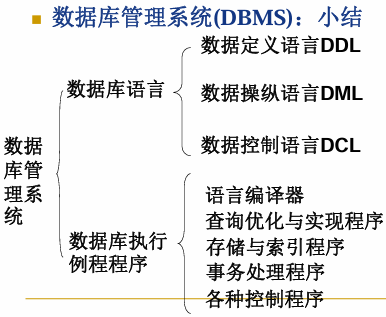

数据库系统：由数据库、数据库管理系统（及其应用开发工具）、应用程序和数据管理员组成的存储、管理、处理和维护数据的系统。

据管理技术的产生和发展：

1. 人工管理阶段
2. 文件系统阶段
3. 数据库系统阶段
   - 特点：①数据结构化；②共享性高、冗余低、易扩充；③数据独立性高；④数据由DBMS统一管理和控制

数据模型：数据模型是对现实世界数据特征的抽象。即它是用来描述数据、组织数据和对数据进行操作的

- 分两类：概念模型；逻辑与物理模型

数据建模过程——两步抽象

1. 现实世界中的客观对象抽象为概念模型：将现实世界抽象为信息世界

2. 把概念模型转换为某一数据库管理系统支持的数据模型：将信息世界转换为机器世界

概念模型：也称信息模型，它是按用户的观点来对数据和信息建模，用于数据库设计

概念模型中属性的类型

1. 按照取值是否唯一：单值属性；多值属性
2. 属性的取值是否能由其他属性的值计算：基属性；派生属性
   - 基属性：属性值在计算机中实际存储的属性

域（Domain）：一组具有相同数据类型的值的集合

角色： 当同一个实体集不止一次参与一个联系时，为 区别各实体参与联系的方式，需要显式指明其角色。实体在联系中的作用称为实体的角色

基数约束: 是对实体之间一对一、一对多和多对多联系的细化。参与联系的每个实体集用基数约束来说明实体集中的任何一个实体可以在联系中出现的最少次数和最多次数（技术约束刚好与联系的位置相反）

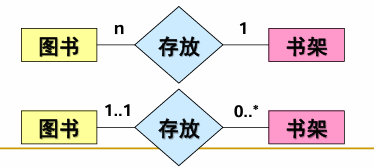

概念模型的表示方法（E-R图的表示方法）

- Chen方法
  - 实体：矩形
  - 属性：椭圆；多值属性：双椭圆；派生属性：虚线椭圆
  - 码：下划线
  - 联系：菱形

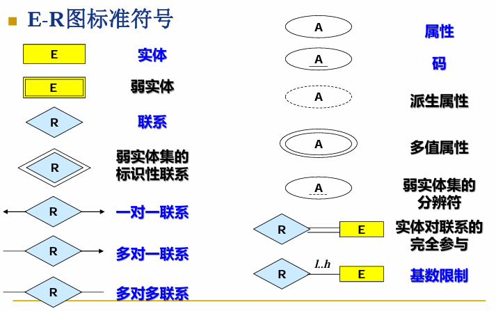

- Crow'sFoot方法
- IDEF1X方法（工程化方法）

 数据模型的组成要素

- 数据结构（最重要）：描述数据库的组成对象，以及对象之间的联系，对系统静态特性的描述

- 数据操作：对数据库中各种对象(型)的实例(值)允许执行的操作及有关的操作规则，是对系统动态特性的描述

- 完整性约束条件：一组完整性规则的集合，保证数据的正确、有效、相容

逻辑数据模型：

1. 层次模型（树形结构）
   - 每棵树有且仅有一个节点无父节点，称为树的根
   - 树中的其它节点都有且仅有一个父节点
2. 网状模型
   - 允许一个以上的结点无双亲
   - 一个结点可以有多于一个的双亲
3. 关系模型
   - 在用户观点下，关系模型中数据的逻辑结构是一 张二维表，它由行和列组成，要求关系必须是规范化的
   - 完整性约束：
     - 实体完整性
     - 参照完整性
     - 用户定义的完整性

**概念模型到关系模型的转换**

- 实体 -> 关系
- 属性 -> 关系的属性
- 多值属性 -> 新的关系+所在实体的码 

- 一对一联系
  - 若联系双方均部分参与，则将联系定义为一个<u>新的关系</u>，属性为参与双方的码和联系的属性
  - 若联系一方全部参与，则将联系另一方的码，<u>联系的属性作为全部参与一方的属性</u>
- 一对多联系
  - 将<u>单方参与</u>的一方实体的码和联系的属性作为多方参与实体的属性
- 多对多联系
  - 将联系定义为新的关系，属性为参与双方的码

- 多元联系
  - 多元联系可以通过继承参与联系的各个实体的码而形成新的关系
  - 这些继承过来的码可以作为新关系的关键字
  - 也可以新增一个分辨标识作为关键字

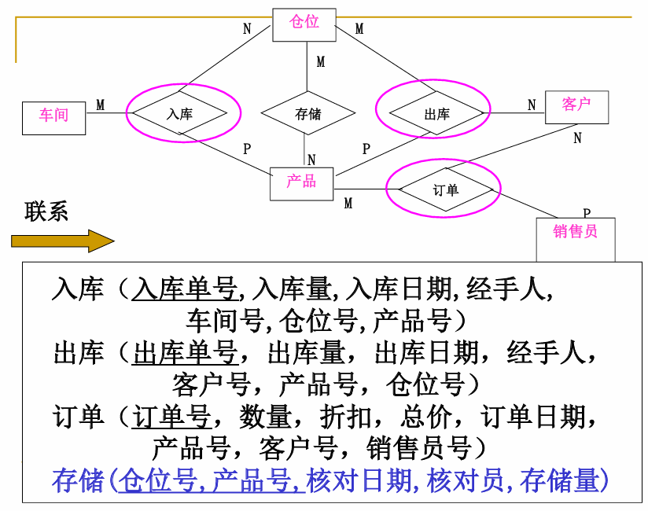

ER设计步骤：

1. 实体设计
2. 联系设计
3. 初步E-R图 =》详细E-R图

Part-of 联系即部分联系，它表明某个实体型是另外 一个实体型的一部分

1. 整体实体如果被破坏，部分实体仍然可以独立存在 ，称为非独占的Part-of联系
2. 整体实体如果被破坏，部分实体不能存在，称为独占的Part-of联系

弱实体集：所对应关系的码由弱实体本身的分辨符再加上所依赖的强实体(独立实体)的码构成。如果一个实体集的存在依赖于其他实体集的存在，则这个实体集叫弱实体集，否则为强实体集。

强实体集：有主码的实体集称为强实体集

ISA联系转换：对于完备性约束，即一个高层实体至少属于 一个低层实体，则可以不为高层实体建立关系。低层实体所对应的关系包括上层实体的所有属性。

1. 高层实体和低层实体分别转为不同的关系
2. 低层实体所对应的关系包括高层实体的码

不相交约束与可重叠约束

- 不相交约束描述父类中的一个实体不能同时属于多个子类中的实体集，即一个父类中的实体最多属于一个子类实体集
- 完备性约束描述父类中的一个实体是否必须是某一个子类中的实体。如果是，则叫完全特化；否则，叫部分特化
  -  完全特化用父类到子类的双线连接表示， 单线连接表示部分特化

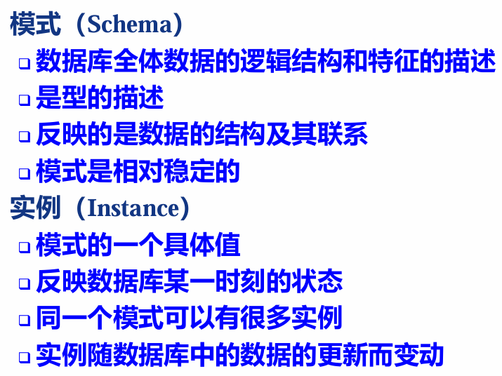

数据库系统三级模式结构：

- 模式（Schema）（也称逻辑模式）：一个数据库只有一个模式
  - 是全体数据库中<u>全体数据的逻辑结构和特征的描述</u>，所有用户的公共数据视图
- 外模式（External Schema）（也称子模式或用户模式）：外模式通常是模式的子集
  - 数据库用户（包括应用程序员和最终用户）使用的<u>局部数据的逻辑结构和特征的描述</u>，数据库用户的数据视图，是与某一应用有关的数据的逻辑表示
  - 模式与外模式的关系：一对多
  - 外模式与应用的关系：一对多
- 内模式（Internal Schema）（也称存储模式）：一个数据库只有一个内模式
  - 是<u>数据物理结构和存储方式的描述</u>，是数据在数据库内部的表示方式

数据库的二级映像功能与数据独立性

- 外模式／模式映像：映象定义通常包含在各自外模式的描述中
  - 保证数据的逻辑独立性
    - 当模式改变时，数据库管理员修改有关的 外模式／模式映象，使外模式保持不变。应用程序是依据数据的外模式编写的，从而应用程序不必修改，保证了数据与程序的逻辑独立性，简称数据的逻辑独立性
- 模式／内模式映像：定义了数据全局逻辑结构与存储 结构之间的对应关系，唯一的
  - 保证数据的物理独立性
    - 当数据库的存储结构改变了（例如选用了另一种存储结构），数据库管理员修改模式/内模式映象，使模式保持不变，从而应用程序不受影响。保证了数据与程序的物理独立性，简称数据的物理独立性。

二级映像的作用：保证了数据库外模式的稳定性；从底层保证了应用程序的稳定性，除非应用需求本身发生变化，否则应用程序一般不需要修改

### 第2章 关系模型

关系模型的组成要素：

一、关系数据结构：关系、关系模式、关系数据库

1. 单一的数据结构----关系
   - 现实世界的实体以及实体间的各种联系均用关系来表示

2. 数据的逻辑结构----二维表

   - 从用户角度，关系模型中数据的逻辑结构是一张二维表。

1.1 关系的分类

基本关系 (基本表或基表)：实际存在的表，是实际存储数据的逻辑表示

查询表：查询结果对应的表

视图表：由基本表或其他视图表导出的表，是虚表，不对应实际存储的数据

1.2  关系模式：对关系的描述 

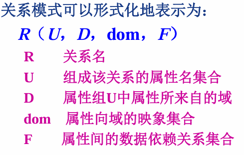

对比：关系模式是对关系的描述，是静态的、稳定的；而关系是动态的、随时间不断变化的

1.3 关系数据库：支持关系模型的数据库系统

- 在一个关系数据库中，某一时刻所有关系模式对应的关系的集合构成一个关系数据库
- 关系数据库的型：常称为关系数据库模式，是关系数据库中所有关系模式的集合

1.4 关系模型的存储结构

二、关系操作：增删改查，通常用代数方式或逻辑方式来表示，分别称为关系代数和关系演算

特点： 集合操作方式：操作的对象和结果都是集合， 一次一集合的方式

关系代数:用对关系的运算来表达查询要求

关系演算:用谓词来表达查询要求

2.1 查询：选择、投影、连接、除、并、交、差、笛卡尔积

2.2 数据更新：插入、删除、修改 

三、关系完整性：实体完整性、参照完整性、用户定义完整性

实体完整性和参照完整性：关系模型必须满足的完整性约束条件，通常由关系系统自动支持

用户定义的完整性：应用领域需要遵循的约束条件，体现了具体领域中的语义约束

1. 实体完整性规则（Entity Integrity）：若属性A是基本关系R的主属性，则属性A不能取空值
2. 参照完整性规则：若属性（或属性组）F是基本关系R的外码，它与基本关系S的主码Ks相对应（基本关系R和S不一定是不同的关系），则对于R中每个元组在F上的值必须为
   - 或者取空值（F的每个属性值均为空值）
   - 或者等于S中某个元组的主码值
3. 用户定义完整性：用户定义的完整性是针对某一具体关系数据库的约束条件，反映某一具体应用所涉及的数据 必须满足的语义要求

**关系代数：**

集合运算：交，并，差，笛卡尔积

关系运算：选择、投影、连接、除

基本运算5种：并、差、笛卡尔积、选择、投影

自然连接：是一种特殊的等值连接；两个关系中进行比较的分量必须是同名的属性组；在结果中把重复的属性列去掉

除：给定关系R (X，Y) 和S (Y，Z)，其中X，Y，Z 为属性组。R中的Y与S中的Y可以有不同的属性名，但必须出自相同的域集。R与S的除运算得到一个新的关系P(X)，P是R中满足下列条件的元组在X属性列上的投影：元组在X上分量值x的象集Yx 包含S在Y上投影的集合

交由：并、差构成；连接操作由：选择和笛卡尔积构成；除由：笛卡尔积、选择、投影构成

**元组关系演算：**

元组关系演算是以元组变量作为谓词变量的基本对象，其中 $ P(t) \text { 运算符优先次序 (括弧, } \boldsymbol{\theta}, \exists, \forall, \neg, \wedge, V)$

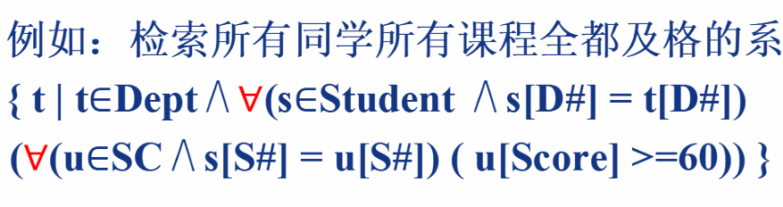

**域关系演算**

三种关系运算都可说是非过程性的：域演算的非过程性最好，元组演算次之，关系代数最差

### 第3章 关系数据库标准语言SQL

SQL的特点：①综合统一；②高度非过程化；③面向集合的操作方式；④以同一种语法结构提供多种使用方式；⑤语言简洁，易学易用

**数据定义**：模式定义、表定义、视图和索引的定义

1. 模式定义

   ```sql
   # 模式的定义
   CREATE SCHEMA <模式名> AUTHORIZATION <用户名> [<表定义子句>|<视图定义子句>|<授权定义子句>] 
   eg:
   CREATE SCHEMA TEST AUTHORIZATION ZHANG
   CREATE TABLE TAB1(COL1 SMALLINT,
                     COL2 INT,
                     COL3 CHAR(20),
                     COL4 NUMERIC(10，3),
                     COL5 DECIMAL(5，2)
                    );
   # 模式的删除
   DROP SCHEMA <模式名> <CASCADE | RESTRICT>
   eg:
   DROP SCHEMA TEST CASCADE;
   ```

2. 表定义

   ```sql
   # 定义基本表
   CREATE TABLE <表名> (<列名> <数据类型>[ <列级完整性约束条件> ]
                      [, <列名> <数据类型>[ <列级完整性约束条件>] ]
                      ...
                      [, <表级完整性约束条件> ] );
   eg:
   CREATE TABLE Prof 
   (Pno CHAR(10),
    Pname CHAR(20) NOT NULL,
    Sal SMALLINT,Page SMALLINT,
    Dno CHAR(2),
    PRIMARY KEY (Pno),
    FOREIGN KEY (Dno) REFERENCES Dept(Dno)
   );
   # 修改表
   ALTER TABLE <表名>
   [ ADD [COLUMN] <新列名> <数据类型> [完整性约束]]
   [ ADD <表级完整性约束> ]
   [ DROP [COLUMN] <列名>[CASCADE | RESTRICT]]
   [ DROP CONSTRAINT<完整性约束名> [ RESTRICT | CASCADE]]
   [ RENAME COLUMN <列名> TO <新列名>］
   [ ALTER COLUMN <列名> TYPE <数据类型>］;
   # 删除表
   DROP TABLE <表名>［ RESTRICT | CASCADE］;
   ```

3. 索引定义

   - 建立索引的目的：加快查询速度，利用索引提高查询效率是以空间和增加了数据更改的时间为代价的
   - 一个基本表上最多只能建立一个聚簇索引

   ```sql
   # 建立索引，建立时可选唯一索引、非唯一索引与聚簇索引
   # 唯一索引：每个索引值只对应唯一的数据记录。 
   # 聚簇索引：索引项的顺序与表中记录的物理顺序一致的索引组织
   CREATE [UNIQUE][CLUSTER] INDEX <索引名>  
   ON <表名>(<列名>[<次序>][,<列名>[<次序>]]...);
   # 修改索引 
   ALTER INDEX <旧索引名> RENAME TO <新索引名>;
   # 删除索引
   DROP INDEX <索引名>;
   ```

   - 索引分类：顺序表索引，辅助索引，B+树索引，哈希(hash)索引，位图索引

一、顺序表索引

- 稠密索引：索引块中存放每条记录的索引属性值以及指向相应记录的指针

- 稀疏索引：每个索引项存放每个物理块的第一条记录的索引属性值及指向该物理块的指针

- 多级索引：

  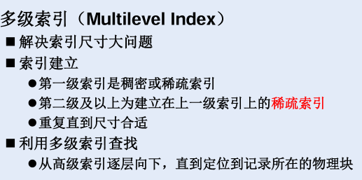

二、辅助索引：建立在表的非排序属性上的索引；一个表最多只能建立一个主索引，但可以在不同属性上建立多个辅助索引，<u>只能按一个（组）属性排序</u>；辅助索引必须是稠密索引，<u>建立在无序属性上的</u>

- 辅助索引的属性往往会取重复值，去掉可减小索引大小与查找开销
- 引入指针桶去除重复索引项：索引项指针----指针桶相应位置----相应的元组

三、B+树索引（多级索引平衡树）

解决大型索引的组织和维护；查找效率高、按不同值查找性能平衡、易于维护等

B+树的秩：一个索引块最多能存放的指针的个数

B+树索引的查询：

- 随机查找：按照索引属性的取值进行查找：从根结点开始，沿父子结点指针逐层向下搜索，直到叶结点（匹配则返回结果，否则没有满足条件的元组） 
- 范围查找：用随机查找的方法分别找到范围条件的入口点和结束点，对入口点和结束点之间的属性值进行顺序搜索

四、哈希索引

哈希表：B个哈希桶
哈希函数：①将记录的索引属性值影射到哈希桶；②每个桶存放放一条或多条哈希值相同的索引项；③每个索引项包括属性值和指向相应记录的指针

静态哈希索引

桶溢出的原因：a) 哈希桶数量不足，不能存放所有的索引项；b) 属性存在偏斜，某些属性值过多；c) 哈希函数设计不合理，无法将索引均匀地映射到每个桶 ，导致某个桶的数据过多 

减少桶溢出的措施：<u>分配溢出桶</u>

动态哈希索引：①可扩展哈希索引②线性哈希索引

4. 数据字典：数据字典是关系数据库管理系统内部的一组系统表， 它记录了数据库中所有定义信息（表 + 视图）

5. 视图定义：基表中的数据发生变化，从视图中查询出的数据也随之改变

```sql
# 定义视图
CREATE  VIEW 
<视图名>  [(<列名>  [, <列名>]...)] 
AS  <子查询>
[WITH  CHECK  OPTION];
# eg:
CREATE VIEW IS_Student
AS
SELECT Sno, Sname, Sage
FROM Student
WHERE Dno = 'IS'
WITH CHECK OPTION;
# 删除视图
DROP VIEW <视图名>[CASCADE];
```

- **查询视图**：视图消解法，当对非行列子集视图查询的转换可能出错
  - 行列子集视图：若视图是从单个基本表导出 ，并且只是去掉了基本表的某些行和某些列 ，但保留了主码。

- **更新视图**：通过使用视图消解法，允许对行列子集视图进行更新
- **视图的作用**：
  - 视图能够简化用户的操作
  - 视图使用户能以多种角度看待同一数据
  - 视图对重构数据库提供了一定程度的逻辑独立性
  - 视图能够对机密数据提供安全保护


**数据查询**：select

1. 单表查询

   - 选择表中的若干元组：SELECT DISTINCT Sno  FROM SC；（使用DISTINCT 去重）

   - 字符匹配：使用换码字符将通配符转义为普通字符

     ```sql
     SELECT Cno, Ccredit FROM Course WHERE Cname LIKE "DB\_Design" ESCAPE '\'；
     ```

   - ORDER BY子句：缺省值为升序

   - GROUP BY子句

     - 列出所有课程及格的学生的平均成绩

       ```sql
       select Sno，AVG(Grade)
       from SC
       group by Sno
       having MIN(Grade) >= 60
       ```

   - LIMIT子句：LIMIT <行数1>[ OFFSET <行数2>];

2. 连接查询：内连接、左外连接、右外连接、全外连接

3. 嵌套查询：将一个查询块嵌套在另一个查询块的WHERE子句或 HAVING短语的条件中的查询称为嵌套查询

   - 子查询的限制：不能使用ORDER BY子句
   - 带有EXISTS谓词的子查询：一些带EXISTS或NOT EXISTS谓词的子查询不 能被其他形式的子查询等价替换

4. 集合查询：并操作UNION；交操作INTERSECT；差操作EXCEPT

5. 基于派生表的查询

**数据更新**：插入数据、修改数据、删除数据

1. 插入数据：

   ```sql
   # 插入元组
   INSERT 
   INTO <表名> [(<属性列1>[, <属性列2> ...)] 
   VALUES (<常量1> [, <常量2>] ...);
   # 插入子结果查询
   INSERT  
   INTO <表名> [(<属性列1> [, <属性列2> ...)] 
   子查询;
   eg:       
   INSERT INTO Dept_age(Dno, Avg_age) 
   	SELECT Dno, AVG(Sage) 
   	FROM  Student
   	GROUP BY Dno;
   ```

2. 修改数据：

   ```sql
   UPDATE <表名>
   SET <列名> = <表达式>[, <列名>=<表达式>]...
   [WHERE<条件>];
   # eg:
   UPDATE SC
   SET Grade=0
   WHERE 'MA'=
   	(SELECT Dno
        FROM Student
        WHERE Student.Sno = SC.Sno);
   ```

3. 删除数据：

   ```sql
   DELETE FROM<表名> [WHERE<条件>];
   # eg:删除有四门不及格课程的所有同学信息
   Delete  
   From  Student    
   Where Sno in 
   ( Select Sno  From  SC    
   Where Grade < 60
   Group by Sno
   Having Count(*)>= 4 );
   ```
   
### 第4章 数据库编程

SQL语言的限制：

- 无法表达递归等复杂操作
- 无法对数据进行复杂操作
- 无法自主设计业务处理逻辑
- 无法进行交互式操作

解决限制的方法：

1. 扩展SQL功能方法：

   - 引入新的SQL子句 

   - 引入新的内置函数

   - 过程化SQL

2. 通过高级语言实现复杂应用

   - 嵌入式SQL：将SQL语言嵌入到某一种高级语言中使用 
   - API（ODBC、JDBC）

一、嵌入式SQL

主变量：在SQL语句中使用的主语言程序变量简称为主变量

**游标**：解决集合性操作语言与过程性操作语言的不匹配，游标是系统为用户开设的一个数据缓冲区，存放 SQL语句的执行结果 ，用户可以用SQL语句逐一从游标中获取记录，并赋给主变量，交由主语言进一步处理

使用游标的步骤

1.说明游标：`EXEC SQL DECLARE <游标名> CURSOR  FOR <SELECT语句>;`

2.打开游标：实际上是执行相应的SELECT语句。`EXEC SQL OPEN <游标名>;`

3.推进游标指针并取当前记录：`EXEC SQL FETCH <游标名> INTO <主变量>[<指示变量>][, <主变量>[<指示变量>]]...;`

4.关闭游标：`EXEC SQL CLOSE <游标名>;`

动态SQL的两种执行方式：1.立即执行语句，运行时编译并执行；2. Prepare-Execute-Using语句，先编译之后动态传参。

二、过程化SQL——存储过程和存储函数

过程化SQL程序可以被命名和编译，并保存在数据库中，称为存储过程（stored procedure）或存储函数（stored function）（自定义函数）， 供其他过程化SQL调用

 存储函数和存储过程的异同

- 同：都是持久性存储模块
- 异：函数必须指定返回的类型 

存储过程的优点：①经编译和优化后存储在数据库服务器中，运行效率高②降低客户机和服务器之间的通信量③有利于集中控制，方便维护

### 第5章 数据库安全性

数据的完整性和安全性是两个不同概念

- 数据的完整性
  - 防止数据库中存在不符合语义的数据，也就是防止数据库中存在不正确的数据
  - 防范对象：不合语义的、不正确的数据
- 数据的安全性
  - 保护数据库防止恶意的破坏和非法的存取，防止不合法的使用所造成的数据泄露、更改或破坏
  - 防范对象：非法用户和非法操作

数据库的不安全因素：

1. 非授权用户对数据库的恶意存取和破坏
2. 数据库中重要或敏感的数据被泄露
3. 安全环境的脆弱性

数据库安全性控制的常用方法：

- 用户标识和鉴别：系统提供的最外层安全保护措施，系统核对口令以鉴别用户身份 

- 存取控制：定义用户权限、合法权限检查；

  - 方法：①自主存取控制（C2）②强制存取控制（B1）

  ```sql
  # 授权
  GRANT <权限> [,<权限>］...
  ON <对象类型> <对象名>,[<对象类型> <对象名>]]...
  TO <用户>[,<用户>]...
  [WITH GRANT OPTION];
  
  GRANT ALL PRIVILEGES ON TABLE Student, Course TO U2, U3; 
  GRANT SELECT ON TABLE SC TO PUBLIC;
  GRANT UPDATE(Sno), SELECT ON TABLE Student TO U4;
  # 回收
  REVOKE <权限> [, <权限>]...  
  ON <对象类型> <对象名>,...  
  FROM <用户>[,<用户>] 
  [CASCADE|RESTRICT];
  
  REVOKE UPDATE(Sno) ON TABLE Student FROM U4 CASCADE;
  REVOKE SELECT ON TABLE SC FROM PUBLIC;
  ```

  - 创建数据库模式的权限：`CREATE USER <username> [WITH][SUPERUSER|CREATEDB] PASSWORD 'password';`
  - 数据库角色：被命名的一组不数据库操作相关的权限（权限的集合）

  ```sql
  CREATE ROLE R1;
  GRANT SELECT, UPDATE, INSERT ON TABLE Student TO R1;
  GRANT R1 TO 王平, 张明, 赵玲;
  REVOKE R1 FROM 王平;
  ```

  - 自主存取控制缺点：可能存在数据的“无意泄露”，由于仅对权限进行控制但是数据本省并无安全性标记
  - 强制存取控制规则 ：(1)仅当主体的许可证级别大于或等于客体的密级时，该主体才能读取相应的客体  (2)仅当主体的许可证级别小于或等于客体的密 级时，该主体才能写相应的客体

- 视图机制：把要保密的数据对无权存取这些数据的用户隐藏起来，对数据提供一定程度的安全保护（在视图上定义存取权限）

- 审计（事后保护）：分为用户级审计，系统级审计

  - AUDIT语句：设置审计功能
  - NOAUDIT语句：取消审计功能

  ```sql
  SHOW AUDIT_TRAIL;
  SET AUDIT_TRAIL TO ON;
  AUDIT ALTER, UPDATE ON SC BY ACCESS; 
  NOAUDIT ALTER, UPDATE ON SC; 
  ```

- 数据加密：防止数据库中数据在存储和传输中失密的有效手段，将明文转换为密文

  - 存储加密
    -  透明存储加密：内核级加密保护方式，对用户完全透明
    - 非透明存储加密：通过多个加密函数实现
  - 传输加密：链路加密；端到端加密
  - 库内加密与库外加密

### 第6章  数据库完整性

数据库的完整性指的是数据的正确性和相容性

- 正确性：符合现实世界语义
- 相容性：同一对象在不同表中的数据符合逻辑

数据库完整性管理的作用：①防止和避免数据库中不合理数据的出现；②DBMS应尽可能地自动防止DB中语义不合理现象

维持完整性需要实现的功能：

1. 提供定义完整性约束条件的机制 
2. 提供完整性检查的方法
3. 违约处理

实体完整性：主码唯一且非空

检查与违约处理：插入或对主码列进行更新操作时， 检查主码值是否唯一，如果不唯一则拒绝插入或修改；检查主码的各个属性是否为空只要有一个为空就拒绝插入或修改。

参照完整性：外码的约束

检查：对被参照表和参照表进行增删改操作时可能会破坏参照完整性，必须检查以保证两个表的相容性

违约处理：外码约束可以在创建参照表时说明不同的违约策略，违约策略有拒绝执行、级联删除 、设为空值

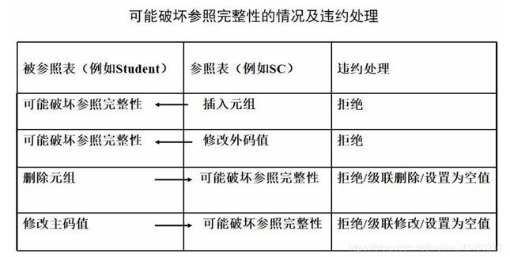

用户定义的完整性：用户定义的完整性就是针对某一具体应用的数据必须满足的语义要求

- 属性上的约束条件
  - 检查和违约处理：插入元组或修改属性的值时，RDBMS检查属性上的约束条件是否被满足。如果不满足则操作被拒绝执行
- 元组上的约束条件
  - 插入元组或修改属性的值时，RDBMS检查元组上的约束条件是否被满足，如果不满足则操作被拒绝执行

完整性约束命名子句：定义与修改

<table><tr>
<td></td>
<td></td>
</tr></table>


触发器：触发器（Trigger）是用户定义在关系表上的一类由事件驱动的特殊过程

语法结构：

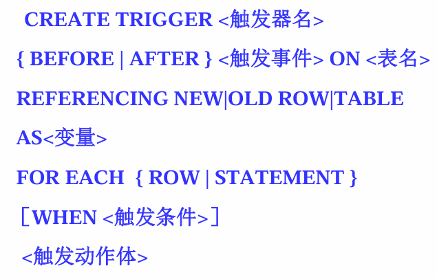

删除语句：DROP TRIGGER <触发器名> ON <表名>; 

- 行级触发器（FOR EACH ROW）：UPDATE 语句影响多少行，就触发多少次
- 语句级触发器（FOR EACH STATEMENT）： 执行完UPDATE语句后触发动作体将执行一次
- 同一个表上的多个触发器激活时遵循如下的执行顺序：
  - 执行该表上的BEFORE触发器；
  - 激活触发器的SQL语句；
  - 执行该表上的AFTER触发器

### 第7章 关系数据理论

数据依赖：一个关系内部属性与属性之间的约束关系，分为函数依赖与多值依赖

规范化：规范化理论正是用来改造关系模式通过分解关系模式来消除其中不合适的数据依赖，以解决插入异常、删除异常、更新异常和数据冗余问题

函数依赖：

在一个关系模式R(U)中，对于U的子集X和Y

- 若X和Y有1：1关系，则 $X \leftrightarrow Y$
- 若X和Y有1：m关系，则 $Y \rightarrow X$
- 若X和Y有n：m关系，则 $X \nrightarrow Y$

<table><tr>
<td>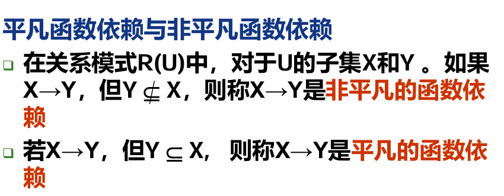</td>
<td>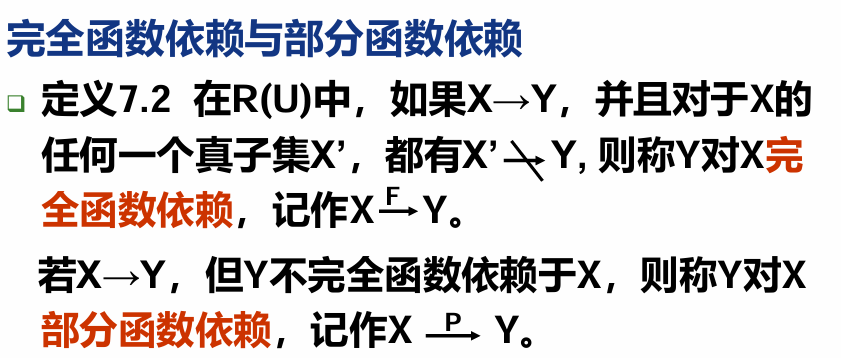</td>
</tr></table>
<table><tr>
<td>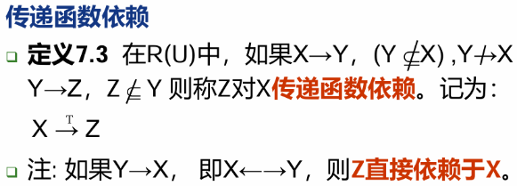</td>
<td>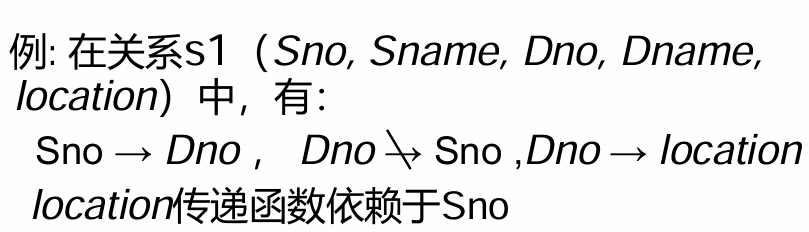</td>
</tr></table>


码：

超码：能推出所有属性的属性组的集合，根据概念可知，候选码是极小的超码集，是超码的子集

范式：规范化的关系称为范式

一个低一级范式的关系模式，通过模式分解可以转换 为若干个高一级范式的关系模式的集合，这种过程就叫规范化

- 第一范式(1NF)：如果一个关系模式R的所有属性都是不可分的基本数据项

  - 如果某个属性，例如学校，还可以继续拆分为高中和大学，就不满足1NF了。I NF 是关系数据库需要满足的最低要求

- 第二范式(2NF)：在满足1NF的前提下，不包含非主属性对码的部分函数依赖（即每 一个非主属性都完全函数依赖于码）

  - 例如在关系R中，码是学号和班级，非主属性是姓名，因为通过学号就能直接推出姓名了，不需要班级，此处姓名就部分依赖于码了，不满足2NF

- 第三范式(3NF)：满足2NF的前提下，不包含非主属性对码的传递函数依赖(即码应该直接决定非主属性，不能间接决定)，即没有任何非主属性对码传递依赖或部分依赖

  - 例如在关系R中，码是客户姓名，非主属性是订单编号和订单负责人，通过客户姓名可以推出他的订单编号，再通过订单编号能推出订单负责人，这种情况下客户姓名和订单负责人是间接决定的，存在传递函数依赖，不满足3NF

- BC范式(BCNF)：消除任何属性对候选码的传递依赖，即每一个决定因素都包含码，表现为在函数依赖集当中，左边的都包含候选码（整个属性组 !)

- 第四范式(4NF)：不允许有非平凡且非函数依赖的多值依赖 

  - 多值依赖：X，Y，Z属于集合U， 且Z=U-X-Y。当给定一组（x，z）值的时候，可以确定一组Y的值，但这组Y的值仅仅取决于x，此时有 $X \rightarrow\rightarrow Y$ 。其实这里就是存在了一对多的关系，即一个 x 和一组 z 有关，可以得到有一组Y 的值，这组值仅仅决定于x值而与z值无关 
  - 平凡的多值依赖：Z是空集
  - 非平凡的多值依赖：Z不是空集

  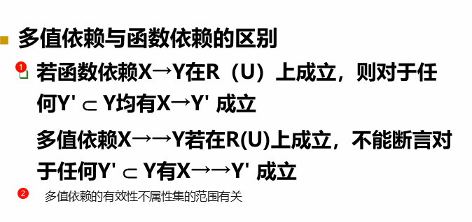

无损连接和保持函数依赖：

- 关系模式进行无损连接分解，避免信息丢失
- 保持原来模型的函数依赖

=》若要求分解既具有无损连接性，又保持函数依赖，则模式分解可以达到3NF，但不一定能够达到BCNF 

ArmStrong公理系统：YZ 表示 $Y \cup Z$

<table><tr>
<td>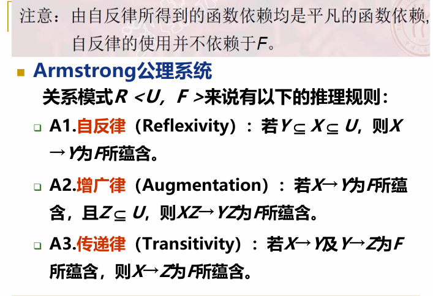</td>
<td>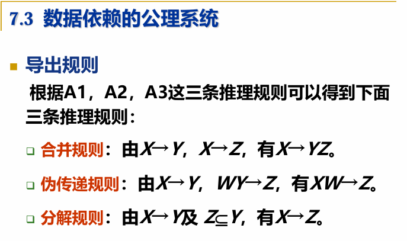</td>
</tr></table>


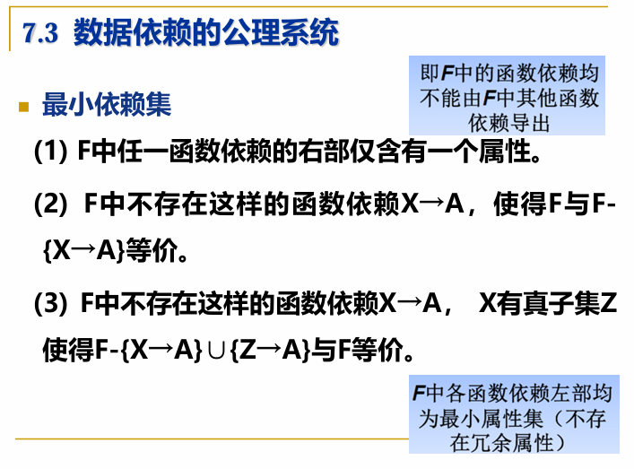

**在关系数据库中，任意一个二元关系模式R至少可以达到4NF**

**如果一个关系模式R中的属性全部是主属性则R至少可以达到3NF**

若R是（A，B，C），F是${AC \rightarrow B，AB \rightarrow C，B \rightarrow C}$，候选码则是AC和AB。这里不存在 部分函数依赖，但对于B  C来说，决定因素B不包含码，因此它不是BCNF。

**如果一个关系模式R的主码是全码，则R至少可以达到BCNF**

### 第8章 数据库设计

设计步骤：

**1.需求分析**

调查机构情况与熟悉业务活动，明确用户的需求，确定系统的边界，生成数据字典和用户需求规格说明书

**2.概念结构设计**

将需求分析得到的用户需求抽象为概念模型，绘制E-R图

特点：能够真实有效的反映现实世界；易于理解、更改；更容易向层次、网络、关系模型转换。

 消除冲突：

- 属性冲突：属性域、属性单位
- 命名冲突：同名异义、异名同义
- 结构冲突：属性&实体、属性个数、联系类型

概念结构设计的步骤

- 抽象数据并设计局部视图

- 集成局部视图，得到全局概念结构

- 验证整体概念结构

**3.逻辑结构设计**

将E-R图转换为与DBMS相符合的逻辑结构（包括数据库模式和外模式），例如E-R图向关系模型转换，再根据<u>规</u>
<u>范化理论</u>对数据模型进行优化，设计用户子模式

常用分解方法：水平分解、垂直分解

**4.物理结构设计**

通常关系数据库物理设计的内容包括关系模式选择存取方法、以及设计关系、索引引等数据库文件的物理存储结构

存取方法：①B+树索引I存取方法；②哈希索引存取方法；③聚簇存取方法

存储结构：

1.存取位置：硬件环境与应用需求决定

2.确定系统配置

**5.数据库实施**

建立实际数据库结构、试运行、装入数据

**6.数据库运行和维护**

维护数据库的安全性、完整性控制以及系统的转储和恢复；性能的监督、分析和改进；增加新功能；发现错误和修
改错误

数据库的重构：
重组织不改变原设计的逻辑和物理结构，而数据库的重构造会部分修改数据库的模式和内模式

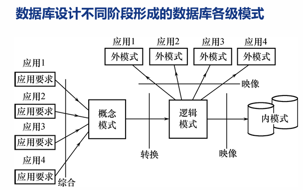

----

数据字典： 进行详细的数据收集和数据分析所获得的主要结果，是关于数据库中数据的描述，是元数据， 而不是数据本身

**数据项**：数据项是不可再分的数据单位

**数据结构**：数据结构反映了数据项之间的组合关系

**数据流**：数据流是数据结构在系统内传输的路径

**数据存储**：数据存储是数据结构停留或保存的地方，也是数据流的来源和去向之一

**处理过程**：具体处理逡辑一般用判定表或判定树来描述

### 第9章 数据库恢复

事务：

1.**定义**：①事务是数据库操作序列，这些操作要么全做，要么全不做，是不可分割的工作单位。一个事务可以是一个sql语句，一组sql语句，或者整个程序。一般来说，一个程序包含多个事务。②事务是恢复的基本单位，也是并发控制的基本单位。

2.**定义事务的SQL语句**

<u>显示定义事务</u>：

开始语句：BEGIN TRANSACTION;
结束语句：COMMIT；//表示提交事务的所有操作
或者ROLLBACK;//表示回滚，即事务运行中发生了某种故障，需要对已完成的操作进行撤销，回滚到事务开始的状态。

<u>隐式方式</u>：当用户没有显式地定义事务时，DBMS按缺省规定自动划分事务

3.**事务的4个特性（ACID)：原子性，一致性，隔离性，持续性**

①原子性：一个事务要么全做，要么全不做
②一致性：事务执行的结果必须一致。如果一个事务被迫中断，即事务中的一些操作做了，剩下的还没做，且做了的对数据库造成的修改已经存入物理数据库的话，就会造成数据库处于不一致的状态。因此事务要么全做，要么全不做，一致性和原子性是密切相关的
③隔离性：一个事务的执行不能被其他事务干扰
④持续性（也称为永久性)：一个事务一旦提交，它对数据库中数据的改变应该是永久性的，持久性通过恢复机制实现

4.**数据库故障种类**：事务内部的故障、系统故障、介质故障、计算机病毒

① 事务内部的故障

事务内部的故障有的是可以通过事务程序本身发现的，有的是非预期的、不能由事务程序处理的
事务故障的情况下，数据库可能处于不正确的状态。恢复程序要在不影响其他事务运行的情况下，强行回滚该事务，即撤销该事务造成的修改，这类恢复操作称为UNDO(事务撤销)

② 系统故障（软故障）

系统故障是指造成系统停止运转的任何事件，使得系统要重新启动（例如硬件错误、操作系统故障、DBMS代码错
误、系统断电等等)

系统故障的情况下，在系统重新启动后，恢复子系统除了需要撤销未完成的事务以外，还需要REDO（事务重做）所有已提交的事务

③ 介质故障 (硬故障)

外存故障，如磁盘损坏、磁头碰撞、瞬时强磁场干扰、破坏硬盘数据的计算机病毒等

通过数据备份来恢复数据库。

④ 计算机病毒

5.**数据转储和登录日志**：利用冗余数据实施数据库恢复

① 数据转储

转储是指DBA定期地将整个数据库复制到磁带或另一个磁盘上保存起来的过程。备用的数据称为后备副本或后援副本。数据库遭到破坏后可以将后备副本重新装入，但是重装后备副本叧能将数据库恢复到转储时的状态，需要重新执行自转储后的所有更新事务

种类：静态转储与动态转储；海量转储与增量转储

静态转储（在系统中无运行事务时进行)、动态转储（转储期间允许对数据库进行存取或修改）

海量转储（每次转储全部数据库）、增量转储（每次只转储上一次转储后更新过的数据）

数据转储方法分为：动态海量转储、动态增量转储，静态海量转储、静态增量转储

② 登记日志文件

定义：日志文件(log)是用来记录事务对数据库的更新 操作的文件，由系统自动记录。分为以记录为单位的日志文件和以数据块为单位的日志文件

以记录为单位的日志文件：

<table><tr>
<td></td>
<td>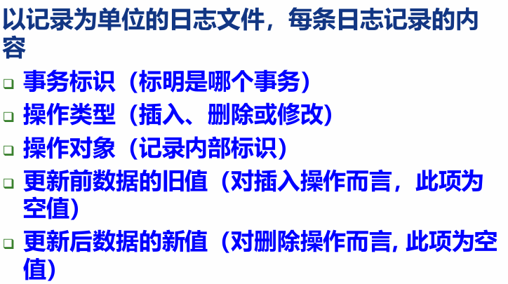</td>
</tr></table>


以数据块为单位的日志文件：事务标识（标明是那个事务）与被更新的数据块

日志文件的作用：
（1）事务故障恢复和系统故障恢复必须用日志文件
（2）在动态转储方式中必须建立日志文件，后备副本和日志文件结合才能有效恢复数据库
（3）在静态转储方式中也可以建立日志文件，当数据库毁坏后可以重新装入后备副本把数据库恢复到转储结束时刻的正确状态，然后利用日志文件，把已完成的事务进行重做处理，对故障发生时尚未完成的事务进行撤销处理

登记日志文件的两条原则：
（1）登记的次序严格按并发事务执行的时间次序
（2）必须先写日志文件，后写数据库

6.**不同的数据库系统故障下的恢复策略**

①事务故障的恢复
由系统自动完成，对用户透明：利用日志文件撤销（UNDO）此事务已对数据库进行的修改

反向扫描文件日志（即从最后向前扫描日志文件），查找该事务的更新操作。

②系统故障的恢复
由系统重新启动时自动完成，不需要用户干预：撤销（UNDO）故障发生时未完成的事务，重做（REDO）已完成
的事务

正向扫描日志文件（即从头扫描日志文件）将事务入重做与撤销队列，反向扫描日志文件undo，正向扫描日志文件redo

③介质故障的恢复
最严重的一种故障：重装数据库，重做（REDO）已完成的事务

恢复到最近一次转储时的一致性状态：

对于静态转储的数据库副本，装入后数据库即处于一致性状态

对于动态转储的数据库副本，还须同时装入转储时刻的日志文件副本，利用恢复系统故障的方法即（REDO+UNDO），才能将数据库恢复到一致性状态。

*为避免磁盘介质出现故障影响数据库，许多数据库管理系统提供了数据库镜像功能(复制数据实现)

7.**两种提高恢复效率的方法**：具有检查点的恢复技术；数据库镜像

具有检查点的恢复技术：

这种技术在日志文件中增加了检查点记录：检查点之前的事务已经做完了，不需要重做，检查点期间和之后的事务
需要重做，可以改善恢复效率。

检查点是DBMS强制使内存DB Buffer中的内容与介质DB中的内容保持一致的时刻点

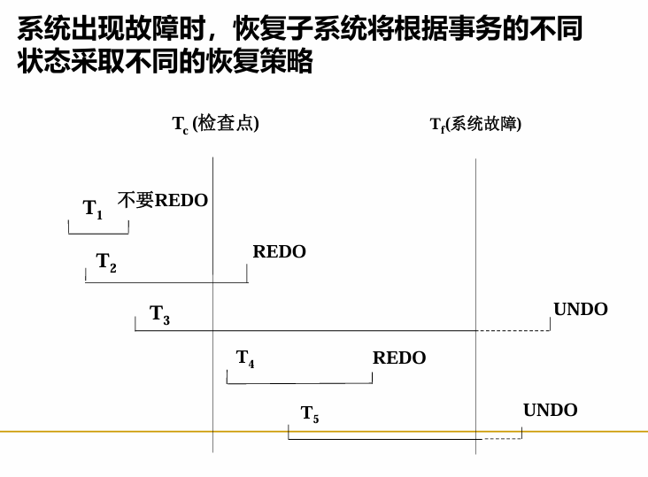

数据库镜像：

DBMS自动把整个数据库或其中的关键数据复制到另一个磁盘上，自动保证镜像数据与主数据库的一致性

<table><tr>
<td>复制过程：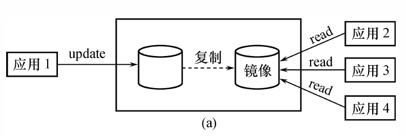</td>
<td>发生故障时：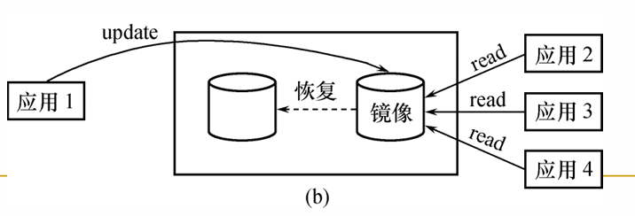</td>
</tr></table>


### 第10章 并发控制

并发控制机制的任务：对并发操作进行正确调度；保证事务的隔离性；保证数据库的一致性

1.**并发操作带来的数据不一致**：由于并发操作破坏了事务的隔离性

①丢失修改：两个事务T1和T2读入同一数据并修改，T2提交的结果破坏了T1提交的结果，导致T1的修改被丢失

②不可重复读：指事务T1读取数据后，事务T2执行更新操作，使T1无法再现前一次读取结果

③读脏数据：事务T1修改某一数据后并将其写回磁盘，事务T2读取同一数据后，T1由于某种原因被撤销，这时T1修改过的数据恢复原值，T2读到的数据就与数据库中的数据不一致

④幻读：事务T1读取数据后，事务T2执行插入或删除操作，使T1无法再现前一次读取结果。（可归类至不可重复读）

并发控制的主要技术：封锁、时间戳、乐观控制法、多版本并发控制

2.**隔离级别**：四类隔离级别由低到高分别是：读未提交、读已提交、可重复读、可串行化

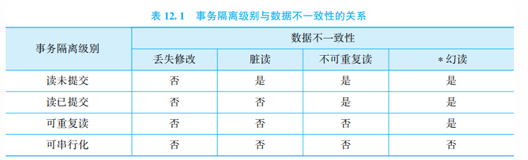

3.**封锁：X锁和S锁**

①排他锁/写锁，X锁

若事务T对数据对象A加上X锁，则只允许事务T读取和修改A

事务T释放A上的锁之前：其他事务不能读取和修改A，不能再对A加任何类型的锁

②共享锁/读锁，S锁

若事务T对数据对象A加上S锁，则事务T可以读取A，但不能修改A

事务T释放A上的S锁之前：其他事务可以读取A，可以对A加S锁，但不能修改A，也不能对A加X锁

锁的相容矩阵：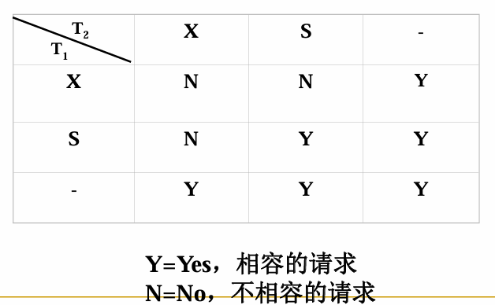

4.**三级封锁协议**：约定何时申请X锁/S锁、持续时间、何时释放等等

①一级封锁协议：事务T在修改数据R之前必须先对其加X锁，直到事务结束才释放

②二级封锁协议：事务T在修改数据R之前必须先对其加X锁（一级封锁协议），并且其他事务在读取数据之前必须先对其加S锁，读完后即可释放S锁

③三级封锁协议：事务T在修改数据R之前必须先对其加X锁（一级封锁协议），并且其他事务在读取数据之前必须先对其加S锁，<u>直到事务结束才释放</u>(二级封锁协议是读完就能释放）

不同级别的封锁协议和一致性保证：

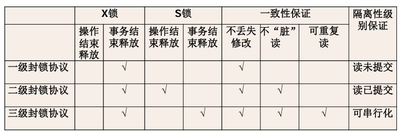

5.**活锁和死锁**

避免活锁：采用先来先服务的策略

解决死锁的方法：
1.预防死锁

①一次封锁法：每个事务必须一次将所有要使用的数据全部加锁，否则就不能继续执行
②顺序封锁法：预先对数据对象规定一个封锁顺序，所有事务按这个顺序实施封锁

2.死锁的诊断与解除

诊断：①超时法：如果一个事务的等待时间超过了规定的时限，就认为发生了死锁

​           ②等待图法：构建事务等待图（有向图：节点表示运行的事务，边表示事务等待的情况），存在回路即死锁

解除：选择一个处理死锁代价最小的事务，将其撤销（UNDO），释放此事务持有的所有的锁

6.**可串行化调度**： 多个事务的并发执行是正确的，当且仅当其结 果不按某一次序串行地执行这些事务时的结果相同

一个给定的并发调度，当且仅当它是可串行化的，才认为是正确调度 

7.**冲突可串行化调度**

冲突操作：指不同的事务对用一个数据的读写操作（读和写）和写写操作（写和写）

不同事务的冲突操作和同一事物的两个操作是不能交换的，如果发生交换，自然会发生错误。基于此，如果调度能保证冲突操作的次序不变，就称为冲突可串行化的调度。冲突可串行化调度一定是可串行化调度。（但是注意，可串行化调度也有可能不满足冲突可串行化)

8.**两段锁协议**：指所有事务必须分两个阶段对数据项加锁和解锁

①获得封锁（扩展阶段)：在对任何数据进行读、写操作之前，事务首先要获得对该数据的封锁

②释放封锁(收缩阶段)：在释放一个封锁之后，事务不再申请和获得任何其他封锁

若并发执行的所有事务均遵守两段锁协议，则对这些事物的任何并发调度策略都是可串行化的；若并发事务的一个调度是可串行化的，不一定所有事务都符合两段锁协议

9.**封锁粒度**： 封锁对象的大小

封锁的对象：逻辑单元，物理单元 
逻辑单元: 属性值、属性值集合、元组、关系、索引项、整个索引、整个数据库等
物理单元：页（数据页或索引页）、物理记录等

10.**多粒度封锁**：在一个系统中同时支持多种封锁粒度供不同的事务选择

多粒度树： 以树形结构来表示多级封锁粒度，根结点是整个数据库，表示最大的数据粒度 ，叶结点表示最小的数据粒度

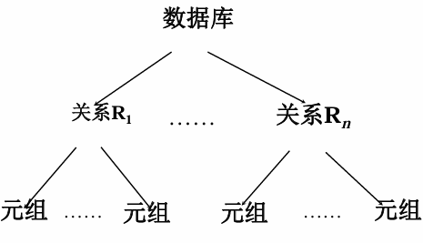

多粒度封锁：

显式封锁: 直接加到数据对象上的封锁

隐式封锁: 该数据对象没有独立加锁，是由于其上级结点加锁而使该数据对象加上了锁 

11.**引进意向锁**：提高对某个数据对象加锁时系统的检查效率

- 如果对一个结点加意向锁，则说明该结点的下层结点正在被加锁

- 对任一结点加基本锁，必须先对它的上层结点加 意向锁

①意向共享锁（IS）：如果对一个数据对象加IS锁，表示它的后裔结点拟（意向）加S锁

②意向排它锁（IX）：如果对一个数据对象加IX锁，表示它的后裔结点拟（意向）加X锁

③共享意向排它锁（SIX）：如果对一个数据对象加SIX锁，表示对它加S锁， 再加IX锁，即SIX = S + IX

eg：对某个表加SIX锁，则表示该事务要读整个表（所以要对该表加S锁），同时会更新个别元组 （所以要对该表加IX锁）

意向锁的相容矩阵：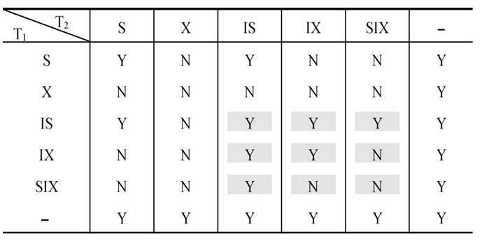

具有意向锁的多粒度封锁方法

Ⅰ、提高了系统的并发度

Ⅱ、减少了加锁和解锁的开销

Ⅲ、在实际的数据库管理系统产品中得到广泛应用

### 第11章 关系查询处理和查询优化

代数优化：指关系代数表达式的优化，通过对关系代数表达式的等价变换来提高查询效率

典型的启发式规则：  

1. 选择运算应尽可能先做。在优化策略中这是最重要、最基本的一条  
2. 投影运算尽可能先做。

物理优化：指存取路径和底层操作算法的选择

1.基于规则的启发式优化：适合解释执行的系统
2.基于代价估算的优化：基于代价的优化方法要计算各种操作算法的执行代价， 与数据库的状态密切相关
3.两者结合的优化方法

----

### 习题

试述数据库系统三级模式结构，这种结构的优点是什么？

数据库系统的三级模式结构由外模式、模式和内模式组成。（参见书上图 1 . 15) 外模式，亦称子模式或用户模式，是数据库用户（包括应用程序员和最终用户）能够看见和使用的局部数据的逻辑结构和特征的描述，是数据库用户的数据视图，是与某一应用有关的数据的逻辑表示。模式，亦称逻辑模式，是数据库中全体数据的逻辑结构和特征的描述，是所有用户的公共数据视图。模式描述的是数据的全局逻辑结构。外模式涉及的是数据的局部逻辑结构，通常是模式的子集。内模式，亦称存储模式，是数据在数据库系统内部的表示，即对数据的物理结构和存储方式的描述。*数据库系统的三级模式是对数据的三个抽象级别，它把数据的具体组织留给 DBMS管理，使用户能逻辑抽象地处理数据，而不必关心数据在计算机中的表示和存储。为了能够在内部实现这三个抽象层次的联系和转换，数据库系统在这三级模式之间提供了两层映像：外模式／模式映像和模式／内模式映像。正是这两层映像保证了数据库系统中的数据能够具有较高的逻辑独立性和物理独立性。*
