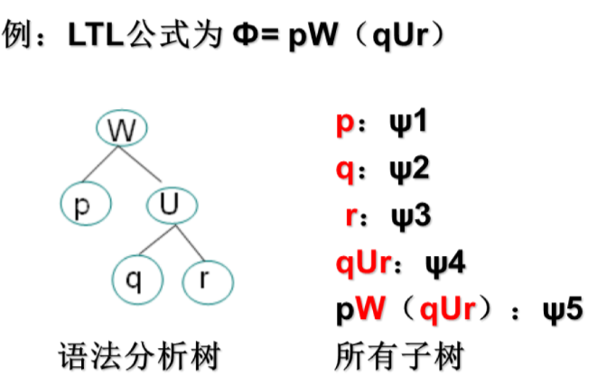

## 模型检测

### 前置知识

$ \vdash $ ：断定符（公式在L中可证）

#### 系统验证的分类

1. 基于模型和基于证明
   - 基于证明：系统描述为一组逻辑公式r，而规范是另一个公式 $ \Phi $ 通过找到 $ r \vdash \Phi   $的证明来验证系统
   - <u>基于模型</u>（笔记重点）：系统描述为模型M，规范是公式 $ \Phi  $,通过计算模型是否满足 $\Phi  $（ $M \models \Phi  $ ）来验证系统

2. 自动化的程度

3. 完全验证与性质验证

4. 预期应用领域

5. 开发前与开发后

   **注：之后所述的系统验证方法都是基于模型的、自动的、性质验证的处理方法**

#### 模型检测方法步骤   

- 使用模型检测器的描述性语言对系统进行建模，得到一个模型$M$

- 待证性质的规范利用一个时态逻辑公式 $\Phi  $ 来表示

- 以$M$和 $\Phi  $做输入进行模型检测

  ​	如果 $M \models \Phi  $ 则输出yes，否则输出no

#### 时态逻辑分类

- 线性时态逻辑LTL：时间是线性的逻辑
- 计算树逻辑CTL：时间形成分支的逻辑

### 线性时态逻辑

————Linear-time Temporal Logic，简称LTL

#### 语法

$\Phi $::=⊥∣⊤∣p∣( ¬$\Phi  $)∣( $\Phi  $∧$\Phi  $)∣($\Phi  $∨$\Phi  $)∣($\Phi  $→$\Phi  $)∣(X$\Phi  $)∣(F$\Phi  $)∣(G$\Phi  $)∣($\Phi  $U$\Phi  $)∣($\Phi  $W$\Phi  $)∣($\Phi  $R$\Phi  $)

##### 语义符号

- $\top$:表示永真(重言式) 	(不加约束）
- $\bot$:表示永假(矛盾式)  (所有约束)

##### 时态连接词

- X:表示下一个状态	(next)
- F:表示某未来状态（Future）
- G:表示所有未来状态 (Globally)
- U:表示直到(until) 
- R:表示释放(release)
- W:表示弱直到  (weak-until)
- p:表示某个原子集的命题原子(atoms)

总结: 	时态连接词 **X，F，G，U，R，W**

##### 语法分析树

LTL的公式 $\Phi  $ 的子公式的语法分析树是 $\Phi $ 的子树

##### 时态连接词的优先级

*目的：消除歧义性(二义性)*

- 约定最高级:小括号
- 1级：一元连接词 $\neg$，X，F，G(包括时态）
- 2级：二元连接词 U，R，W (时态)
- 3级：二元连接词 $\vee$，$\wedge$ 
- 4级：二元连接词 $\rightarrow$

#### LTL语义

##### 迁移系统

利用迁移系统来建模系统，迁移系统通过状态和迁移来建模。给出如下定义：

一个迁移系统$M=(S,\rightarrow,L)$

1）状态集合S	S={ $s_{0},s_{1},\cdots,s_{n}$}

2）带有迁移系统关系$\rightarrow$（S上的二元关系），使得每个$s\in S$有某个$s'\in S$，且满足 $s\rightarrow s'$

3）L为一个标记函数$L：S \rightarrow P(Atoms)$

​	L(s):在特定状态S下为真的原子集合；P(Atoms)表示Atoms的幂集

注：

- 迁移系统简称为模型 ，一个模型有状态集S，关系 → （描述的是系统如何从一个状态转向另一个状态），以及每个状态S伴随有原子命题的集合L(s)。

- 用有向图表示一个有限迁移系统 M 的所有信息，图的结点包含了在该状态下为真的所有原子命题。

  - 例如：

  - 在上述状态图中，状态r 是一个死锁状态，他的下一个状态永远只能是自身。一般死锁状态指的是状态集合中的死锁状态，常用 $ S_{d} $ 表示

##### 路径的概念

模型M = { S , → , L } 中的一条路径是S中状态的无限序列$s_{1},s_{2},s_{3}\dots$，对每个i ⩾ 1，都有$s_{i} \rightarrow s_{i+1}$。则我们可以将该路径写为 $\pi =s_{1} \to s_{2} \to s_{3} \to \dots $ 。我们用$\pi^i$表示从第i 个状态(即$s_{i}$)开始的后缀，比如$\pi^3=s_3\to s_4 \to \cdots$。

- 因此，我们可从给定状态s开始的所有可能计算路径可视化，将迁移系统展开为一个无限计算树。

  

在无限计算树中，模型M的执行路径被明确的表示出来。给出关于路径满足关系的定义

- 设$M=(S,\rightarrow,L)$是一个模型，$\pi =s_{1} \to s_{2} \to \dots $ 是M中的一条路径，路径 $\pi$与LTL公式满足关系定义如下：

- A： 

  - π ⊨ ⊤

  - π ⊭ ⊥  

- B:

  - $\pi \vDash p$当且仅当$p \in L(s_1)$

  - $\pi \vDash\neg\Phi  $ 当且仅当

  - $\pi \vDash \Phi _1 \wedge \Phi _2$当且仅当 $\pi \vDash \Phi _1$且 $\pi \vDash \Phi _2$

  - $\pi \vDash \Phi _1 \vee \Phi _2$当且仅当$\pi \vDash \Phi _1$或$\pi \vDash \Phi _2$

  - $\pi \vDash \Phi _1 \to \Phi _2$当且仅当只要$ \pi \vDash \Phi _1$就有$ \pi \vDash \Phi _2$

- C:
  
  - $ \pi \vDash X \Phi $当且仅当 $\pi^2 \vDash \Phi $
    > - $ \pi \vDash X \Phi $表示路径从第二个状态开始满足LTL公式$\Phi $
    > - $ \Phi $是原子集内的某个原子命题，也是一个LTL公式，在路径中也叫做状态；$ X \Phi $表示这个原子命题的下一个状态；$\pi^2$表示从路径π上的第二个状态开始的路径

  - $  \pi \vDash G \ \Phi $当且仅当对所有 $ i\geqslant 1,\pi^i \vDash \Phi$	（G为所有未来状态）

  - $ \pi \vDash F \ \Phi $当且仅存在某个$i\geqslant 1$使得, $\pi^i \vDash \Phi$（F某未来状态）

  - $\pi \vDash \Phi  \ U \psi$当且仅当存在某个$ i\geqslant 1$，使得$ \pi^i \vDash \psi$并且对所有$ j=1,\cdots,i-1$，有$ \pi^i\vDash \Phi $
    > - 
    > - 直到的意思为p成立直到q成立，p成立时q不成立，之后q成立时p不成立，且两者紧挨着
    
  - $\pi \vDash \Phi  \ W \psi$当且仅当存在某个$ i\geqslant 1$，使得$ \pi^i \vDash \psi$且对所有的$ j=1,\cdots,i-1$，有$\pi^i\vDash \Phi$，或者对所有$ k \geqslant 1$，有$\pi^k\vDash \Phi$
    > - 弱直到的意思为
    >   - 要么对所有的路径来说都满足$\Phi$
    >   - 要么先满足 $\Phi$ 之后再满足 $\psi$
    
  - $ \pi \vDash \Phi  \ R \ \psi$当且仅当或者存在某个$ i\geqslant 1$，使得$\pi^i \vDash \Phi$且对所有$j=1,\cdots,i$，有$ \pi^j\vDash \psi$；或者对所有$k \geqslant 1$，有$\pi^k\vDash \psi$
    
    - 释放R是直到的对偶
    
    > - 释放的意思是
    >   - 要么对所有的路径来说都满足 $\psi$
    >   - 要么满足 $\Phi$ 当且仅当释放 $ \psi$ 后（先满足 $\psi$之后再满足$\Phi$，可同时成立）
    

##### 语义等价

- 定义：设$\phi,\psi$是 LTL 公式, 若对于所有的模型 M 以及 M 中的所有的路π 都有π ⊨ ψ当且仅当 $\pi \vDash \psi$，则称 ϕ 与 ψ 是语义等价的, 记作ϕ ≡ ψ 
- 等价性质：
  - 对偶性：
    - $ \neg G \phi \equiv  F \neg \phi$ 	类比全称量词与存在量词
    - $\neg F \phi \equiv  G \neg \phi$
    - $ \neg X \phi \equiv \neg X \neg \phi$
    - $\neg (\phi U \psi) \equiv  (\neg \phi R \neg \psi)$
    - $ \neg (\phi R \psi) \equiv (\neg \phi U \neg \psi)$
  - 分配性：
    - $F(\phi \vee \psi) \equiv F \phi \vee F \psi$
    - $ G(\phi \wedge \psi) \equiv F \phi \wedge F \psi$
- 连接词相互定义
  - $ \phi \equiv \top U \phi$
  - $ \phi \equiv \bot R \phi$
  - $ \phi U \psi \equiv \phi W \psi \wedge F \psi $
  - $\phi W \psi \equiv \phi U \psi \vee G \phi $
  - $\phi W \psi \equiv \psi R (\phi \vee \psi)$
  - $ \phi R \psi \equiv \psi W ( \phi \wedge \psi) $
    > -  X (下一个)与其他联结词完全正交，不能用其他联结词来代替
    > -  LTL最小联结词集合为{U|R|W，  X}

### 模型检测  

#### 互斥

定义：指在同一时刻不能有两个用户使用一个资源，互斥的结果是死锁。

### 分支时间逻辑

————也称计算树逻辑，Computing Tree Logic,简称为CTL

#### 语法

$\Phi$:：= ⊥∣⊤∣p∣( ¬$\Phi  $)∣( $\Phi  $∧$\Phi  $)∣($\Phi  $∨$\Phi  $)∣($\Phi  $→$\Phi  $)∣(AX$\Phi  $)∣(EX$\Phi  $)∣(AF$\Phi  $)∣(EF$\Phi  $)∣(AG$\Phi  $)∣(EG$\Phi  $)∣A[$\Phi  $U$\Phi  $]|E[$\Phi  $U$\Phi  $]

其中:F:某未来，X:下个， G:所有未来U：直到，A：所有路径，E:存在一条路径

##### 语义符号

- $\top$:表示永真(重言式) 	(不加约束）
- $\bot$:表示永假(矛盾式)  (所有约束)

##### 时态连接词

- A：所有路径（无一例外）
- E:存在一条路径

- X:表示下一个状态	(next)
- F:表示某未来状态（Future）
- G:表示所有未来状态 (Globally)
- U:表示直到(until) 
- p:表示某个原子集的命题原子(atoms)

注：

1. CTL时态联结词都是成对出现的（一对符号），一般以A|E开头
2. CTL中不含LTL中的W（弱直到）和R（释放）

##### 时态联结词的优先级

- 一元联结词$\neg$和时态联结词AG，EG，AF，EF，AX，EX
- $\vee$，$\wedge$ 
-  $\rightarrow $，AU，EU

##### 语法分析树

#### CTL语义

- AX：所有下个状态
- EX：在某个下个状态
- AG：对所有以s开始的计算路径，包含路径的初始状态s，性质$\phi$全局成立
- EG：存在一条以s开始的计算路径，使得沿着该路径，$\phi$全局成立
- AF：对所有以s开始的计算路径，存在某个未来状态使$\phi$成立
- EF：存在一条以s开始的计算路径，使得$\phi$在某个未来状态存在
- $s \vDash A[\phi_1  U\phi_2  ]$ 对所有满足$s_1 = s$ 的路径，该路径满足$\phi_1  U\phi_2 $   
  - $s_1 $为初始状态
  - U为直到含义
  - 
- $s \vDash E[\phi_1  U\phi_2  ]$ 存在一条从s开始的计算路径，满足$\phi_1$ ，直到$\phi_2 $ 在其上成立   
  - 

##### 语义等价

- 对偶公式

  - A与E对偶，G与F对偶

  - $\neg AF \phi \equiv EG \neg \phi $

  - $\neg EF \phi \equiv AG \neg \phi $

  - $\neg AX \phi \equiv EX \neg \phi $

  - $AF \phi \equiv A[\top U \phi] $

  - $EF \phi \equiv E[\top U \phi] $

- 联结词的适当集

  - {AX，EX} 其中之一
  - {EG，AF，AU} 其中之一
  - EU
- 常用的等价公式
  - $AG \phi \equiv \phi \wedge AX \ AG \phi$
  - $EG \phi \equiv \phi \wedge EX \ EG \phi$
  - $AF \phi \equiv \phi \vee AX \ AF \phi$
  - $EF \phi \equiv \phi \vee EX \ EF \phi$ 
  - $A[\phi U \psi]= \psi \vee (\phi \wedge AX \ A[\phi U \psi])$ 
  - $E[\phi U \psi]= \psi \vee (\phi \wedge EX \ E[\phi U \psi])$ 
### CTL*与CTL和LTL的表达能力

#### LTL与CTL的直观比较

1. CTL比LTL强的一面:**允许对路径使用量词**
2. LTL比CTL强的一面
   - LTL可以用公式描述在所有路径上选择一个范围
   - Fp→Fq:每条有p的路径，随后也有q 
   - 在CTL中，由于每个F必须有一个前束的A或E，不能表达“每条有p的路径，随后也有q”
   - AF p→AF q和AG(p→AF q)含义都与之不同

注：三者含义辨析

1. Fp→Fq:

   这个表达式可以被解释为：如果在未来的某个时刻p成立，则在未来的某个时刻q也成立。

2. AF p→AF q:

   在这个表达式中，A和F分别代表了"所有"（All）和"未来"（Future）。所以，这个表达式可以被解释为：在所有可能的未来情况下，如果p成立，则q也成立。

3. AG(p→AF q):

   这个表达式可以被解释为：在所有可能的全局情况下，如果p成立，则q将在未来的某个时刻成立。

- 这三个表达式之间的主要区别在于**它们涵盖的范围和时刻**。第一个表达式只是简单地表述了p和q之间在未来某个时刻的关系，而没有涵盖所有可能的情况。第二个表达式扩展了这种关系到所有可能的未来情况。而第三个表达式进一步扩展了这种关系，不仅包括了所有可能的未来情况，还包括了所有可能的全局情况。

#### CTL*

对LTL与CTL表达能力合并成一个称为CTL*一种逻辑, (称为CTL乘或CTL加强)

CTL的构造方式为:

1. 将LTL与CTL合并
2. 除去CTL对每个时态算子(X,U,F,G)  与A,E伴随使用这种约束
3. 即：不规定必须使用AX, AU，EU等

#### 语法

1. 状态公式
   - $ \phi ::= \top|p|(\neg \phi)|(\phi \wedge \phi)|A[\alpha]|E[\alpha]$
     - $\phi$ 为CTL*公式
     - $\alpha$ 为任意路径公式
     - p为任意原子公式
2. 路径公式（沿路径赋值）
   - $\alpha ::= \phi|(\neg \alpha)|(\alpha \wedge \alpha)|(\alpha U\alpha)|G(\alpha)|F(\alpha)|X(\alpha)$
     - $\phi $ 为任何状态公式

注：

LTL公式$\alpha $ 等价于CTL公式A[$\alpha$] 	=>  LTL 是CTL*的子集 

CTL是CTL*的子集

三者关系：

### 模型检测算法

略

## 参考资料（😶‍🌫️）

1. [面向计算机的数理逻辑/软件理论基础笔记](https://blog.csdn.net/qq_37400312/article/details/110388241)
1. [时序逻辑之线性时序逻辑（LTL）和分支时序逻辑（CTL）对比及典型示例](https://blog.csdn.net/yuniruchujian/article/details/106213848)