## 算法设计与分析

### 1. 算法基础

解题过程：

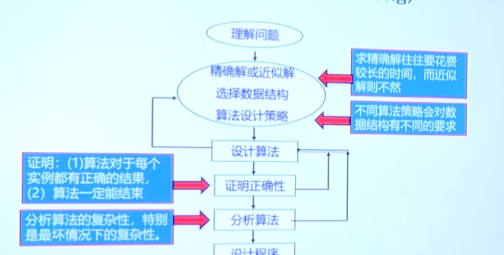

**算法的复杂性分析**


<u>不同的时间复杂性</u> 


#### 算法时间复杂性的分类


#### 算法复杂性在渐进意义下的阶

渐进意义下的记号：$O,\Omega,\Theta,o,w$

g(n)是定义在正数集上的正函数，T(n)为算法的时间复杂性，n是数据规模

注意：T(n) 与 n 有关，意味着是一个函数集合，指代算法在任意时刻的复杂性

- 渐进上界记号$O$
  - 若 $T(n) = O(g(n))$
  - 算法在任何实例情况下，其时间复杂度的阶不高于g(n)的阶($\le g(n)$)
- 渐进下界符号$\Omega$
  - $T(n) = \Omega(g(n))$
  - 算法在任何实例情况下，其时间复杂度的阶不低于g(n)的阶($\ge g(n)$)
- 渐进的界 $\Theta$
  - $T(n)的上界为g(n),下界也为g(n)，则有T(n) = \Theta(g(n))$
- 非紧渐进上界记号 $o$
  - 若 $T(n) = o(g(n))$
  - 算法在任何实例情况下，其时间复杂度的阶小于g(n)的阶($<g(n)$)
- 非紧渐进上界记号 $w$
  - $T(n) = w(g(n))$
  - 算法在任何实例情况下，其时间复杂度的阶大于g(n)的阶($> g(n)$)

<u>常见的复杂性函数</u>

C  $\log n$  $\log ^{2} n$  n  $n \log n$  $n^{2}$  $n^{3}$ $2^{n}$  n!

<u>递归算法的时间复杂性分析</u>

1. 递推方法

   

2. 主定理

   - 主定理 (Master Theorem) 设 $\mathrm{a} \geq 1, \mathrm{~b}>1$  为常数,  f(n)  为函数,T(n) 为非负整数, 且  T(n)=aT(n / b)+f(n)则有以下结果:
   - 根据$n^{\log_{b}a}和f(n)的阶的关系(> ,= ,<)$，确定使用下列规则 
   - $若 f(n)=O\left(n^{\log_{b} a-\varepsilon}\right), \varepsilon>0 , 那么T(n)=\Theta\left(n^{\log_{b} a}\right) \\$
   - $若 f(n)=\Theta\left(n^{\log _{b} a}\right) , 那么T(n)=\Theta\left(n^{\log_{b} a} \log n\right) \\$
   - $若  f(n)=\Omega\left(n^{\log_{b} a+\varepsilon}\right),\varepsilon>0,且对于常数 c<1 和所有充分大的n有a f(n / b) \leq c f(n) , 那么T(n)=\Theta(f(n))$

3. 递归树

   - 递归树是迭代计算模型
   - 递归树的生成过程与迭代过程一致
   - 根据递归定义不断拓展递归树，直到边界条件
   - 对递归树产生的所有项求和就是递归方程的解

递归树步骤：

```
通过递归树的方法求解T(n)=2T(n/2)+cn
1. 将T(n)看作一个节点
2. 将每个节点按照T(n)方式展开
3. 由图可知，递归树总共有logn 层，对每层所有节点的复杂度累加，得出每层的复杂度为cn，叶子层的复杂度为nT(1) = nc'。所以总的复杂度为nlogn
```

<figure class = "half">
    
    
</figure>
#### 递归之几种特殊形式的复杂度

1. $T(n)=T(\alpha n)+T(\beta n)+cn $ 的复杂度,其中$\alpha + \beta  = 1,\alpha \le \beta$ 
   - $最短路径 \log_{\frac{1}{\alpha}}n => \Omega(cn \times \log_{\frac{1}{\alpha}}n ) \quad 最长路径 \log_{\frac{1}{\beta}}n => O(cn \times \log_{\frac{1}{\beta}}n ) \quad \therefore T(n) = \Theta(n \log n)$


   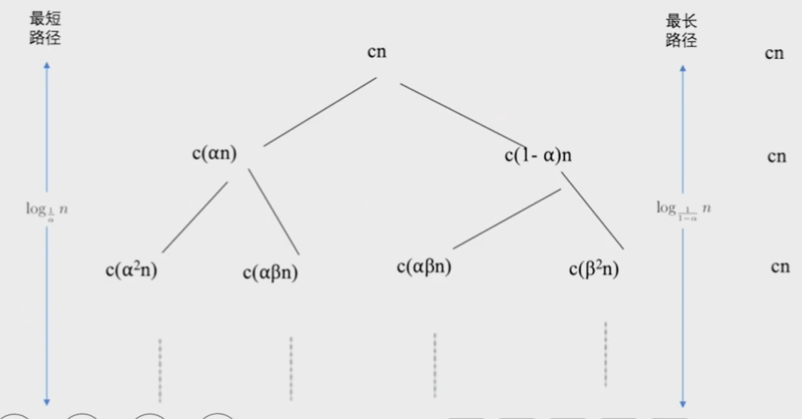

2. $T(n)=T(\alpha n)+T(\beta n)+cn $ 的复杂度,其中 $ \alpha + \beta  < 1,\alpha \le \beta$ 

   - 对于第i层来说层的复杂度为 $(\alpha + \beta)^i \times cn$ 

   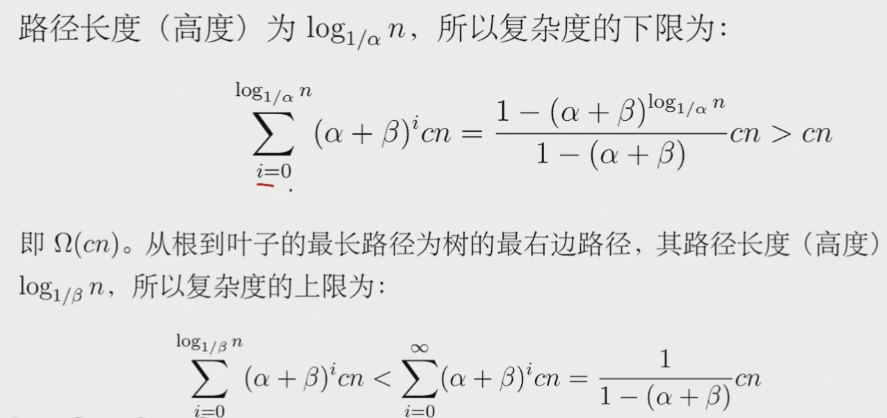

3. $T(n) = T(n- k) + T(k) + cn$ 的期望复杂度

   - 当k = n/2 时，原式子变为T(n) = 2T(n/2) + cn ,复杂度为 $n\log n$ ，所以说在此公式的求和项中，貌似每一项都是 $\Theta(n^2)$ ，所以可能会误解期望值为 $\Theta(n^2)$ 

   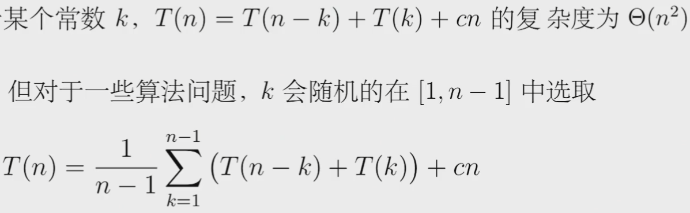

   - 结果为$O(n \log n)$  有点复杂，<a href="#click_me_jump">按下不表,👻</a>

**辨析**：1. $T(n)=T(\alpha n)+T(\beta n)+cn $      2. $T(n) = T(n- k) + T(k) + cn$

- 两者都是对于n的划分，1）为按比例划分，2）为按照常数划分

### 2. 分治与递归

#### 分治的基本方法

**分治的思想**

规模比较大的问题分解成较小的问题，较小的问题再解决成更小的问题，直到容易解决为止

- 对较小问题的解决，是继续分解 -- 递归方程
- 直到容易解决为止（通常为1个元素）-- 边界条件

**分治的步骤**

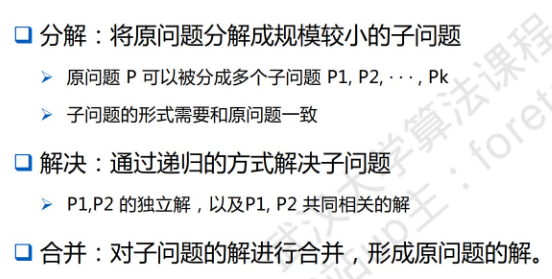

**分治的条件**

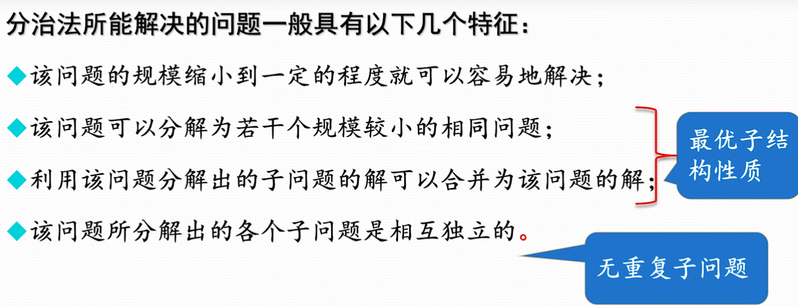

 分治法：将一个问题分成大致相等的k个子问题，算法最有效（平衡思想）

**分治的复杂度**

分治法将规模为n的问题分成k个规模为n/m的子问题去解。

(1)设分解阈值n=1且adhoc解规模为1的问题耗费1个单位时间。

(2)设将原问题分解为k个子问题以及用merge将k个子问题的解 合并为原问题的解需用f(n) 个单位时间。

(3)用T(n)表示分治法解规模为|P|=n的问题所需的计算时间。
$$
T(n) = 
\left\{\begin{matrix}
 O(1) & n =1\\
 kT(\frac{n}m)+ f(n) & n>1
\end{matrix}\right.
$$

#### 递归

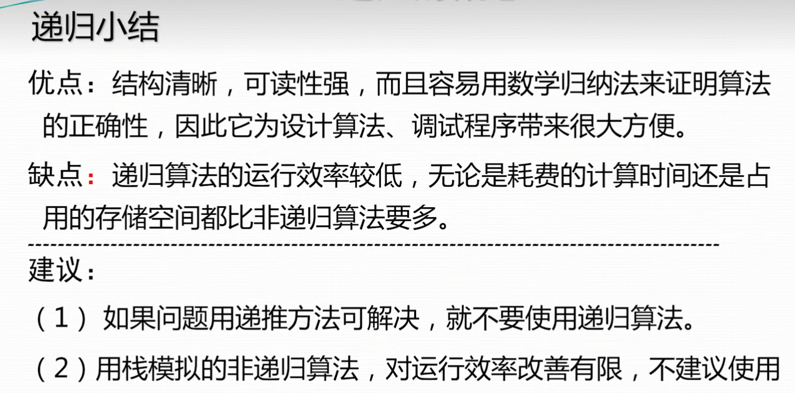

#### 快速排序

*基本步骤*
・<u>分解</u>：选择一个主元素k从将原数组分解成为两个子数组，小于主元素的所有元素组成了一个子数组，大于主元素的所有元素组成了另外一个子数组，

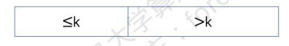

・解决：对子数组进行递归调用解决；

・合并：通过上述步骤，已经完成对原数组的排序，无需合并操作。

*分解与算法*

让i指向小于等于主元素部分的最后一个元素，j指向大于主元素部分的最后一个元素

<figure class = "half">
    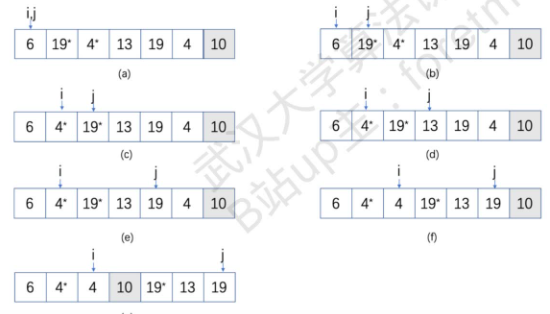
    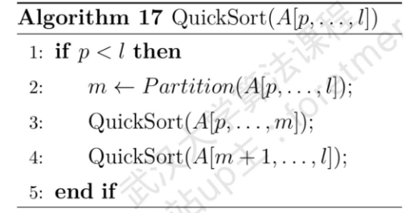
</figure>

​    *复杂度分析*

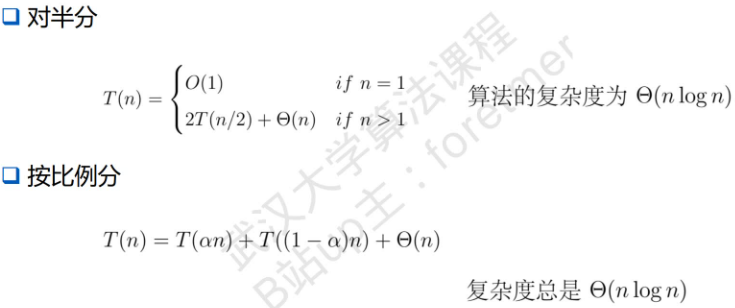

#### 最大子数组问题

**定义**：给定一个数组，找出此数组所有子数组中和最大的子数组，即为最大子数组问题

eg: A = {6,-9,7,-2,9,-5} ,易得A[3,5] = {7,-2,9}的和为14，是A的最大的子数组

**解题步骤**：

- 分解：

  -  对原数组进行二分，也就是将数组划分为左右相等（或者相差一个元素）的两个子数组。

- 解决：
  -  不同于前面两个例子，只需要解决子问题即可。这里对两个子问题进行递归调用得出的解分别是左边子数组的最大子数组（设为 $Sub_{l}^{Max}$ ）和右边子数组 的最大子数组（设为$Sub_{r}^{Max}$），但原问题的最大子数组还可能出现在横跨两个子数组上（设为$Sub_{m}^{Max}$）
- 合并：
  - 合并步骤相对简单，只要求3个解的最大值即可，即 $max \left \{Sub_{l}^{Max},Sub_{r}^{Max},Sub_{m}^{Max} \right \}$

**横跨在两个子问题上的最大子数组**

- 只要依次遍历左右数组的所有子数组,即可找到横跨在两个子问题上的最大子数组
- 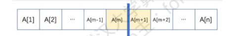
- 我的理解：从中间向两端遍历，如从A[m]向左遍历含有A[m]的最大子数组，共n/2次；从A[m+1]向右遍历含有A[m+1]的最大子数组，也为n/2次.最后合并左右最大子数组，**复杂度为 $\Theta(n)$** 

$ =>  T(n) = 2T(n/2) + cn => T(n) = \Theta(n \log n)$ 

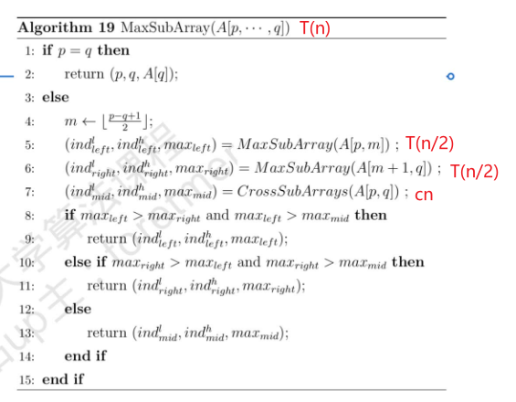

#### 寻找第k小元素

**定义**：给定一个无序数组 $S = [s_1,s_1,\cdots,s_{n-1},s_n]$ ，要求输出这个数组的第k小元素，也就是从小到大排序后的第k个元素。

**解题方法**：

1. 一种简单的方法是先将数组S排序，再输出第k个元素即可，但这种方法取决于排序的复杂度，而比较排序最优的复杂度为 $\Theta(nlogn)$ ,所以这种方法复杂度为$\Theta(nlogn)$ 
2. 利用分治，当我们将数组分为两半时，显然可以判断得出第k小元素在数组左侧还是右侧，因此可以省略另一半的遍历排序，复杂度为 $\Theta(n)$
   - 分治的基本策略是将原数组分成两个子问题，然后递归的解决这两个子问 题，但显然，这样做并不能降算法的复杂度，我们想到二分搜索之所以能降低复杂度，是因为再递归的过程中，每次都舍弃一个子问题。这里我们也采取相同的策略, 将两个子问题舍弃一个，而递归的解决剩余的一个子问题。

**一些问题：**

1. 如何将原数组分成两个子问题
   - 寻找一个中间元素
2. 如何找到这个处于中间位置的元素m
   - 将 n 个元素划分成 m 个组（通常是每组5个元素），取每组的中间元素，再取这些中间元素的中间元素
3. 怎么找到中间元素的中间元素
   -  递归调用
4. 哪个子问题需要被舍弃
   - 元素分成3组，小于m ,等于m ,和大于m ,找到相应的组，舍弃其他组
   - 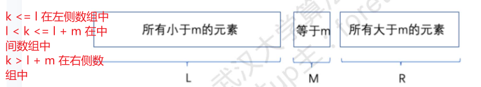

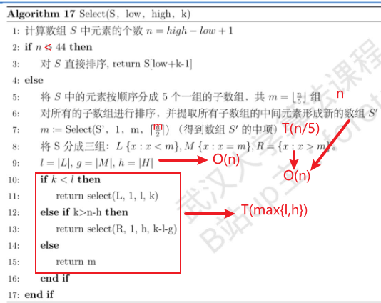


**复杂度的计算**

由上图可知，复杂度的计算需要*考虑T(max{l,h})*的取值，同时*为何n < 44时直接排序*。

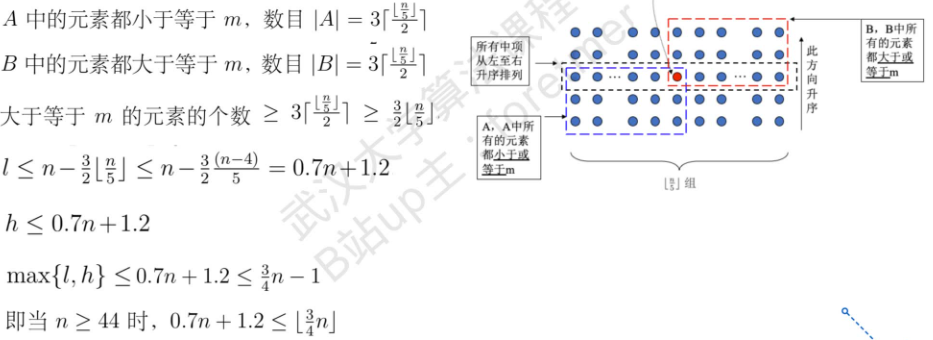

根据上述推导可知，n $\ge$ 44 时，$max \left \{l,h \right \} \le [\frac{3}{4}n] $ ,

故，T(max{l,h}) $\le$ [$\frac34 n$] .

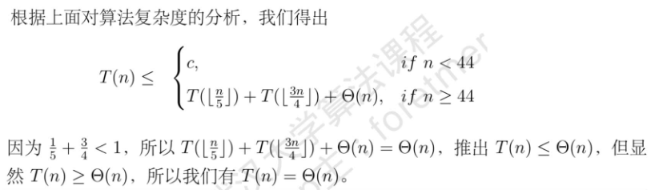

注：当 $\beta$ =  T(max{l,h}) < [$\frac45 n$] 时，才有T(n) $\le$ T([$\frac15 n$]) + T($\beta n$) + $\Theta(n)$ $\le$   $\Theta(n)$,如此才能保证算法复杂度符合要求

**算法的改'进'**

在上述代码中，重要的部分为找到中间元素的中间元素，如果我们将数组S中所有元素求均值，以此划分数组，这种方式较简单并且代码实现更加简洁但复杂度会有变化

以均值获取中间元素：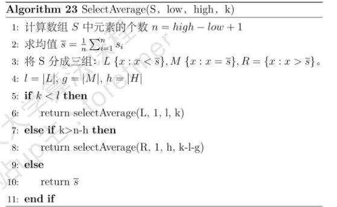

 当数据是按比例划分时,如  $|L|=\alpha,|H|=1-\alpha, 0<\alpha<1$ , 则复杂度$T(n)=O(n)$，递归式为:

$$
\begin{array}{c} 
T(n) \leq\left\{\begin{array}{l}
1, & \text { if } n=1 \\
T(\alpha n)+\Theta(n), & \text { if } n \neq 1 \text { and } 0.5 \leq \alpha<1 \\
T((1-\alpha) n)+\Theta(n), & \text { if } n \neq 1 \text { and } 0<\alpha<0.5
\end{array}\right. \\
\end{array}
$$
 但在某些情况下, 数据非常不均匀, 在极端的情况下  $|L|=n-1 \quad|H|=1 ，T(n)=O\left(n^{2}\right) $，递归式为
$$
\begin{array}{ll}
T(n) \leq\left\{\begin{array}{l}
1, & \text { if } n=1 \\
T(n-1)+\Theta(n), & \text { if } n \neq 1
\end{array}\right. \\
\end{array}
$$

#### 二分查找

非递减序的n个元素a［0：n-1］，现要在这n个元素中找出一特定元素x。

- 复杂性O(logn)

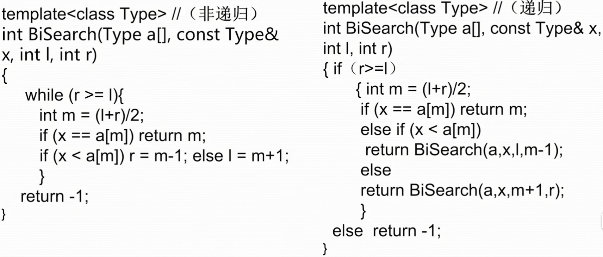

#### 快速幂算法

给定实数a和非负整数n，用分治法设计求 $a^n$ 的快速算法（递归算法）

- 递归算法时间复杂性O(logn)


- 非递归算法时间复杂度O(log n)

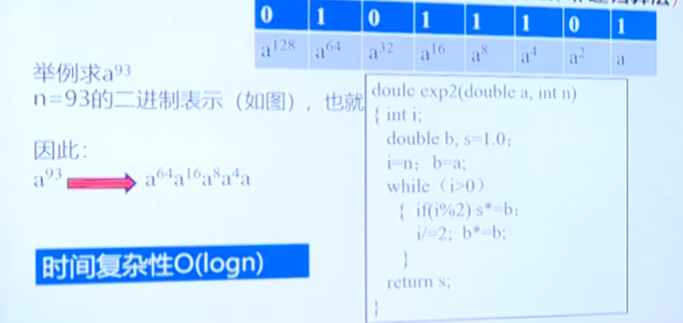

#### Strassen矩阵乘法

- 分成8个部分的乘积进行计算
  - 时间复杂性为$O(n^3)$
  
  - $$
    T(n) = \left\{\begin{matrix}
     O(1) & n=2\\
     8T(\frac{n}2) + O(n^2) & n > 2 
    \end{matrix}\right.
    $$

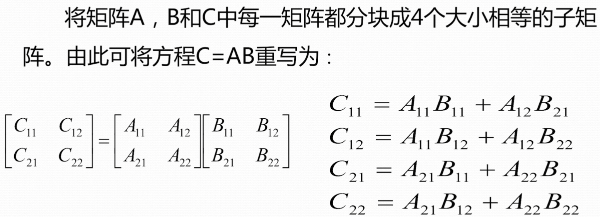

- 分成7个部分的乘积进行计算

  - $T(n)=O(nlog7)=O(n^2.81)$ 

  - $$
    T(n) = \left\{\begin{matrix}
     O(1) & n=2\\
     7T(\frac{n}2) + O(n^2) & n > 2 
    \end{matrix}\right.
    $$

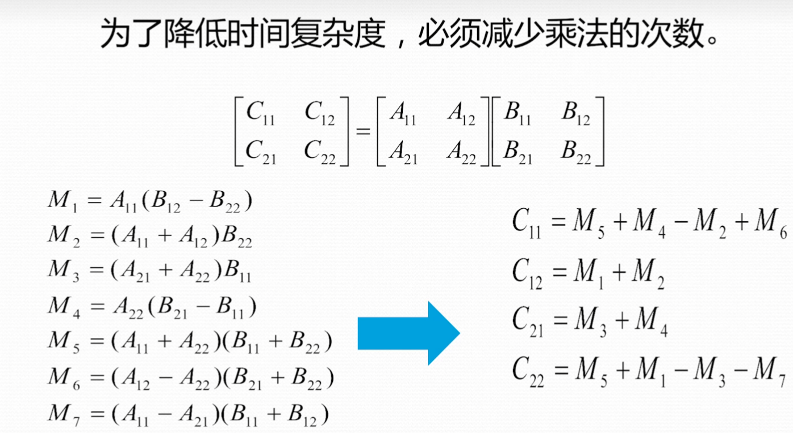

#### 棋盘覆盖问题

在一个 $2^k \times 2^k$ 个方格组成的棋盘中，恰有一个方格与其他方格不同称该方格为——特殊方格，且称该棋盘为一特殊棋盘.在棋盘覆盖问题中，要用图示的4种不同形态的L型骨牌覆盖给定的特殊棋盘上除特殊方格以外的所有方格，且任何2个L型骨牌不得重复覆盖.

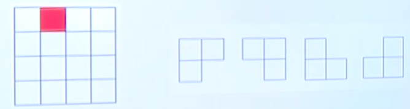

我们将棋盘均分成四份后，发现有一个部分有特殊格子，其他三部分并没有，因此无法直接使用分治思想解决问题。为了将这3个五特殊格子的子棋盘转化为他特殊棋盘，我们用一个L形骨牌在靠近中心的位置覆盖这3个较小棋盘的汇合处，将其视作特殊格子。因此，原问题就转化为4个子棋盘覆盖问题。

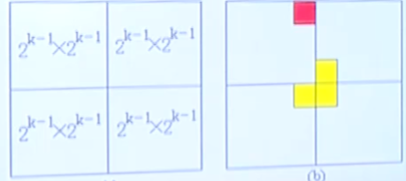

**代码实现**

```
if size ≤ 2 then
        选择合适的 L 骨牌填充，return;/* 按照 spcx 和 spcy 判断特殊格子的位置 */
end if
size ← size/2;
k←k+1;/*第k个骨牌*/
for (i,j) ∈ {(−1,−1),(0,−1),(−1,0),(0,0)} do /* 从上到下从左到右遍历 4 个子问题 */
    if 特殊格子在此子问题中 then/* 按照 spcx 和 spcy 判断特殊格子的位置 */ 
          ChessBoard(topx + size + i ∗ size, topy + size + j ∗ size, spcx, spcy, size);
    else
          Domino【topx + size + i, topy + size + j】 ← k;
          ChessBoard(topx +size+i∗size,topy +size+j∗size,topx +size+i,topy +size+ j, size);
    end if 
end for
```

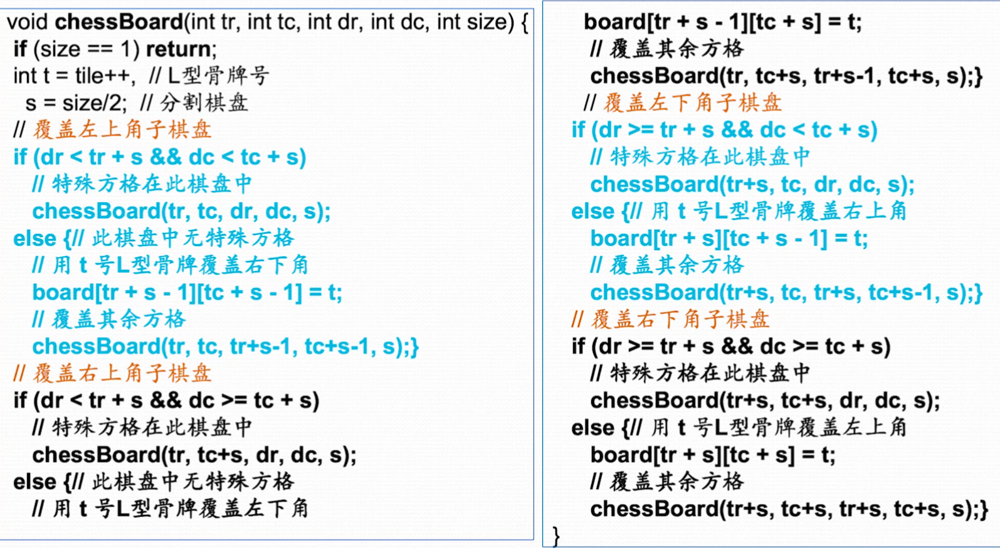

**时间复杂性**
$$
T(n) = \left\{\begin{matrix}
 O(1) ,& n=1\\
 4T(\frac{n}2) + O(1), & n > 1
\end{matrix}\right.
$$
$=> T(n) = O(n^2)$ 

<u>非递归算法：栈实现</u>

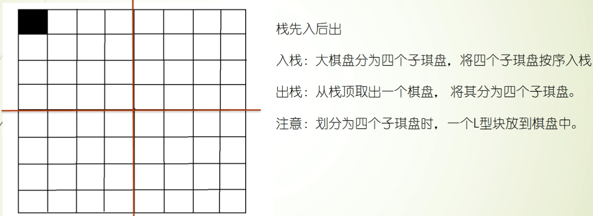

<u>非递归算法：队列实现</u>

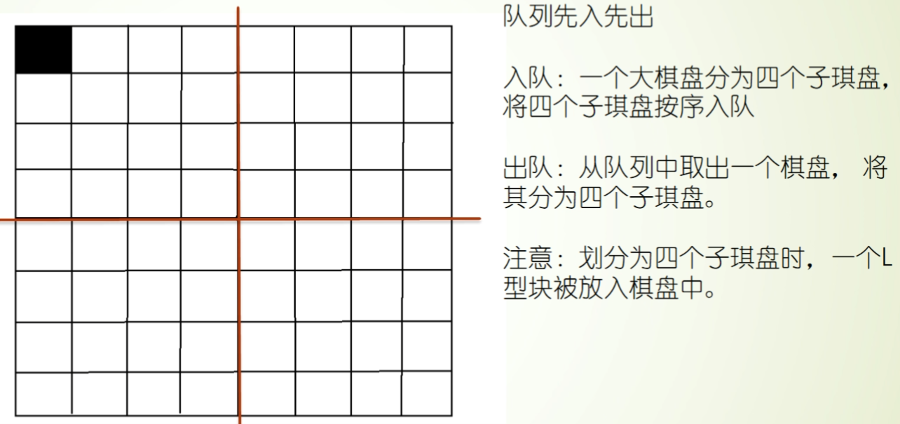

**注：** 

 * 非递归算法只需要掌握L形骨牌的覆盖顺序，可以在棋盘中正确填写编号即可。

 * （1）三种算法的覆盖图案不同

   （2）如果原始图中的已覆盖方格位置不同，导致覆盖图案也不同

   （3）如果四个子问题的处理顺序不同，覆盖方案也不同

   （4）这三种算法的效率比较：栈运行时间最短，队列运行时间最长

### 3. 迭代法


***

<span name = "click_me_jump">按常数划分T(n)的期望复杂度</span>

$T(n)=\frac{1}{n-1} \sum_{k =1}^{n-1}(T(n-k)+T(k)) + cn$ 

$ \; \qquad = \frac{1}{n-1} \left \{ T(n-1) + T(1) + T(n-2) +T(2)+ \cdots+ T(1)+T(n-1)\right \} +cn $

 $=> T(n) = \frac {2}{n-1} \sum _ {k=1}^ {n-1} +cn$

T(n)= $ \frac {2}{n-1} $ $ \sum _ {k=1}^ {n-1} $ T(k)+cn ,另S(n)= $ \sum _ {k=1}^ {n} $ T(k),上式化为:

T(n) = S(n) - S(n-1)   = $ \frac {2}{n-1} $ S(n-1) + cn

​					 			$ \Rightarrow $ S(n)= $ \frac {n+1}{n-1} $ S(n-1) + cn

​				     			$ \Rightarrow $ $ \frac {S(n)}{n(n+1)} $ = $ \frac {S(n-1)}{(n-1)n} $ + $ \frac {c}{n+1} $ 两边除以n(n+1)

另R(n)= $ \frac {S(n)}{n(n+1)} $ ,上式化为:   R(n) = R(n-1) + $\frac{c}{n+1}$

对上式进行展开: R(n)=c ( $ \frac {1}{3}  +  \frac {1}{4}  + \cdots+\frac {1}{n+1} $ ) $ \Rightarrow $ R(n) = c ( $ H_ {n+1} $ - $ \frac {3}{2} $ ) ,另调和级数 $ H_ {n} $ = $ \frac {1}{1} $ + $ \frac {1}{2} $ + $ \cdots $ + $ \frac {1}{n} $ 

所以,  $S(n)=n(n+1)R(n)=cn(n+1)(  H_ {n+1}  -  \frac {3}{2}  )$

可得T(n): 

T(n)=S(n)-S(n-1)=cn(  (n+1) $ H_ {n+1} $ -(n-1) $ H_ {n} $ -3)  )

=cn( $H_{n+1} + H_{n} + n(H_{n+1} - H_{n}) - 3$ )

= cn( $ \frac {n}{n+1} $ + $ H_ {n+1} $ + $ H_ {n} $ -3)

= cn( $ \frac {n}{n+1} $ + $ \frac {1}{n+1} $ + $ 2H_ {n} $ -3)

= 2cn( $ 1H_ {n} $ -1)

=O($n \log n$ ) 因为 $ H_ {n} $ =O( $ \log n $ )

所以,T(n)=T(n-k)+T(k)+cn的期望复杂度为O(n $ \log $ n)。

***


