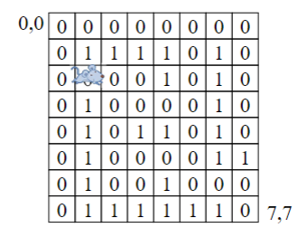

## 算法设计与分析 

（二级标题中带有 `*` 符号的章节是我们学校讲的）

------

### 1. 算法基础

解题过程：


**算法的复杂性分析**


<u>不同的时间复杂性</u> 


#### 算法时间复杂性的分类


#### 算法复杂性在渐进意义下的阶

渐进意义下的记号：$O,\Omega,\Theta,o,w$

g(n)是定义在正数集上的正函数，T(n)为算法的时间复杂性，n是数据规模

注意：T(n) 与 n 有关，意味着是一个函数集合，指代算法在任意时刻的复杂性

- 渐进上界记号$O$
  - 若 $T(n) = O(g(n))$
  - 算法在任何实例情况下，其时间复杂度的阶不高于g(n)的阶($\le g(n)$)
- 渐进下界符号$\Omega$
  - $T(n) = \Omega(g(n))$
  - 算法在任何实例情况下，其时间复杂度的阶不低于g(n)的阶($\ge g(n)$)
- 渐进的界 $\Theta$
  - $T(n)的上界为g(n),下界也为g(n)，则有T(n) = \Theta(g(n))$
- 非紧渐进上界记号 $o$
  - 若 $T(n) = o(g(n))$
  - 算法在任何实例情况下，其时间复杂度的阶小于g(n)的阶($<g(n)$)
- 非紧渐进上界记号 $w$
  - $T(n) = w(g(n))$
  - 算法在任何实例情况下，其时间复杂度的阶大于g(n)的阶($> g(n)$)

<u>常见的复杂性函数</u>

C  $\log n$  $\log ^{2} n$  n  $n \log n$  $n^{2}$  $n^{3}$ $2^{n}$  n!

<u>递归算法的时间复杂性分析</u>

1. 递推方法

   

2. 主定理

   - 主定理 (Master Theorem) 设 $\mathrm{a} \geq 1, \mathrm{~b}>1$  为常数,  f(n)  为函数,T(n) 为非负整数, 且  T(n)=aT(n / b)+f(n)则有以下结果:
   - 根据$n^{\log_{b}a}和f(n)的阶的关系(> ,= ,<)$，确定使用下列规则 
   - $若 f(n)=O\left(n^{\log_{b} a-\varepsilon}\right), \varepsilon>0 , 那么T(n)=\Theta\left(n^{\log_{b} a}\right) \\$
   - $若 f(n)=\Theta\left(n^{\log _{b} a}\right) , 那么T(n)=\Theta\left(n^{\log_{b} a} \log n\right) \\$
   - $若  f(n)=\Omega\left(n^{\log_{b} a+\varepsilon}\right),\varepsilon>0,且对于常数 c<1 和所有充分大的n有a f(n / b) \leq c f(n) , 那么T(n)=\Theta(f(n))$

3. 递归树

   - 递归树是迭代计算模型
   - 递归树的生成过程与迭代过程一致
   - 根据递归定义不断拓展递归树，直到边界条件
   - 对递归树产生的所有项求和就是递归方程的解

递归树步骤：

```
通过递归树的方法求解T(n)=2T(n/2)+cn
1. 将T(n)看作一个节点
2. 将每个节点按照T(n)方式展开
3. 由图可知，递归树总共有logn 层，对每层所有节点的复杂度累加，得出每层的复杂度为cn，叶子层的复杂度为nT(1) = nc'。所以总的复杂度为nlogn
```

<figure class = "half">
    
    
</figure>
#### 递归之几种特殊形式的复杂度

1. $T(n)=T(\alpha n)+T(\beta n)+cn $ 的复杂度,其中$\alpha + \beta  = 1,\alpha \le \beta$ 
   - $最短路径 \log_{\frac{1}{\alpha}}n => \Omega(cn \times \log_{\frac{1}{\alpha}}n ) \quad 最长路径 \log_{\frac{1}{\beta}}n => O(cn \times \log_{\frac{1}{\beta}}n ) \quad \therefore T(n) = \Theta(n \log n)$


   

2. $T(n)=T(\alpha n)+T(\beta n)+cn $ 的复杂度,其中 $ \alpha + \beta  < 1,\alpha \le \beta$ 

   - 对于第i层来说层的复杂度为 $(\alpha + \beta)^i \times cn$ 

   

3. $T(n) = T(n- k) + T(k) + cn$ 的期望复杂度

   - 当k = n/2 时，原式子变为T(n) = 2T(n/2) + cn ,复杂度为 $n\log n$ ，所以说在此公式的求和项中，貌似每一项都是 $\Theta(n^2)$ ，所以可能会误解期望值为 $\Theta(n^2)$ 

   

   - 结果为$O(n \log n)$  有点复杂，<a href="#click_me_jump">按下不表,👻</a>

**辨析**：1. $T(n)=T(\alpha n)+T(\beta n)+cn $      2. $T(n) = T(n- k) + T(k) + cn$

- 两者都是对于n的划分，1）为按比例划分，2）为按照常数划分

### 2. 迭代法 *

#### 简单迭代计算

*迭代*：是一种不断用变量的旧值递推新值的过程

ps：简单迭代例如杨辉三角与内存移动问题，这里仅介绍内存移动问题加上高精度问题

1.问题描述

数组中有n个数据，要将它们顺序循环向后移k位，即前面的元素向后(右)移k位，后面的元素则循环向前移k位，例：0、1、2、3、4、5循环移3位后为：3、4、5、0、1、2。考虑到n会很大，不允许用2*n及以上个空间来完成此题

2.问题分析

$x_i = (i + k) \mod n$ ，其中 $x_i$ 为下标为i的元素需要移动到的位置

若n=5，k=3时，0、1、2、3、4 移动3位后为2、3、4、0、1，一轮移动恰好完任务（0→3→1→4→2→0）。

若n=6，k=3时，0、1、2、3、4、5移动3位后为3、4、5、0、1、2，用三轮移动完任务（0→3→0，1→4→1，2→5→2）

所以问题的关键是我们如何知道移动结束，因此我们需要寻找到移动的轮数问题以及每轮移动的元素数量

- 移动的轮数：n和k的最大公约数Q
- 每轮移动的元素数量：n/Q 

```
设数列中元素个数为n，向右移动次数为k，位置编号为0，1，2，．．．，i，．．．，n—1。则计算位置：
Loc1：x1＝（x0＋k）mod n，设商为y0，x1＝k＋x0 -n＊y0 ；
Loc2：x2＝（x1＋k）mod n，设商为y1，x2＝2＊k＋x0 -n＊（y0＋y1）；
按上述规律，可得下式：
xi=(i*k+x0-n*(y0+y1+...+yi)) mod n  
其中n*(y0+y1+...+yi)的值mod n必为0，由上式得 xi ＝（x0＋i＊k）mod n 
设第i次连续移动后，回到初始位置，则有必有xi=(x0 + i*k) mod n = x0 
	由于有可能一次移动无法移动完成，可能需要多轮
设第p轮连续移动的起始位置为xp，则有：xi = (xp+i*k) mod n= xp
必有：i＊k mod n＝0 成立 => 意为在这一轮移动中，共移动i个元素，也移动了i次
因有：i＊k mod n＝0 成立 可设：i＊k／n ＝ y => i＊k ＝ n＊y
设k与n的最大公约数Q，可设k＝a＊Q，n＝b＊Q，可得k／n＝y／i＝a＊Q／b＊Q＝a／b 其中a，b互质。
	取i为最小移动次数即移动的最小的元素数量，必满足i＝b。 所以 n＝ i＊Q ,i＝n／Q
	=> 每轮移动的元素数量 n/Q
```

3.计算模型
$$
\begin{align*}
(1)& 求最大公约数一欧几里得定理，当  \mathrm{r} \neq 0  时，有 \\

& \qquad \left\{\begin{array}{l}
\mathrm{r}=\mathrm{a} \bmod \mathrm{b} \\
\operatorname{gcd}(\mathrm{a}, \mathrm{b})=\operatorname{gcd}(\mathrm{b}, \mathrm{r}) \quad \mathrm{r} \neq 0
\end{array}\right.
\\
(2)&令  q=b , 移动次数:  \mathrm{i}=\mathrm{n} / \mathrm{q} \\
(3)&计算元素移动位置:  m=(m+k) \bmod n
\end{align*}
$$
注：高精度加减乘除，leetcode或者luogu上均有模板，只需背记即可

```
Memory_move(n, k, a[n])
{
    q <- Euclid(n,k); //n,k的最大公约数，q为移动的轮数
    for(i <- 0;i<q; i <- i+l)
    {
        tmp <- a[i]:
        p <- i;
        for(j <- O;j<n/q;j <- j+1) // n/q为每轮移动的元素数量
        {
            p <- (p+k) mod n;
            s <- a[p];
            a[p] <- tmp;
            tmp <- s;
        }
    }
}
```

#### 求解方程的近似计算

**非线性方程** 

对于非线性方程来说，我们可能会遇到这样的题目：给定一个方程 形如 f(x) = 0，求在(a,b)之间的解，并且要求精度。所以我们需要先判断是否存在解，之后才进行求解

- 非线性方程的收敛性与收敛速度

$$
若当  x \in[a, b]  时,  \phi(x) \in[a, b] , 且  \phi(x)  满足  \left|\phi^{\prime}(x)\right| \leq L<1, x \in[a, b] 则迭代收敛于唯一的根。
$$

- 建立迭代方程
  (1)选取适当的初值
  (2)建立迭代方程,将方程f(x)=0转换成x= $ \phi $ (x)的等价
  (3)运用迭代方程x= $ \phi $ (x),反复计算,如 $ x_ {1} $ = $ \phi $ ( $ x_ {0} $ )  $ x_ {2} $ = $ \phi $ ( $ x_ {1} $ ), $ \cdots $ , $ x_ {n} $ = $ \phi $ ( $ x_ {n-1} $ ),得到x的序列,若该数列收敛,则最终可以得到满足一定精度 $ \varepsilon $ 的解,即有 $ |x_ {n} $ - $ x_ {n-1} $ |< $ \varepsilon $ 。
  有时候也会用f( $ x_ {n} $ ) $\le \varepsilon $ 或 f( $ x_ {n} $ )=0 来判断。

- 二分法(略)

- 牛顿法

  - 本质上是通过某点的切线不断逼近零点的位置

  设待解方程为 f(x) ，其中一个解为 x，设通过点(x0,y0) 的切线斜率为 f'(x0) ，则其切线方程为 f(x) = f(x0) + f'(x0)*(x - x0) 与x轴相交时，f(x) = 0，则可得 x = x0 - f(x0)/f'(x0) 

  以此，我们得到了迭代方程，之后可以求出迭代数列 $x_1,x_2,\cdots ,x_n$ ，直到满足精度为止

**牛顿法的时间复杂性分析**


实际上牛顿法的实际是泰勒展开的前两项展开所得，精度与余项 $\xi_{i}$ 有关，由于地方太小，仅给出结论
$$
\left|\varepsilon_{i+1}\right|=\frac{1}{(m+2) !}\left|f^{\prime}\left(\xi_{i}\right)\right|^{m+2}\left|g^{(m+2)}\left(\eta_{i}\right)\right|\left|\varepsilon_{i}\right|^{m+2} ，其中\xi_{i} \in (x^*,x_i)\\


若  x^{*}  是单根, 则  \left|f^{\prime}\left(\xi_{i}\right)\right|^{m+2}\left|g^{(m+2)}\left(\eta_{i}\right)\right|  在  \mathbf{x}^{*}  的某邻域内是有界的, 且当  \mathrm{i} \rightarrow+\infty  时,  \xi_{i} \rightarrow x^{*}, \eta_{i} \rightarrow 0 , 所以 \\

\lim _{i \rightarrow \infty} \frac{\left|\varepsilon_{i+1}\right|}{\left|\varepsilon_{i}\right|^{m+2}}=\frac{1}{(m+2) !}\left|f^{\prime}\left(x^{*}\right)\right|^{m+2}\left|g^{(m+2)}(0)\right| \neq 0
$$
**收敛阶为  p=m+2  ** => 如果展开式精确到三阶导数时，m + 2 = 3此时 m = 1计算量等会发生改变 

如果设f(x)的计算量为1个单位,则计算 f(x) 的计算量设为 $\theta_j$ ,则式牛顿法的计算量为 $ \theta  =1+  \sum _ {j=1}^ {m+1} \theta_j$  

 因此,式牛顿法的效率指数为$ EI=  p^ {\frac {1}{\theta }}  =  (m+2)^ {1/(1+\sum_{j=1}^ {m+1}\theta_j ) }    $ ) 

对比牛顿法迭代公式可知余项为二阶导，因此 m + 2 = 2, m = 0可以得到 $ \lim_{i\rightarrow \infty } $ $ \frac {|\varepsilon _ {i+1}|}{|\varepsilon _ {i}|^ {2}}  =  \frac {1}{2}  |f(  x^ {*}  )  |^ {2}   |g^ {(2)}  (0)|$ 

效率指数为 将m代入后， $EI = 2^ {\frac {1}{1+\theta _ {1}}} $ 。

**求线性代数方程组** 

- 求线性代数方程组算法框架

  - 

  (1)设置线性代数方程组的初值$X=(x_1,  \cdots  ,  x_ {n-1}  ,  x_ {n}) $ 

  (2)构造迭代方程$x_i=g_i(X) \quad (i=1,  \cdots  n-1,n)$ 及精度求解方法;

  (3) 达到迭代次数或精度结束迭代。

- Jacobi算法 and Gauss-Seidel算法

  

  - 两种算法都通过线性方程组构成求解各x值的方程，例如根据第一行的等式移项得到形如x1 = ....xn的式子，之后通过给定初值不断地通过方程得到 $x_i$ 的新值，直到符合精度即可。（可以通过旧值与新值的差）
  - 由于在迭代过程中，我们通过第一个方程算出了x1的新值，所以代入后面方程时可以代入新的值，无需代入旧值，因此节省了运算次数，称为Gauss-Seidel算法
  - 注：$x_1 ^{k+1}上的k+1是指第k+1次计算的值，表明的是迭代次数而非幂指数$

- Jacobi算法和Gauss-Seidel算法时间复杂度比较

$$
若将&移项后的Jacobi或Gauss-Seidel 方程表达为  \mathbf{x}=\mathbf{B x}+\mathbf{f} 形式, 其中  \mathrm{x}=\left(\mathrm{x}_{1}, \mathrm{x}_{2}, \ldots, \mathrm{x}_{\mathrm{n}}\right)^{\mathrm{T}} ,\\
&\mathbf{B}= 
\begin{array}{l}
\ -\frac{1}{a_{11}}\left(0 + a_{12}+a_{13}+\cdots+a_{1 n}\right) \\
\ -\frac{1}{a_{22}}\left(a_{21}+ 0 +a_{23}+\cdots+a_{2 n}\right) \\
\ -\frac{1}{a_{n n}}\left(a_{n1}+a_{n 2}+\cdots+a_{n n-1} +0\right) 
\end{array}
\qquad \mathbf{f} = 
\begin{array}{l}
\ \frac{\mathrm{b}_{1}}{\mathrm{a}_{11}} \\
\ \frac{\mathrm{b}_{2}}{\mathrm{a}_{22}} \\
\ \frac{b_{n}}{a_{n n}} 
\end{array} \\
介绍:&方阵 B 的谱半径 =>  \rho(B) = max\{ | \lambda_i | \}，其中 \lambda 为矩阵的特征值\\
定理:& 设  B=\left(b_{i j}\right) \in \mathrm{R}^{n \times n} , 则  \lim _{\mathrm{k} \rightarrow \infty} B^{k}=0  (零矩阵) 的充分必要条件是矩阵  B  的谱半径  \rho(B)<1  。\\
&\textbf{最少迭代次数}为 :  \mathrm{k} \geq=\frac{\operatorname{s \times ln} 10}{-\ln \rho(B)} ,s为误差范围的指数，如误差精度保留为 10^{-5}，则 s=5
$$

例如：

### 3. 蛮力法 *

#### 蛮力法的基本概念

蛮力法的算法框架可表示如下：
（1）依据问题，设定枚举范围；
（2） 找出约束条件，建立计算模型；
（3）利用计算模型在枚举范围内搜索可能的解。

注意：蛮力法虽然是暴力破解，但是仍然需要限定范围，以及优化一点点

#### 图与图的搜索

- DFS
- BFS

实例：迷宫问题

<div class="row">
    <div class="column" style="float:left;width:30%">             
              
    </div>
    <div class="column" style="float:left;width:40%">       	   
        如图所示，图中方格内标为0的为通路，标1为墙。由于从(0,0)起点出发上左两个方向数组越界，所以我们在矩阵外侧包围1，以此便于边界的判断，如右图所示 
    </div> 
    <div class="column" style="float:left;width:30%"> 
		
    </div>
</div>


计算模型

（1）存储 迷宫图

<div class="row1">
    <div class="column" style="float:left;width:40%">             
            
    </div>
    <div class="column" style="float:right;width:55%">       	   
        其中maze[x][y] = 0表示通路，maze[x][y] = 1表示墙，2表示为死路，3表示为已走过 <br>
        行走的相对路径：<br>
        	行走方向：fx[] = {-1,2,0,0} fy[] = {0,0,-1,-1} <br>
        	行走过程：nextx = x + fx[i] nexty = y + fy[i] ,i =0,1,2,3 <br>
    </div> 
</div>


(1) 迷宫矩阵: `maze[n][n]`

(2) 依据不同的行走方向, 可知T(n,n)=T(n-1,n)+T(n+1,n)+T(n,n-1)+T(n,n+1)这公式并不准确,因为墙的布局对算法
的影响很大, 所以, 最坏情况下, 所有顶点都测试过, 这时, 时间复杂度为$T(n)=0((n*n-1)*4)$

(3)存储空间中包括递归时的所用的栈,所以，空间复杂度至少为$O(2*  n^ {2}  )$。

#### 蛮力法解决优化组合问题

有一些求最优解的问题经过抽象，可以转换为组合优化问题，使用蛮力法来求解是一种简单的方法，称之为穷举查找（exhaustive search）。

- 旅行商问题(traveling salesman problem，TSP)  有一个旅行商由某市出发，经过所有给定的n个城市后，再回到出发的城市。除了出发的城市外，其它城市只经过一回。这样的回路可能有多个，求其中路径成本最小的回路。


关于暴力解决旅行商问题其实是从一个已知城市出发，向另外n-1个城市出发。对于该问题其实计算的是n-1个城市的全排列顺序。如bcd的全排列之后在路径前后加入a，即路径为a(bcd的全排列)a。所以时间复杂性为 $O((n-1)!)$

- 背包问题。给定n个重量为$w_1, w_2,...w_n$，价值为$v_1, v_2,...v_n$的物品和一个承重为W的背包，求将这些物品中的某些装入背包中，在不超出重量W的情况下，价值最高的装法。

（1）问题分析

依题意，可以得到如下的约束关系：目标函数: $max \sum_{j=1}^{n} x_jv_j$  约束条件: $\sum_{j=1}^{n} x_jw_j \le W,x_j \in \{ 0,1 \}$ 

（2）计算模型

1）重量和价值的累加

sum_v=sum_v±a[i].v
sum_w=sum_w±a[i].w

 2）递归方程

递归结束的条件：sum＿w＞W
递归的方程为：knaps（i）＝knaps（i＋1）i  ∈［0，n-1］ 

### 4. 分治与递归

#### 分治的基本方法

**分治的思想**

规模比较大的问题分解成较小的问题，较小的问题再解决成更小的问题，直到容易解决为止

- 对较小问题的解决，是继续分解 -- 递归方程
- 直到容易解决为止（通常为1个元素）-- 边界条件

**分治的步骤**


**分治的条件**


 分治法：将一个问题分成大致相等的k个子问题，算法最有效（平衡思想）

**分治的复杂度**

分治法将规模为n的问题分成k个规模为n/m的子问题去解。

(1)设分解阈值n=1且adhoc解规模为1的问题耗费1个单位时间。

(2)设将原问题分解为k个子问题以及用merge将k个子问题的解 合并为原问题的解需用f(n) 个单位时间。

(3)用T(n)表示分治法解规模为|P|=n的问题所需的计算时间。
$$
T(n) = 
\left\{\begin{matrix}
 O(1) & n =1\\
 kT(\frac{n}m)+ f(n) & n>1
\end{matrix}\right.
$$

#### 递归


#### 快速排序

*基本步骤*
・<u>分解</u>：选择一个主元素k从将原数组分解成为两个子数组，小于主元素的所有元素组成了一个子数组，大于主元素的所有元素组成了另外一个子数组，


・解决：对子数组进行递归调用解决；

・合并：通过上述步骤，已经完成对原数组的排序，无需合并操作。

*分解与算法*

让i指向小于等于主元素部分的最后一个元素，j指向大于主元素部分的最后一个元素

<figure class = "half">
    
    
</figure>

​    *复杂度分析*


#### 最大子数组问题

**定义**：给定一个数组，找出此数组所有子数组中和最大的子数组，即为最大子数组问题

eg: A = {6,-9,7,-2,9,-5} ,易得A[3,5] = {7,-2,9}的和为14，是A的最大的子数组

**解题步骤**：

- 分解：

  -  对原数组进行二分，也就是将数组划分为左右相等（或者相差一个元素）的两个子数组。

- 解决：
  -  不同于前面两个例子，只需要解决子问题即可。这里对两个子问题进行递归调用得出的解分别是左边子数组的最大子数组（设为 $Sub_{l}^{Max}$ ）和右边子数组 的最大子数组（设为$Sub_{r}^{Max}$），但原问题的最大子数组还可能出现在横跨两个子数组上（设为$Sub_{m}^{Max}$）
- 合并：
  - 合并步骤相对简单，只要求3个解的最大值即可，即 $max \left \{Sub_{l}^{Max},Sub_{r}^{Max},Sub_{m}^{Max} \right \}$

**横跨在两个子问题上的最大子数组**

- 只要依次遍历左右数组的所有子数组,即可找到横跨在两个子问题上的最大子数组
- 
- 我的理解：从中间向两端遍历，如从A[m]向左遍历含有A[m]的最大子数组，共n/2次；从A[m+1]向右遍历含有A[m+1]的最大子数组，也为n/2次.最后合并左右最大子数组，**复杂度为 $\Theta(n)$** 

$ =>  T(n) = 2T(n/2) + cn => T(n) = \Theta(n \log n)$ 


#### 寻找第k小元素

**定义**：给定一个无序数组 $S = [s_1,s_1,\cdots,s_{n-1},s_n]$ ，要求输出这个数组的第k小元素，也就是从小到大排序后的第k个元素。

**解题方法**：

1. 一种简单的方法是先将数组S排序，再输出第k个元素即可，但这种方法取决于排序的复杂度，而比较排序最优的复杂度为 $\Theta(nlogn)$ ,所以这种方法复杂度为$\Theta(nlogn)$ 
2. 利用分治，当我们将数组分为两半时，显然可以判断得出第k小元素在数组左侧还是右侧，因此可以省略另一半的遍历排序，复杂度为 $\Theta(n)$
   - 分治的基本策略是将原数组分成两个子问题，然后递归的解决这两个子问 题，但显然，这样做并不能降算法的复杂度，我们想到二分搜索之所以能降低复杂度，是因为再递归的过程中，每次都舍弃一个子问题。这里我们也采取相同的策略, 将两个子问题舍弃一个，而递归的解决剩余的一个子问题。

**一些问题：**

1. 如何将原数组分成两个子问题
   - 寻找一个中间元素
2. 如何找到这个处于中间位置的元素m
   - 将 n 个元素划分成 m 个组（通常是每组5个元素），取每组的中间元素，再取这些中间元素的中间元素
3. 怎么找到中间元素的中间元素
   -  递归调用
4. 哪个子问题需要被舍弃
   - 元素分成3组，小于m ,等于m ,和大于m ,找到相应的组，舍弃其他组
   - 


**复杂度的计算**

由上图可知，复杂度的计算需要*考虑T(max{l,h})*的取值，同时*为何n < 44时直接排序*。


根据上述推导可知，n $\ge$ 44 时，$max \left \{l,h \right \} \le [\frac{3}{4}n] $ ,

故，T(max{l,h}) $\le$ [$\frac34 n$] .


注：当 $\beta$ =  T(max{l,h}) < [$\frac45 n$] 时，才有T(n) $\le$ T([$\frac15 n$]) + T($\beta n$) + $\Theta(n)$ $\le$   $\Theta(n)$,如此才能保证算法复杂度符合要求

**算法的改'进'**

在上述代码中，重要的部分为找到中间元素的中间元素，如果我们将数组S中所有元素求均值，以此划分数组，这种方式较简单并且代码实现更加简洁但复杂度会有变化

以均值获取中间元素：

 当数据是按比例划分时,如  $|L|=\alpha,|H|=1-\alpha, 0<\alpha<1$ , 则复杂度$T(n)=O(n)$，递归式为:

$$
\begin{array}{c} 
T(n) \leq\left\{\begin{array}{l}
1, & \text { if } n=1 \\
T(\alpha n)+\Theta(n), & \text { if } n \neq 1 \text { and } 0.5 \leq \alpha<1 \\
T((1-\alpha) n)+\Theta(n), & \text { if } n \neq 1 \text { and } 0<\alpha<0.5
\end{array}\right. \\
\end{array}
$$
 但在某些情况下, 数据非常不均匀, 在极端的情况下  $|L|=n-1 \quad|H|=1 ，T(n)=O\left(n^{2}\right) $，递归式为
$$
\begin{array}{ll}
T(n) \leq\left\{\begin{array}{l}
1, & \text { if } n=1 \\
T(n-1)+\Theta(n), & \text { if } n \neq 1
\end{array}\right. \\
\end{array}
$$

#### 二分查找

非递减序的n个元素a［0：n-1］，现要在这n个元素中找出一特定元素x。

- 复杂性O(logn)


#### 快速幂算法

给定实数a和非负整数n，用分治法设计求 $a^n$ 的快速算法（递归算法）

- 递归算法时间复杂性O(logn)


- 非递归算法时间复杂度O(log n)


#### Strassen矩阵乘法

- 分成8个部分的乘积进行计算
  - 时间复杂性为$O(n^3)$
  
  - $$
    T(n) = \left\{\begin{matrix}
     O(1) & n=2\\
     8T(\frac{n}2) + O(n^2) & n > 2 
    \end{matrix}\right.
    $$


- 分成7个部分的乘积进行计算

  - $T(n)=O(nlog7)=O(n^2.81)$ 

  - $$
    T(n) = \left\{\begin{matrix}
     O(1) & n=2\\
     7T(\frac{n}2) + O(n^2) & n > 2 
    \end{matrix}\right.
    $$


#### 棋盘覆盖问题

在一个 $2^k \times 2^k$ 个方格组成的棋盘中，恰有一个方格与其他方格不同称该方格为——特殊方格，且称该棋盘为一特殊棋盘.在棋盘覆盖问题中，要用图示的4种不同形态的L型骨牌覆盖给定的特殊棋盘上除特殊方格以外的所有方格，且任何2个L型骨牌不得重复覆盖.


我们将棋盘均分成四份后，发现有一个部分有特殊格子，其他三部分并没有，因此无法直接使用分治思想解决问题。为了将这3个五特殊格子的子棋盘转化为他特殊棋盘，我们用一个L形骨牌在靠近中心的位置覆盖这3个较小棋盘的汇合处，将其视作特殊格子。因此，原问题就转化为4个子棋盘覆盖问题。


**代码实现**

```
if size ≤ 2 then
        选择合适的 L 骨牌填充，return;/* 按照 spcx 和 spcy 判断特殊格子的位置 */
end if
size ← size/2;
k←k+1;/*第k个骨牌*/
for (i,j) ∈ {(−1,−1),(0,−1),(−1,0),(0,0)} do /* 从上到下从左到右遍历 4 个子问题 */
    if 特殊格子在此子问题中 then/* 按照 spcx 和 spcy 判断特殊格子的位置 */ 
          ChessBoard(topx + size + i ∗ size, topy + size + j ∗ size, spcx, spcy, size);
    else
          Domino【topx + size + i, topy + size + j】 ← k;
          ChessBoard(topx +size+i∗size,topy +size+j∗size,topx +size+i,topy +size+ j, size);
    end if 
end for
```


**时间复杂性**
$$
T(n) = \left\{\begin{matrix}
 O(1) ,& n=1\\
 4T(\frac{n}2) + O(1), & n > 1
\end{matrix}\right.
$$
$=> T(n) = O(n^2)$ 

<u>非递归算法：栈实现</u>


<u>非递归算法：队列实现</u>


**注：** 

 * 非递归算法只需要掌握L形骨牌的覆盖顺序，可以在棋盘中正确填写编号即可。

 * （1）三种算法的覆盖图案不同

   （2）如果原始图中的已覆盖方格位置不同，导致覆盖图案也不同

   （3）如果四个子问题的处理顺序不同，覆盖方案也不同

   （4）这三种算法的效率比较：栈运行时间最短，队列运行时间最长

### 5.1 回溯法

（1）针对所给问题，定义问题的解空间（所有可能的解集合）

（2）确定易于搜索的解空间结构（树）；

（3）以深度优先方式搜索解空间，并在搜索过程中用剪枝函数避免无效搜索。

常用剪枝函数：
用约束函数在扩展结点处剪去不满足约束的子树；用限界函数剪去得不到最优解的子树。

回溯法解题的一个显著特征是：**在搜索过程中动态产生问题的解空间树，即边搜索边扩展分支**（不同于数据结构中树的深度遍历方法，先创建树，再深度遍历）

在任何时刻，算法只保存从根结点到当前扩展结点的路径。

若解空间树中从根结点到叶结点的最长路径的长度为h（n），则回溯法所需的计算空间通常为O（h（n））。显式地存储整个解空间则需要O（2h（n））或O（h（n）！）的内存空间。

**回溯法经典例题**

#### 装载问题

共n个集装箱要装上2艘载重量分别为c1和c2的轮船, 其中集装箱 i 的重量为 $w_i$ 且 $ \sum _ {i=\infty }^ {n} w_i \le c_ {1}  +  c_ {2} $  。装载问题要求确定是否有一个合理的装载方案可将这些集装箱装上这两艘轮船。如果有，找出一种装载方案

<u>最优装载方案</u>
(1) 首先将第一艘船尽可能装满;(2)将剩余的集装箱装上第二艘轮船

=> 将第一艘轮船尽可能装满等价于选取全体集装箱的一个子集，使该子集中集装箱重量之和最大。

$max \textstyle{\sum_{i=1}^n}w_ix_i \qquad s.t. \textstyle{\sum_{i=1}^n}w_ix_i \le c_1 \quad x_i \in \{0,1\},1\le i \le n$ 

 没有剪枝时间复杂性为 $O(2^n)$ 

#### n皇后问题

在nxn格的棋盘上放置彼此不受攻击的n个皇后，按照国际象棋的规则，皇后可以攻击与之处在同一行或同一列或同一斜线上的棋子。n后问题等价于在nxn格的棋盘上放置n个皇后，任何2个皇后不放在同一行或同一列或同一斜线上。


1）n后问题（n叉树）算法


2）n后（排列树）问题


- 显然的得到n叉树有n^n次方种可能，而排序树有 n! 种可能，显然排序树的算法更快

#### 01背包问题

<center class="half">
	

<center>

Bound函数计算上界需要让物品按照单位重量价值递减排序，以此便于计算。

#### 旅行商问题


通过指定起点便于简化搜索步骤，遍历剩余结点当第i层时，i==n 时此时只剩下了一个确定的结点，所以就可以将i == n这一层当作叶子结点。

如图 ，第一层是我们指定的起点A -> B 城市1 ，之后从第二层B开始搜索子树，当排序树排列出了三个城市例如123之后，只剩下唯一的一个城市4，我们此时可以直接加上3 -> 4的距离以及4 -> 1的距离，如此就算出了一条路径。如果3,4之间不通，就会返回父节点。剩下的过程同理。 

```c
template<class Type>
void Travelinq<Type>::Backtrack(int i)
{	if(i == n){
       if (a[x[n-1]][x[n]] != NoEdge &&
         a[x[n]][1] != NoEdge &&
       (cc + a[x[n-1]][x[n]] + a[x[n]][1] < bestc ||
        bestc == NoEdge)){
          for (int j = 1; j <= n; j++) bestx[j] = x[j];
          bestc = cc + a[x[n-1]][x[n]] + a[x[n]][1];
		}//if
	}//if
    else {
       for (int j = i; j <= n; j++)
         // 是否进入x[j]子树
         if (a[x[i-1]][x[j]] != NoEdge && (cc + a[x[i-1]][x[j]] < bestc || bestc == NoEdge))		
         {//搜索子树
            Swap(x[i], x[j]);
            cc += a[x[i-1]][x[i]];
            Backtrack(i+1);
            cc -= a[x[i-1]][x[i]];    
            Swap(x[i], x[j]);
         }
     }//else
```

#### 回溯法效率分析与总结

**回溯算法的效率**在很大程度上依赖于以下因素：

(1) 产生x[k]的时间;

(2) 满足显约束的x[k]值的个数；

(3) 计算约束函数constraint的时间；

(4) 计算限界函数bound的时间；

(5) 满足约束函数和限界函数约束的所有x[k]的个数。

好的剪枝函数能显著地减少所生成的结点数。但这样的剪枝函数往往计算量较大。因此，需要权衡(3) (4)跟(5)

**小结**

（1）回溯法解决的问题，其解一定可以表示成n元组的形式。

（2）确定易于求解的解空间树。常用：子集树、排列树、n叉树等

一个问题有可能对应二种或多种解空间树，评价的标准：最后一层叶子结点的数量越少越好。

（3）剪枝函数的设计：要求在保证剪枝效率的情况下计算尽量简单。

对于子集树，通常左分支使用约束函数、右分支使用限界函数剪枝。对于排列树或n叉树，这两个函数同时应用于每个分支。

（4）回溯法是有套路的，一般在递归调用backtrack函数前、后的代码动作是相反的。

（5）到达叶子结点时，如果是求最优解，你要确定需不需要跟之前的最优解比较来更新最优解。有些情况是必须要经过比较确认后才能更新为当前最优解。

### 5.2 分支限界法

**分支限界法基本思想**

以**广度优先或最小耗费（最大效益）优先**的方式搜索问题的解空间树。每个活结点只有一次机会成为扩展结点并一次性产生其所有儿子结点。

儿子结点中导致不可行解或非最优解的儿子结点被舍弃，其余儿子结点被加入活结点表中。如是最小耗费优先，活结点表需要重新排序。

此后从活结点表中取下一结点成为当前扩展结点，并重复上述结点扩展过程。这个过程一直持续到找到所需的解或活结点表为空时为止。

**常见的两种分支限界法**

1）队列式（FIFO）分支限界法

按照队列先进先出（FIFO）原则选取下一个结点为扩展结点。

2）优先队列式分支限界法

按照优先队列中规定的优先级选取优先级最高的结点成为当前扩展结点。

**经典例题**

#### 装载问题

1. 队列式分支限界法

（1）检测当前扩展结点的左儿子结点，可行入队。

（2）将其右儿子结点加入队列（右儿子结点一定可行）。

（3）舍弃当前扩展结点。

（4）每层结点之后都加一个尾部标记—1，将活结点分层。

只考虑求最大载重量，不考虑构造最优解 => 意思为只能得到最大的载重量但是无法得到具体的装载集装箱的解


算法改进：由于上述算法对右分支没有进行剪枝，效率比较慢。

```
//检查左儿子结点
  Type wt = Ew + w(i)；//左儿子结点的重量
   if(wt <= c){ //可行结点
     if (wt > bestw) bestw = wt;
     if (i < n) Q.Add(wt); //加入活结点队列
	}//if
//检查右儿子结点
   if (Ew + r > bestw && i < n)
     Q.Add(Ew); //可能含有最优解
```

由于上述只得到了最大载重量，而未得到最优解，因此我们在每个结点处使用指针指向其父节点，并设置左右儿子标志。

```
class QNode
{ QNode *parent: //指向父结点的指针
 bool LChild; //左儿子标志，是左孩子标记为1，反之为0
 Type weight; //结点所相应的载重量
 }
 
 //构造最优解
 //找到最优值后，可以根据parent回溯到根节点，找到最优解
 for(int i = n;i>=1;--i){
 	bestx[i] = bestE -> LChild;
 	bestE = bestE -> parent;
 }
 
```

2. 优先队列式分支限界法

用最大优先队列存储活结点表（大顶堆）。

活结点x的**优先级**：根到结点x的路径相应的载重量＋剩余集装箱重量之和。优先队列中优先级最大的活结点成为下一个扩展结点。

以结点x为根的子树中所有结点相应的路径的载重量**不会超过**x的优先级。叶结点所相应的载重量与其优先级相同。

因此：一旦优先队列中有一个叶结点成为当前扩展结点，则可以断言该叶结点所相应的解即为最优解。此时可终止算法。（注意：算法中叶子结点要进队列）


#### 背包问题（优先队列）

**算法思想**

- 先进行预处理：将各物品依其单位重量价值从大到小排列。

- 优先队列的优先级：已装物品价值 + 后面物品装满剩余容量的价值

- 算法：先检查当前扩展结点的左儿子结点。如果该左儿子结点是可行结点，则将它加入活结点优先队列中，如果优于当前最优值，则更新当前最优值。当前扩展结点的右儿子结点一定是可行结点，仅当右儿子结点满足上界约束时（优先级大于当前最优值）才将它加入活结点优先队列。从优先队列中取下一个活结点成为扩展结点，继续扩展。

**结点信息**

- 当前背包价值、重量；
- 结点的优先级（价值上界）；
- 左孩子标志；
- 父结点地址；
- 本结点对应的下一个要装入背包的物品编号;

Bound函数同回溯法


#### 旅行商问题（优先队列）

**算法思想**

- 算法开始时创建一个最小堆，用于表示活结点优先队列。
- 堆中每个活结点的优先级为：cc+lcost。cc为出发城市到当前城市的路程（或费用），Icost是当前顶点（当前城市）最小出边+剩余顶点（城市）最小出边和（禁忌除外）。
- 每次从优先队列中取出一个活结点成为扩展结点（S层结点），
- 当s=n-2时，扩展出的结点是排列树中某个叶子结点的父结点。如该叶结点相应一条可行回路且费用小于当前最优解bestc,则将该结点插入到优先队列中，否则舍去该结点
- 当s<n-2时，产生当前扩展结点的所有儿子结点。计算可行儿子 结点的优先级cc+lcost及相关信息。当cc+lcost<bestc时，将这个可行儿子结点插入到活结点优先队列中。
- 该扩展过程一直持续到优先队列中取出的活结点是一个叶子结点
   为止。

**最小出边（禁忌除外）的解释**
对于刚扩展出的顶点，其前已选的所有顶点是禁忌的（不能选）。
对于未扩展出的顶点，其前已选的（顶点1除外）的顶点是禁忌的

例题：已知五个城市，城市间的距离如右图所示。

<center class ="half">
    
	
</center>
#### 小结

1.队列式：活结点表是一个队列，新扩展出的满足条件的活结点追加在队尾。这里需要加入层次标志（如-1），或记录下层编号在活结点中。

2.优先队列式：活结点表是优先队列，一般使用堆（大顶堆或小顶堆）存储，优点是只需要O（logn）时间复杂性完成插入或者删除（取堆顶结点，即优先级最高的结点）

3.构造解方法，活结点通过记录其父结点地址，及左孩子标志去在找到最优值时，回溯方法找到最优解。**也可在扩展出的结点中记录构造的解，如问题规模较大时，应考虑压缩存储。**

4.分支限界法的剪枝方法
（1）对于子集树，左右分支剪枝策略不同
（2）对于排列树，n又树，剪枝策略是相同的

5.算法的结束控制
（1）队列式分支限界，活结点表为空
（2）优先队列式，叶子结点成为扩展结点（在确认后面的活结点不存在更好的解）或队列为空。通常叶子结点加入优先队列中

***

<span name = "click_me_jump">按常数划分T(n)的期望复杂度</span>

$T(n)=\frac{1}{n-1} \sum_{k =1}^{n-1}(T(n-k)+T(k)) + cn$ 

$ \; \qquad = \frac{1}{n-1} \left \{ T(n-1) + T(1) + T(n-2) +T(2)+ \cdots+ T(1)+T(n-1)\right \} +cn $

 $=> T(n) = \frac {2}{n-1} \sum _ {k=1}^ {n-1} +cn$

T(n)= $ \frac {2}{n-1} $ $ \sum _ {k=1}^ {n-1} $ T(k)+cn ,另S(n)= $ \sum _ {k=1}^ {n} $ T(k),上式化为:

T(n) = S(n) - S(n-1)   = $ \frac {2}{n-1} $ S(n-1) + cn

​					 			$ \Rightarrow $ S(n)= $ \frac {n+1}{n-1} $ S(n-1) + cn

​				     			$ \Rightarrow $ $ \frac {S(n)}{n(n+1)} $ = $ \frac {S(n-1)}{(n-1)n} $ + $ \frac {c}{n+1} $ 两边除以n(n+1)

另R(n)= $ \frac {S(n)}{n(n+1)} $ ,上式化为:   R(n) = R(n-1) + $\frac{c}{n+1}$

对上式进行展开: R(n)=c ( $ \frac {1}{3}  +  \frac {1}{4}  + \cdots+\frac {1}{n+1} $ ) $ \Rightarrow $ R(n) = c ( $ H_ {n+1} $ - $ \frac {3}{2} $ ) ,另调和级数 $ H_ {n} $ = $ \frac {1}{1} $ + $ \frac {1}{2} $ + $ \cdots $ + $ \frac {1}{n} $ 

所以,  $S(n)=n(n+1)R(n)=cn(n+1)(  H_ {n+1}  -  \frac {3}{2}  )$

可得T(n): 

T(n)=S(n)-S(n-1)=cn(  (n+1) $ H_ {n+1} $ -(n-1) $ H_ {n} $ -3)  )

=cn( $H_{n+1} + H_{n} + n(H_{n+1} - H_{n}) - 3$ )

= cn( $ \frac {n}{n+1} $ + $ H_ {n+1} $ + $ H_ {n} $ -3)

= cn( $ \frac {n}{n+1} $ + $ \frac {1}{n+1} $ + $ 2H_ {n} $ -3)

= 2cn( $ 1H_ {n} $ -1)

=O($n \log n$ ) 因为 $ H_ {n} $ =O( $ \log n $ )

所以,T(n)=T(n-k)+T(k)+cn的期望复杂度为O(n $ \log $ n)。

***


