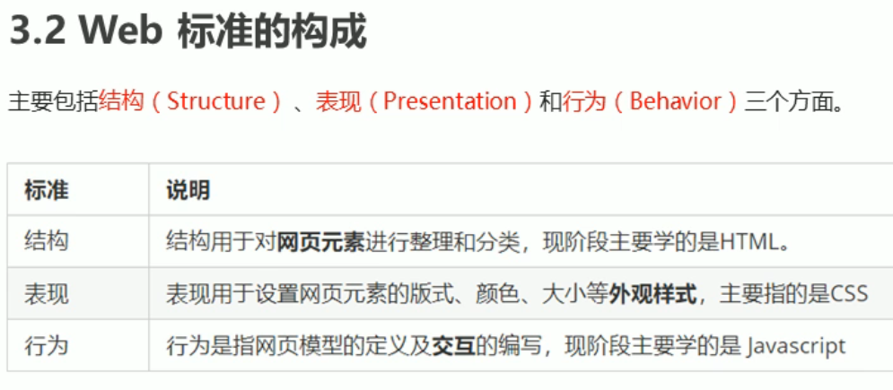
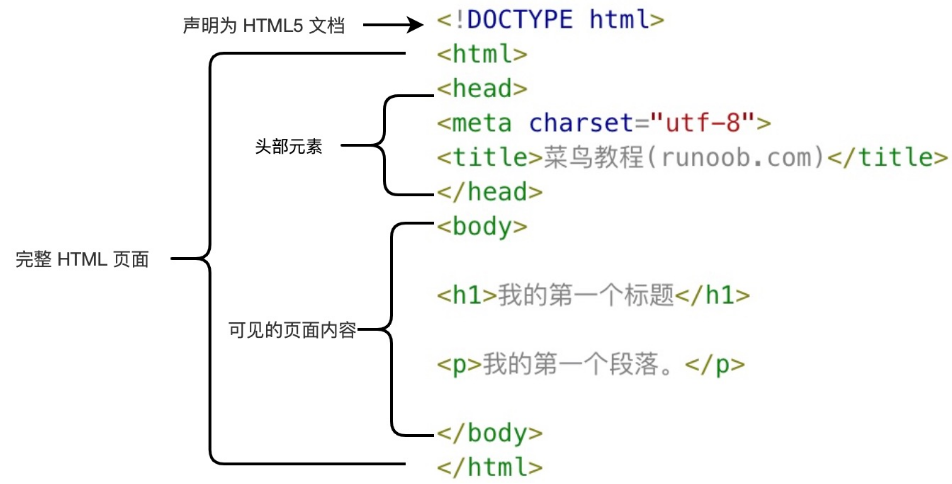
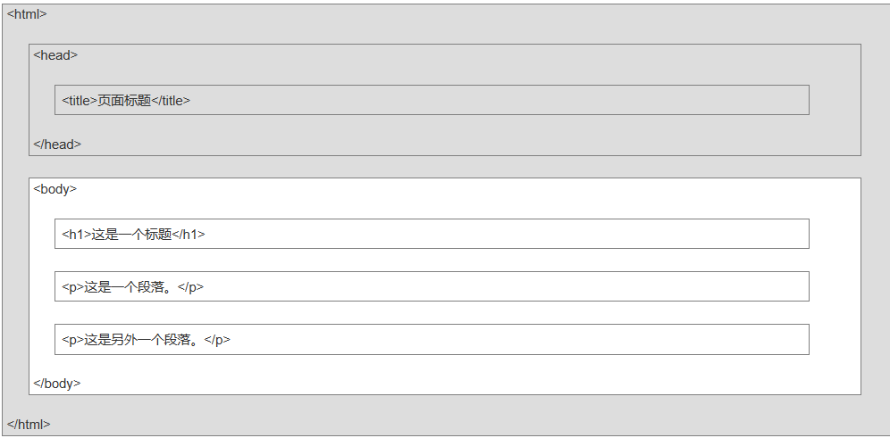
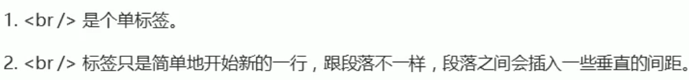
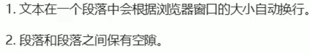

## HTML

### HTML简述

- HTML 指的是超文本标记语言（Hyper Text Markup Language），用来描述网页
  - 不是编程语言，是一套标记标签。超文本：超越文本限制；超级链接文本
- 网页
  - 网页是由HTML书写，浏览器解析
  - 浏览器内核：指负责读取网页内容，整理讯息，计算网页的显示方式并显示页面
- web标准
  - 

#### HTML基本结构

- `<!DOCTYPE html>` 声明为HTML5文件
- `<html lang= "en">或者<html lang = "zh-CN">`告诉浏览器页面用英/中文显示
- `<meta charset="UTF-8" >`采用UTF-8来保存文字

#### HTML 网页结构

#### HTML标签

##### 单标签

` ` 强制换行

##### 其他标签

- 头部标签
  - `<h1></h1>到<h6></h6>`
- 段落标签
  - `

`：另起一段（段落段落之间有较大空隙）
  - 
- 