# uniapp

## 前言

### uniapp的学习意义

`uni-app` 是一个使用 [Vue.js](https://vuejs.org/) 开发所有前端应用的框架，开发者编写一套代码，可发布到iOS、Android、Web（响应式）、以及各种小程序（微信/支付宝/百度/头条/飞书/QQ/快手/钉钉/淘宝）、快应用等多个平台。

简而言之**多端适配**

### uniapp与vue的区别

1. **组件/标签的变化**
   -  div改成view ，span、font改成text ，a改成navigator router-link ， img改成image
2. **uniapp自带路由和请求方式**
   - vue:需要vue-router来实现路由跳转 数据请求方式：需要安装axios
   - uniapp:自带路由不需要使用vue-router 内置了uni.request请求方式
3. **js**
   -  alert,confirm改成uni.showmodel
   - ajax改成uni.request
   - cookie、session没有了，localstorage改成uni.storage

## 全局文件

### pages.json 页面路由

1. pages的声明
2. globalStyle
3. tabBar

## 组件

### 视图容器

#### view

注意：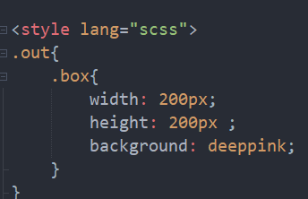 px与rpx的区别，rpx为布局式响应，可以根据不同设备适应，但是px是写死了的

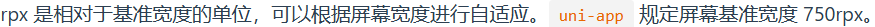

#### scroll-view

1. 使用竖向滚动时，需要给 <scroll-view> 一个固定高度，通过 css 设置 height；
2. 使用横向滚动时，需要给<scroll-view>添加white-space: nowrap；样式。
3. 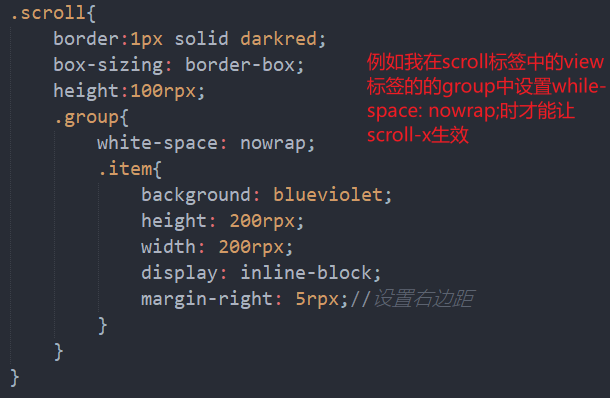

#### swiper

滑块视图容器。

一般用于左右滑动或上下滑动，比如banner轮播图。

注意滑动切换和滚动的区别，滑动切换是一屏一屏的切换。swiper下的每个swiper-item是一个滑动切换区域，不能停留在2个滑动区域之间

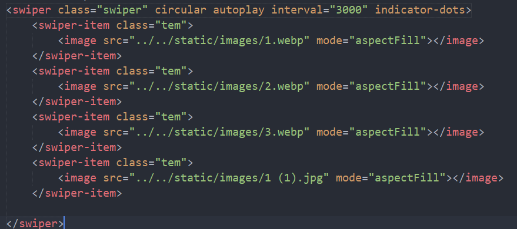

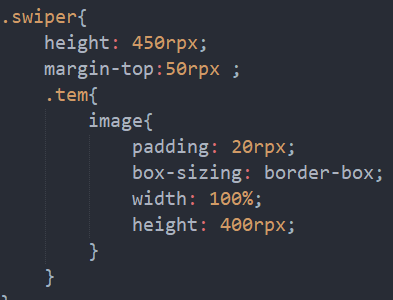 

可以使用padding控制间距

### 基础内容

- icon的使用

  - 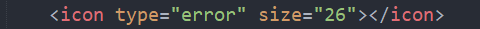

- text的使用（原先的span标签）

  - 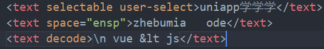

### 媒体组件

  - image
    - 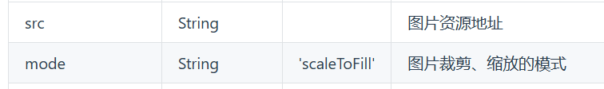
    - `<image src ="" mode=""></image>`
    - 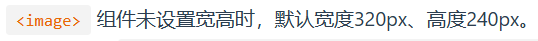
  - video
    - `<video src="../../static/images/uni-app-video-courses.mp4" initial-time="20"></video>`
    - 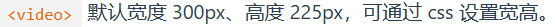

### 表单组件

### 路由与页面跳转

**navigator**

1. 组件方式跳转

   - ```vue
     <navigator url="/pages/list/list1" open-type="redirect">扣1真送吗</navigator>
     ```

   - 跳转tabbar页面，必须设置open-type="switchTab"，否则无法利用组件实现跳转

2. API跳转

   Tips：

- `navigateTo`, `redirectTo` 只能打开非 tabBar 页面。
- `switchTab` 只能打开 `tabBar` 页面。
- `reLaunch` 可以打开任意页面。
- 页面底部的 `tabBar` 由页面决定，即只要是定义为 `tabBar` 的页面，底部都有 `tabBar`。
- 不能在首页 `onReady` 之前进行页面跳转。
- H5端页面刷新之后页面栈会消失，此时`navigateBack`不能返回，如果一定要返回可以使用`history.back()`导航到浏览器的其他历史记录。

## vue2语法

### 基础

#### v-html

- 更新元素的 `innerHTML`

- 注意：**内容按普通 HTML 插入 - 不会作为 Vue 模板进行编译。**

- ```html
  <template>
  	<view>
             <view v-html=" '<div>xxx</div>' "></view>
  	</view>
  </template>
  ```

#### Class 与 Style 绑定

- ```html
  <template>
  	<view>
  		<!-- class -->
  		<view class="static" :class="{ active: isActive}">111</view>
  		<!-- style -->
  		<view v-bind:style="{ color: activeColor, fontSize: fontSize + 'px' }">333</view>
  	</view>
  </template>
  <script>
  	export default {
  		data() {
  			return {
  				isActive: true,
  				hasError: false,
  				activeColor:"green",
  				fontSize:50
  			}
  		}
  	}
  </script>
  <style>
  .static{
  	color: #2C405A;
  }
  .active{
  	background-color: #007AFF;
  }
  .text-danger{
  	color: #DD524D;
  }
  </style>
  ```

### 组件

#### props

`props` 可以是数组或对象，用于接收来自父组件的数据。`props` 可以是简单的数组，或者使用对象作为替代，对象允许配置高级选项，如类型检测、自定义验证和设置默认值。

- type

- default:any

- required:Boolean

- validator : Function

  当类型为数组列表对象时，需要使用default(){}函数进行赋值

- 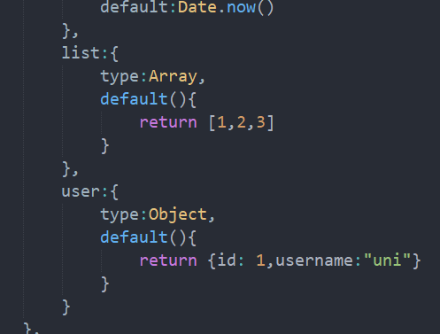 

  此时父组件通过:list的形式进行绑定

```vue
<publicTitle :list="[2,3,4]" :user="{id:2,username:'ssss'}"></publicTitle>
```

#### 自定义事件

**将原生事件绑定到组件**

一个组件的根元素上直接监听一个原生事件。 这时，你可以使用 @事件的 `.native` 修饰符

```html
<template>
		<view>
			<!-- 我是父组件 -->
			<componentA @click.native="clickComponentA" style="height: 200px;"></componentA>
		</view>
	</template>
```

**.sync 修饰符**

当一个子组件改变了一个 `prop` 的值时，这个变化也会同步到父组件中所绑定。 `.sync` 它会被扩展为一个自动更新父组件属性的 `v-on` 监听器。(相当于组件之间的双向绑定)

注：如果是事件需要在methods中写下this.$emit('update:变量名',值)

```vue
			methods:{
				changeTitle(){
					//触发一个更新事件
					this.$emit('update:title',"uni-app")
				}
			}
```

#### this.$emit( )

子组件自定义一个点击事件，然后在父组件中使用，并且可以传递数据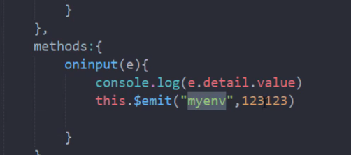

父组件中利用定义的点击事件接受数据：

```vue
	<myEvent title="组件的传值" @myEnv="onEnv"></myEvent>
```


## API

### 网络

#### 发起请求

uni.request(OBJECT)

- url:String

- data

  - 类型：Object/String/ArrayBuffer
  - 请求的参数

- method 常用get,post

- timeout:响应时间默认60秒，60000ms

- dataType:String默认为JSON格式

- success

  - | 参数       | 类型                      | 说明                                         |
    | :--------- | :------------------------ | :------------------------------------------- |
    | data       | Object/String/ArrayBuffer | 开发者服务器返回的数据                       |
    | statusCode | Number                    | 开发者服务器返回的 HTTP 状态码               |
    | header     | Object                    | 开发者服务器返回的 HTTP Response Header      |
    | cookies    | `Array.<string>`          | 开发者服务器返回的 cookies，格式为字符串数组 |

### 界面

#### 交互反馈

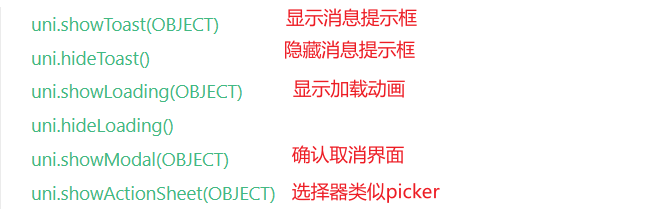

- uni.showToast()
  - title
  - icon:常用success/error等
  - image
  - mask:是否显示透明蒙层，防止触摸穿透，默认：false
  - duration
- uni.showLoading()
  - 显示 loading 提示框, 需主动调用 uni.hideLoading( ) 才能关闭提示框。
  - title/mask/success/fail/complete
- uni.showModal( )
  - 显示模态弹窗，可以只有一个确定按钮，也可以同时有确定和取消按钮
  - success参数有confirm/cancel,content(editable为true时用户输入的文本)
- uni.showActionSheet(OBJECT)
  - itemList：Array<String>，按钮的文字数组<=6最好
  - success参数tapIndex为Number
    - 用户点击的按钮，从上到下的顺序，从0开始

#### 设置导航条

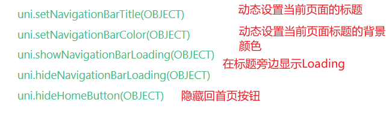

#### 设置TabBar

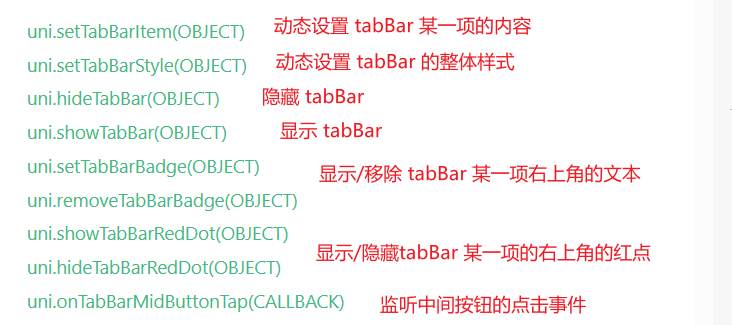

- uni.setTabBarItem(OBJECT)

  - ```js
    uni.setTabBarItem({
      index: 0,
      text: 'text',
      iconPath: '/path/to/iconPath',
      selectedIconPath: '/path/to/selectedIconPath'
    })
    ```

  - iconfont:字体图标，优先级高于 iconPath

    - 注意: 设置 `iconfont` 属性时，pages.json `iconfontSrc` 需要指定字体文件，参考下面的配置

### 页面与路由

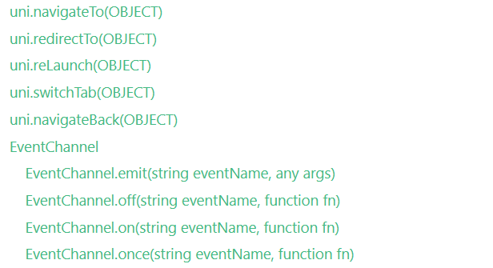

### 数据缓存

- uni.setStorage(OBJECT)

  - 将数据存储在本地缓存中指定的 key 中，会覆盖掉原来该 key 对应的内容，这是一个异步接口。（刷新一次页面就会更新）

  - key

    - String,本地缓存中的指定的 key

  - data

    - Any,需要存储的内容，只支持原生类型、及能够通过 JSON.stringify 序列化的对象

  - ```js
    uni.setStorage({
    	key: 'storage_key',
    	data: 'hello',
    	success: function () {
    		console.log('success');
    	}
    });
    ```

- uni.getStorage(OBJECT)

  - ```js
    uni.getStorage({
    	key: 'storage_key',
    	success: function (res) {
    		console.log(res.data);
    	}
    });
    ```

- uni.setStorageSync(KEY,DATA)

  - 将 data 存储在本地缓存中指定的 key 中，会覆盖掉原来该 key 对应的内容，这是一个同步接口。(刷新时不会更新)

  - ```js
    try {
    	uni.setStorageSync('storage_key', 'hello');
    } catch (e) {
    	// error
    }
    ```

- uni.getStorageSync(KEY)

  - ```js
    try {
    	const value = uni.getStorageSync('storage_key');
    	if (value) {
    		console.log(value);
    	}
    } catch (e) {
    	// error
    }
    
    ```

- uni.removeStorage(OBJECT)

  - 从本地缓存中异步移除指定 key

- uni.removeStorageSync(KEY)

  - 同步移除指定 key

- uni.clearStorage()

  - 清理本地数据缓存

- uni.clearStorageSync()

  - 异步

https://note.youdao.com/s/3ynQdE6b
