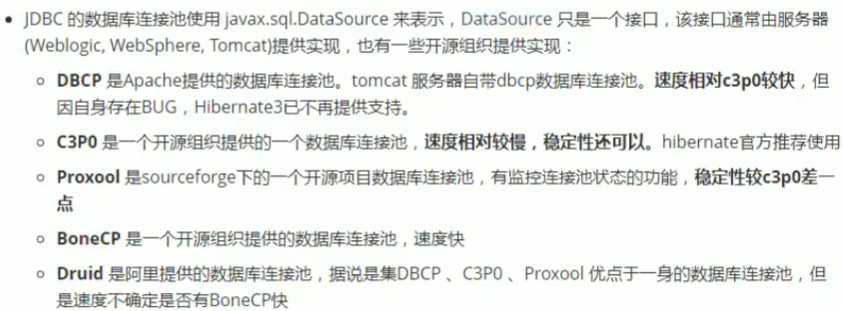

### JDBC

#### 概述

JDBC是SUN公司制定的一套规范，一套接口。由于数据库的种类各不相同，各大数据库厂商纷纷实现这套接口以此让Java程序员得以与数据库相连。可以在各大数据库官网上下载

#### JDBC编程六步


**1. 注册驱动**

```java
//try catch代码块中
// 1. 通过registerDriver
            Driver driver = new Driver();
            DriverManager.registerDriver(driver);
// 2. 通过Class类加载器自动加载
			Class.forName("com.mysql.cj.jdbc.Driver");
		
//原因 Driver类中静态代码块自动注册驱动
public class Driver extends NonRegisteringDriver implements java.sql.Driver {
    public Driver() throws SQLException {
    }

    static {
        try {
            DriverManager.registerDriver(new Driver());
        } catch (SQLException var1) {
            throw new RuntimeException("Can't register driver!");
        }
    }
}
```

**2. 获取连接**

```java
Connnection conn = null;
//try catch
String url = "jdbc:mysql://localhost:3306/game";//数据库地址
conn = DriverManager.getConnection(url,"root","Why721806");//用户名和密码
```

**3. 获取数据库操作对象**

```java
//1. Statement 获取数据库操作对象
        Statement statement = null;
	//try catch
		statement = connection.createStatement();
//2. PreparedStatement 获取预编译数据库操作对象
		PreparedStatement prepareStatement = null;
	//try catch
	//SQL 语句的框子，一个?代表一个占位符，用来接收一个值，注意不能用单引号括起来
        String sql = " select loginName,loginPwd from t_user where loginName = ? and loginPwd= ?" ;
        preparedStatement = connection.prepareStatement(sql);//此时SQL语句已经编译	
		//给?传值 setXxx方法Xxx与sql语句中的?类型保持一致
		//这里是String类型就为setString,是int就为setInt,double为setDouble等
        preparedStatement.setString(1,"xxx");//1表示第一个问号的值
        preparedStatement.setString(2,"xxx");
```

**Statement与PreparedStatement的异同**

- Statement存在SQL注入问题而PreparedStatement解决了这个问题

- Statement是编译一次执行一次。PreparedStatement是编译一次执行N次。PreparedStatement效率高

-  PreparedStatement 会在编译阶段做类型的安全检查

   综上，PreparedStatement使用较多，只有极少数情况使用Statement。如业务方面需要进行sql语句拼接时

**4. 执行SQL语句**

```java
//Statement
	//sql语句为DML语句
	String sql = "update new_player set sex='男' where level = 10";
    int i = statement.executeUpdate(sql);//返回值为int
	//sql语句为select语句
	//ResultSet存储了查询的列
	String sql = " select loginName,loginPwd from t_user where " + "loginName = '"+userInfo.get("loginName")+"' " ;
	resultSet= statement.executeQuery(sql);
    
//PreparedStatement	
	//sql语句为DML语句
	int i = ps.executeUpdate();//无需再传sql因为PreparedStatement已经预编译过了
	//sql语句为select语句
	resultSet= preparedStatement.executeQuery();
```

**5. 处理查询结果**

```java
//仅有select语句需要处理查询结果
	//next()方法返回是否有数据,为boolen类型
	if(resultSet.next()){ //可以通过getXxx方法获取相应的列
        String pwd = resultSet.getString("loginPwd");
        if(pwd.equals(userInfo.get("loginPwd")))
            loginSuccess = true;
    }
	//或者
	while (rs.next()){
        System.out.println(rs.getString("name") + "\t" +
        rs.getString("exp"));
    }

```

**6. 释放资源**

```java
//从小到大释放由于最后声明的为ResultSet resultSet所以先释放
	finally {
        //若是DML语句没有resultSet，那么不需要写下面这段
            if (resultSet != null) {
                try {
                    resultSet.close();
                } catch (SQLException e) {
                    e.printStackTrace();
                }
            }
            if(preparedStatement!=null) {
                try {
                    preparedStatement.close();
                } catch (SQLException e) {
                    e.printStackTrace();
                }
            }
            if (connection != null) {
                try {
                    connection.close();
                } catch (SQLException e) {
                    e.printStackTrace();
                }
            }
     }
```

#### JDBC的自动提交事务

```java
//三行代码重要
	conn.setAutoCommit(false);//关闭自动提交
	conn.commit();//事务的提交
	if (conn != null) { //报错时再catch中rollback事务 
        try {
            conn.rollback();
        } catch (SQLException ex) {
            e.printStackTrace();
        }
    }
           
```


```java
//JDBC部分方法的封装
public class DBUtils {
    //构造方法私有化
    private DBUtils() {
    }
    static { //静态代码块加载
        try {
            Class.forName("com.mysql.cj.jdbc.Driver");
        } catch (ClassNotFoundException e) {
            e.printStackTrace();
        }
    }
    public static Connection getConnection() throws SQLException 	{
        String url = "jdbc:mysql://localhost:3306/game";
        return DiverManager.getConnection(url,"root","Why721806");
    }
    public static void close(Connection conn, Statement stem, ResultSet rs){
        if (rs != null) {
            try {
                rs.close();
            } catch (SQLException e) {
                e.printStackTrace();
            }
        }
        if (stem != null) {
            try {
                stem.close();
            } catch (SQLException e) {
                e.printStackTrace();
            }
        }
        if (conn != null) {
            try {
                conn.close();
            } catch (SQLException e) {
                e.printStackTrace();
            }
        }

    }

}
```

#### 完整的代码

```java
public static void main(String[] args) {
        Connection conn = null;
        PreparedStatement ps =null;
        ResultSet rs = null;
        try {
            conn = DBUtils.getConnection();
            conn.setAutoCommit(false);//关闭自动提交
            String sql = "select * from player where name like ?";
            ps = conn.prepareStatement(sql);
            //?赋值
            ps.setString(1,"王%");

            rs = ps.executeQuery();
            while(rs.next()){
                System.out.println(rs.getString("name") + "," +rs.getString("email"));
            }
            conn.commit();

        } catch (SQLException e) {
            if (conn != null) {
                try {
                    conn.rollback();
                } catch (SQLException ex) {
                    e.printStackTrace();
                }
            }
            e.printStackTrace();
        }finally {
            DBUtils.close(conn,ps,rs);
        }

    }
```

#### 悲观锁和乐观锁

悲观锁：事务的先后执行，不允许并发，A事务的执行过程中会锁定，只有当A事务提交以后B事务才能进行

```java
String sql = "select * from player where name like ? for update"; 
//select语句尾部加上for update即为行级锁，将查询的结果一行行的都所锁住，不让其他人修改等 
```

乐观锁：事务允许的并发，利用版本来区分事务。假设A，B二人拿到的事务版本为1.0，之后分别修改，A先提交事务将事务更新为1.1版本，当B提交事务的时候，发现事务的版本已经不是1.0了，就会将自己的事务回滚。

#### 数据库连接池

数据库连接池是一种创建和管理数据库连接的技术，其目的是重复使用数据库连接，而不是每次需要时都创建一个新的连接。这种技术可以显著提高对数据库的访问速度和效率。

当一个应用程序需要与数据库交互时，它会从连接池中请求一个连接。当交互完成后，这个连接会被返回到连接池，而不是被关闭。这样，连接就可以被其他请求重复使用，从而减少了创建新连接的开销。

数据库连接池通常会在启动时创建一定数量的连接，并在需要时动态增加或减少连接数量。这样可以保证在高负载情况下仍有足够的连接可用，同时在低负载情况下不会浪费资源。（类似于线程池）

**常见的数据库连接池**

在Java中，常见的数据库连接池实现包括C3P0、DBCP、HikariCP、Durid等。



- 数据库连接池在JDBC的6个步骤中增加了创建连接池。

**1. c3p0**

通过xml文件配置

```xml
<?xml version="1.0" encoding="utf-8" ?>
<c3p0-config>
    <!-- This app is massive! -->
    <named-config name="intergalactoApp">
    <!-- 数据库获取连接的基本信息-->
        <property name="driverClass">com.mysql.cj.jdbc.Driver</property>
        <property name="jdbcUrl">jdbc:mysql://localhost:3306/game</property>
        <property name="user">root</property>
        <property name="password">Why721806</property>
    <!-- 进行数据库管理的基本信息-->
        <property name="acquireIncrement">5</property>
        <property name="initialPoolSize">15</property>
        <property name="minPoolSize">5</property>
        <property name="maxPoolSize">100</property>

        <!-- intergalactoApp adopts a different approach to configuring statement caching -->
        <property name="maxStatements">0</property>
        <property name="maxStatementsPerConnection">5</property>
    </named-config>
</c3p0-config>

```

```java
import com.mchange.v2.c3p0.ComboPooledDataSource;

public class C3P0Config {
    public static ComboPooledDataSource createDataSource1() {
        //创建线程池
        ComboPooledDataSource dataSource = new ComboPooledDataSource();
        //配置数据库信息注册驱动
        dataSource.setDriverClass("com.mysql.cj.jdbc.Driver");
        dataSource.setJdbcUrl("jdbc:mysql://localhost:3306/mydatabase");
        dataSource.setUser("root");
        dataSource.setPassword("password");
        // 其他配置参数...
        return dataSource;
    }
    
     public static ComboPooledDataSource createDataSource2() {
        //创建线程池
        ComboPooledDataSource dataSource = new ComboPooledDataSource("intergalactoApp");
        //intergalactoApp同xml配置名称，配置的xml文件必须放在根路径下，否则读取不到
         /* By default, c3p0 will look for an XML configuration file in its classloader's 		   resource path under the name "/c3p0-config.xml". That means the XML file should 			be placed in a directly or jar file directly named in your applications 				 CLASSPATH, 		  in WEB-INF/classes, or some similar location.*/
        return dataSource;
    }
    
    //获取连接代码 datasource.getConnnection();
}
```

**2. DBCP**

**DBCP配置文件**

```properties
DriverClassName=com.mysql.cj.jdbc.Driver
#驱动注册
url=jdbc:mysql://localhost:3306/game
#要连接的数据库用户名
username=root
#要连接的数据库密码
password=Why721806
```

**获取连接池等**

```java
public void testGetConnection2() throws SQLException, IOException {
        Properties properties = new Properties();
        //方式一
//        InputStream is = ClassLoader.getSystemClassLoader().getResourceAsStream("");
        FileInputStream is = new FileInputStream(new File("pojo/dbcp.properties"));
    	//文件路径书写要正确
        properties.load(is);
        BasicDataSource dataSource = BasicDataSourceFactory.createDataSource(properties);
		
    	//获取连接
        Connection conn = dataSource.getConnection();
    }
```

**3. Druid**

```properties
#配置文件 druid.properties
driverClassName=com.mysql.cj.jdbc.Driver
url=jdbc:mysql://localhost:3306/game
username=root
password=Why721806
```

```java
//JDBC部分方法的封装

import com.alibaba.druid.pool.DruidDataSourceFactory;
import pojo.DruidTest;

import javax.sql.DataSource;
import java.io.IOException;
import java.sql.*;
import java.util.Properties;

/**
 * 德鲁伊连接池
 */
public class JDBCUtils {

    private static DataSource dataSource;
    //构造方法私有化
    private JDBCUtils() {
    }
    static { //静态代码块加载
        try {
            Properties pros = new Properties();
      pros.load(DruidTest.class.getClassLoader().getResourceAsStream("pojo/druid.properties"));//路径需要书写正确
            dataSource = DruidDataSourceFactory.createDataSource(pros);
        } catch (Exception e) {
            throw new RuntimeException(e);
        }
    }
    public static Connection getConnection() throws SQLException {
        return dataSource.getConnection();
    }
    public static void close(Connection conn, Statement stem, ResultSet rs){
        //同DBUtils的close方法
    }
}

```

#### apache-dbutils实现curb操作

DbUtils是Apache组织提供的一个对JDBC进行简化封装的开源工具类库，可以简化JDBC应用程序的开发，同时不会影响程序的性能，默认是支持Druid和C3P0这样的数据库连接池的。


在进行查找操作时，dbutils中的QueryRunner需要我们传入ResultSetHandler，由于ResultSetHandler是一个接口，所以我们需要传入实现类，实现类如上图。

```java
/**
 * Common-dbutils测试之
 * QueryRunner测试
 */
public class JDBCTest16 {
    //测试插入
    @Test
    public void testInsert(){
        QueryRunner runner = new QueryRunner();
        Connection conn = null;
        try {
            //注意JDBCUtils是自己使用Druid连接池写的封装类
             conn = JDBCUtils.getConnection();
             String sql = "insert into t_user(loginName,loginPwd,realName) values (?,?,?)";
            int i = runner.update(conn, sql, "xukun", "123", "蔡徐坤");
            System.out.println(i==1 ? "成功" :"失败");
        } catch (SQLException e) {
            e.printStackTrace();
        }finally {
            JDBCUtils.close(conn,null,null);
        }

    }
    //测试查询

    /**
     * MapHandler是ResultSetHandler的实现类，对应表中的一条数据
     * 将字段以及相应字段的值封装为map
     */
    @Test
    public void testQuery1(){
        QueryRunner runner = new QueryRunner();
        Connection conn = null;
        try {
            conn = JDBCUtils.getConnection();
            String sql = "select * from t_user where id = ?";
            MapHandler handler = new MapHandler();
            Map<String, Object> query = runner.query(conn, sql, handler, 5);
            System.out.println(query);
        } catch (SQLException e) {
            e.printStackTrace();
        }finally {
            JDBCUtils.close(conn,null,null);
        }
    }
    /**
     * MapListHandler是ResultSetHandler的实现类，对应表中的多条数据
     * 将字段以及相应字段的值封装为map，将map装进List
     */
    @Test
    public void testQuery2(){
        QueryRunner runner = new QueryRunner();
        Connection conn = null;
        try {
            conn = JDBCUtils.getConnection();
            String sql = "select * from t_user";
            MapListHandler handler = new MapListHandler();
            List<Map<String, Object>> query = runner.query(conn, sql, handler);
            query.forEach(System.out::println);
        } catch (SQLException e) {
            e.printStackTrace();
        }finally {
            JDBCUtils.close(conn,null,null);
        }
    }

    /**
     * ScalarHandler用于查询特殊值
     */
    @Test
    public void testQuery3(){
        QueryRunner runner = new QueryRunner();
        Connection conn = null;
        try {
            conn = JDBCUtils.getConnection();
            String sql = "select count(*) from t_user";
            ScalarHandler<Long> handler = new ScalarHandler<>();
            Long query = runner.query(conn, sql, handler);
            System.out.println(query);
        } catch (SQLException e) {
            e.printStackTrace();
        }finally {
            JDBCUtils.close(conn,null,null);
        }
    }
}
```

```java
import org.apache.commons.dbutils.DbUtils;
public class testClose{
    public void close(Connection conn, Statement stem, ResultSet rs){
            DbUtils.closeQuietly(conn);//悄悄地关闭Dbutils帮助你处理了异常
            DbUtils.closeQuietly(stem);
            DbUtils.closeQuietly(rs);
    //        DbUtils.closeQuietly(conn, stem, rs);
        }
}
```

### 资料推荐

【JDBC从入门到精通视频教程-JDBC实战精讲】 https://www.bilibili.com/video/BV1Bt41137iB/?share_source=copy_web&vd_source=fd4d605d618b12d1ede0abcffd459f49
