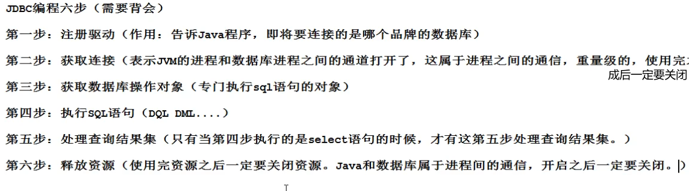

### JDBC

#### 概述

JDBC是SUN公司制定的一套规范，一套接口。由于数据库的种类各不相同，各大数据库厂商纷纷实现这套接口以此让Java程序员得以与数据库相连。可以在各大数据库官网上下载

#### JDBC编程六步



**1. 注册驱动**

```java
//try catch代码块中
// 1. 通过registerDriver
            Driver driver = new Driver();
            DriverManager.registerDriver(driver);
// 2. 通过Class类加载器自动加载
			Class.forName("com.mysql.cj.jdbc.Driver");
		
//原因 Driver类中静态代码块自动注册驱动
public class Driver extends NonRegisteringDriver implements java.sql.Driver {
    public Driver() throws SQLException {
    }

    static {
        try {
            DriverManager.registerDriver(new Driver());
        } catch (SQLException var1) {
            throw new RuntimeException("Can't register driver!");
        }
    }
}
```

**2. 获取连接**

```java
Connnection conn = null;
//try catch
String url = "jdbc:mysql://localhost:3306/game";//数据库地址
conn = DriverManager.getConnection(url,"root","Why721806");//用户名和密码
```

**3. 获取数据库操作对象**

```java
//1. Statement 获取数据库操作对象
        Statement statement = null;
	//try catch
		statement = connection.createStatement();
//2. PreparedStatement 获取预编译数据库操作对象
		PreparedStatement prepareStatement = null;
	//try catch
	//SQL 语句的框子，一个?代表一个占位符，用来接收一个值，注意不能用单引号括起来
        String sql = " select loginName,loginPwd from t_user where loginName = ? and loginPwd= ?" ;
        preparedStatement = connection.prepareStatement(sql);//此时SQL语句已经编译	
		//给?传值 setXxx方法Xxx与sql语句中的?类型保持一致
		//这里是String类型就为setString,是int就为setInt,double为setDouble等
        preparedStatement.setString(1,"xxx");//1表示第一个问号的值
        preparedStatement.setString(2,"xxx");
```

**Statement与PreparedStatement的异同**

- Statement存在SQL注入问题而PreparedStatement解决了这个问题

- Statement是编译一次执行一次。PreparedStatement是编译一次执行N次。PreparedStatement效率高

-  PreparedStatement 会在编译阶段做类型的安全检查

   综上，PreparedStatement使用较多，只有极少数情况使用Statement。如业务方面需要进行sql语句拼接时

**4. 执行SQL语句**

```java
//Statement
	//sql语句为DML语句
	String sql = "update new_player set sex='男' where level = 10";
    int i = statement.executeUpdate(sql);//返回值为int
	//sql语句为select语句
	//ResultSet存储了查询的列
	String sql = " select loginName,loginPwd from t_user where " + "loginName = '"+userInfo.get("loginName")+"' " ;
	resultSet= statement.executeQuery(sql);
    
//PreparedStatement	
	//sql语句为DML语句
	int i = ps.executeUpdate();//无需再传sql因为PreparedStatement已经预编译过了
	//sql语句为select语句
	resultSet= preparedStatement.executeQuery();
```

**5. 处理查询结果**

```java
//仅有select语句需要处理查询结果
	//next()方法返回是否有数据,为boolen类型
	if(resultSet.next()){ //可以通过getXxx方法获取相应的列
        String pwd = resultSet.getString("loginPwd");
        if(pwd.equals(userInfo.get("loginPwd")))
            loginSuccess = true;
    }
	//或者
	while (rs.next()){
        System.out.println(rs.getString("name") + "\t" +
        rs.getString("exp"));
    }

```

**6. 释放资源**

```java
//从小到大释放由于最后声明的为ResultSet resultSet所以先释放
	finally {
        //若是DML语句没有resultSet，那么不需要写下面这段
            if (resultSet != null) {
                try {
                    resultSet.close();
                } catch (SQLException e) {
                    e.printStackTrace();
                }
            }
            if(preparedStatement!=null) {
                try {
                    preparedStatement.close();
                } catch (SQLException e) {
                    e.printStackTrace();
                }
            }
            if (connection != null) {
                try {
                    connection.close();
                } catch (SQLException e) {
                    e.printStackTrace();
                }
            }
     }
```

#### JDBC的自动提交事务

```java
//三行代码重要
	conn.setAutoCommit(false);//关闭自动提交
	conn.commit();//事务的提交
	if (conn != null) { //报错时再catch中rollback事务 
        try {
            conn.rollback();
        } catch (SQLException ex) {
            e.printStackTrace();
        }
    }
           
```


```java
//JDBC部分方法的封装
public class DBUtils {
    //构造方法私有化
    private DBUtils() {
    }
    static { //静态代码块加载
        try {
            Class.forName("com.mysql.cj.jdbc.Driver");
        } catch (ClassNotFoundException e) {
            e.printStackTrace();
        }
    }
    public static Connection getConnection() throws SQLException 	{
        String url = "jdbc:mysql://localhost:3306/game";
        return DiverManager.getConnection(url,"root","Why721806");
    }
    public static void close(Connection conn, Statement stem, ResultSet rs){
        if (rs != null) {
            try {
                rs.close();
            } catch (SQLException e) {
                e.printStackTrace();
            }
        }
        if (stem != null) {
            try {
                stem.close();
            } catch (SQLException e) {
                e.printStackTrace();
            }
        }
        if (conn != null) {
            try {
                conn.close();
            } catch (SQLException e) {
                e.printStackTrace();
            }
        }

    }

}
```

#### 完整的代码

```java
public static void main(String[] args) {
        Connection conn = null;
        PreparedStatement ps =null;
        ResultSet rs = null;
        try {
            conn = DBUtils.getConnection();
            conn.setAutoCommit(false);//关闭自动提交
            String sql = "select * from player where name like ?";
            ps = conn.prepareStatement(sql);
            //?赋值
            ps.setString(1,"王%");

            rs = ps.executeQuery();
            while(rs.next()){
                System.out.println(rs.getString("name") + "," +rs.getString("email"));
            }
            conn.commit();

        } catch (SQLException e) {
            if (conn != null) {
                try {
                    conn.rollback();
                } catch (SQLException ex) {
                    e.printStackTrace();
                }
            }
            e.printStackTrace();
        }finally {
            DBUtils.close(conn,ps,rs);
        }

    }
```

#### 悲观锁和乐观锁

悲观锁：事务的先后执行，不允许并发，A事务的执行过程中会锁定，只有当A事务提交以后B事务才能进行

```java
String sql = "select * from player where name like ? for update"; 
//select语句尾部加上for update即为行级锁，将查询的结果一行行的都所锁住，不让其他人修改等 
```

乐观锁：事务允许的并发，利用版本来区分事务。假设A，B二人拿到的事务版本为1.0，之后分别修改，A先提交事务将事务更新为1.1版本，当B提交事务的时候，发现事务的版本已经不是1.0了，就会将自己的事务回滚。
