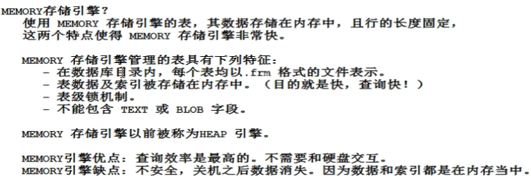

## MySQL

#### 概述

数据库 : 数据库(DataBase 简称 DB)就是信息的集合或者说数据库是由数据库管理系统管理的数据的集合。

数据库管理系统 : 数据库管理系统(Database Management System 简称 DBMS)是一种操纵和管理数据库的大型软件，通常用于建立、使用和维护数据库。如Mysql等

数据库系统 : 数据库系统(Data Base System，简称 DBS)通常由软件、数据库和数据管理员(DBA)组成。

数据库管理员 : 数据库管理员(Database Administrator, 简称 DBA)负责全面管理和控制数据库系统。

#### SQL


#### 表的创建

```mysql
use game;

create table player (
	id int,
	name varchar(100),
	level int,
	exp int,
	gold decimal(10,2)
);

desc player; -- 查看表
alter table player modify column name varchar(200);
alter table player add column last_login datetime; -- 增加列
alter table player rename column name to nick_name;-- 重命名列 
alter table player drop column last_login;-- 删除列
drop table player;-- 删除表
```

#### 增删改查语句

```mysql
insert into player (id,name,level,exp,gold) values (1,'张三',1,1,1);
insert into player (id,name) values (2,'李四');
insert into player (id,name,level) values (3,'王五',1);
delete from player where gold = 0;
-- delete from player where name= '王五';
update player set level = 1 where name = '李四';
update player set gold=1 where id=3;
update player set exp=0,gold=0;
select name,level from player;
select * from player;
```

**1. NOT,AND,OR的使用**

其中优先级为not > and > or

```mysql
select * from player p where `exp` > 1 and `exp` < 5;
select * from player where level > 1 and level < 5 or exp>1 and exp<5; 
-- between and以及in的使用
select * from player where level in (1,3,5);-- level为1,3,5
select * from player where `level` between 1 and 10;-- 表范围
```

**2. like关键词的使用**

```mysql
select * from player where name like '%王%';
select * from player where name like '王%';
select * from player where name like '王_';
select * from player where name like '%王';

-- '%王%'代表名字中含有王的，%意思为任意个字符
-- '王_'代表以王字起头的name且只有两个字, _ 意思为一个字符
```

**3. regexp通配符的使用**


```mysql
select * from player where name regexp '^王.$';-- 开头为王的二字名字
select * from player where name regexp '王';-- 名字中含王
select * from player where name regexp '王|张';-- 名字中含王或张
select * from player where email regexp '^[abc]';-- 以a|b|c为开头的email
select * from player where email regexp 'net$';-- 以net为结尾
```

```mysql
-- 注：检查空语句为
select * from player where email is null or email = '';
-- 排序语句为
select * from player order by `level` DESC;
select * from player order by `level` DESC ,exp;
-- 上句意为按照level降序排列，级数相同按照exp顺序排列（默认为顺序）
```

**4. 聚合函数的使用 **


```mysql
select COUNT(*) from player where name regexp '王';
select AVG(`level`) from player;
select MAX(`level`) from player p ;
select SUM(`exp`) from player p where email like '%net';
```

- group by 的使用

```mysql
select sex,count(sex) from player p group by sex; 
-- count(sex)不会将sex为null的计数因为sex中不含null但是count(*)会 
select sex,count(*) from player group by sex; 
```

- having 的使用

```mysql
select `level`,count(level) from player p group by `level` having count(LEVEL)> 3; -- level等级相同的分组中数量超过三的
```

- distinct 去重

```mysql
select distinct sex from player;
```

```mysql
-- 综合实例
select substr(name,1,1),count(substr(name,1,1)) from player p 
group by substr(name,1,1) 
-- having count(substr(name,1,1)) > 4 
order by count(substr(name,1,1)) desc
limit 3,3; -- 按照姓氏分组数量排序返回4,5,6名
-- limit 10 是限制10个，limit 3,3 是3的后3个即4,5,6 
```

- 集合运算

```mysql
select * from player where `level` between 1 and 3
intersect -- except -- union 
select * from player where `exp`  between 1 and 3;
-- union并集 intersect交集 except 差集
```

**6. 建表约束**

- 非空约束 not null 
- 唯一性约束 unique
- 主键约束 primary key
  - 在MySQL中not null unique即为主键
  - 一般是int,bigint,char类型作为主键 不可变数据类型


- 外键约束 foreign key
  - 先创建父，再创建子；先删除子，再删除父；先插入父，再插入子
  - 外键值可以为null，即insert into t_student (name) values ("lisi");语句正确
  - 被子表引用的外键来源父表的字段是具有唯一性的，即classno唯一


- 检查约束 check（mysql不支持,oracle支持）

#### 存储引擎

存储引擎是MySQL中特有的名词其他数据库没有(Oracle的名称不同)

MySQL支持9大存储引擎




#### 事务（重中之重）

**1. 什么是事务**

一个事务其实就是一个完整的业务逻辑。是一个最小的工作单元，不可再分。是多条DML语句同时成功，同时失败。

**2. 事务**

- 仅存在于DML语句中，只有update,delete,insert和事务有关 

- InnoDB存储引擎：提供了一组用来记录事务性活动的日志文件

  - ```
    事务开启了：
        insert
        insert
        delete
        insert
        update
    事务结束
    ```

  

**3. 事物的提交与回滚**

提交事务： commit; 语句

回滚事务：rollback; 语句（回滚只能回滚到上一次的提交点）

mysql中执行一条DML语句就会自动提交事务，在开发中我们需要使用 `start transaction` 关闭自动提交


**4. 事物的4个特性**

- A（atom）: 原子性
  - 说明事务是最小的工作单元，不可再分。
- C（consistence）: 一致性
  - 所有事务要求，在同一个事务中，所有操作必须同时成功或者同时失败，以保持数据的一致性
- I （isolation）: 隔离性
  - A事务和B事务具有一定的距离
- D: 持久性
  - 事务最终结束的保障。

**5. 事物的隔离级别**


- read uncommitted


- read committed
- repeatable read(mysql 默认级别)
- serializable 

#### 子查询

```mysql
select avg(level) from player p;
select * from player where `level` > (select avg(level) from player p);
select name,level , round((select avg(level) from player p)) as average,
level - round((select avg(level) from player p)) as diff 
from player limit 8;
-- 即通过()将查询语句包起来作为其他语句的条件
create table new_player (select * from player p where `level` between 1 and 3);
insert into new_player (select * from player where `level` > 98);

select exists(select * from player p where `level` > 10);
-- 判断是否存在等级大于10的player
```

#### 表关联

```mysql
-- inner join内连接 通过关联语句内联左右两个表返回可以找到的
-- left join左连接 左表中和右表关联的字段填充左表，返回的是整个左表
-- right join右连接 
select * from player p
right join equip e 
on p.id = e.player_id ;
-- 或者通过where语句
select * from player p ,equip e where p.id = e.player_id;
```


#### 索引

```
【创建】：
CREATE [UNIQUE|FULLTEXT|SPATIAL] INDEX index_name
ON table_name (column_name(s));
alter table table_name add INDEX index_name; 
【查询】：
SHOW INDEX FROM table_name;
【删除】：
DROP INDEX index_name ON table_name;

在表的数据量很大的情况下通过给经常查询的字段添加索引可以大大提高查询速度
```


#### 视图

```mysql
create view top10 as
select * from player order by level desc limit 10;

drop view top10 ;

alter view top10 as select * from player order by `level` limit 9;

select * from top10 t ; -- 也可以使用查询语句，同表的数据定义语言通用视图是由表的语句动态生成的，更改表时视图也会更新
-- 更新player中id为19的gold数量为11，视图中的数据也会相应改变
update player set gold = 11 where id = 19;
```

