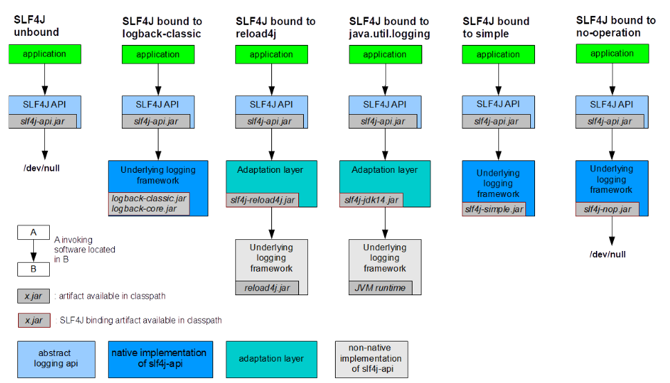
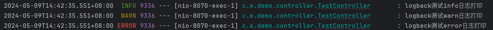

## SpringBoot日志系统

### 日志系统介绍

SpringBoot为我们提供了丰富的日志系统，它几乎是开箱即用的。它支持多种日志框架，包括`Logback`、`Log4j2`和`Java Util Logging（JUL）` 等。默认情况下，如果我们使用SpringBoot的starters启动器，它将使用`Slf4j + Logback`作为日志框架。

Logback：Logback是SpringBoot默认的日志框架，它是Log4j的继任者，提供了更好的性能和可靠性。你可以通过在资源目录下创建一个logback-spring.xml文件来配置Logback。

Log4j2：Log4j2是Log4j的升级版，它在性能和功能上都有所提升，支持异步日志和插件机制。如果你想在SpringBoot中使用Log4j2，你需要添加相应的依赖并在配置文件中指定Log4j2作为日志框架。

Java Util Logging（JUL）：JUL是Java SE的默认日志框架，SpringBoot可以配置使用JUL作为日志框架，但一般不推荐使用，因为它的性能和灵活性相对较差。

### 日志门面（统一日志框架）

一般情况下，在项目中存在着各种不同的第三方 jar ，且它们的日志选择也可能不尽相同，显然这样是不利于我们使用的，那么如果我们想为项目设置统一的日志框架该怎么办呢？

为了解决这种问题，SpringBoot 支持Slf4j和Commons Logging这两个日志门面。这些门面可以与多种日志实现进行集成，使得我们可以在不改变代码的情况下更换日志框架。

而日志门面，如Slf4j，是把不同的日志系统的实现进行了具体的抽象化，只提供了统一的日志使用接口，使用时只需要按照其提供的接口方法进行调用即可，由于它只是一个接口，并不是一个具体的可以直接单独使用的日志框架，所以最终日志的格式、记录级别、输出方式等都要通过接口绑定的具体的日志系统来实现。

**日志门面和日志实现就像JDBC和数据库驱动一样。**

在 [SLF4J 官方](https://www.slf4j.org/manual.html)，也给了我们参考的例子



所以，SpringBoot为了统一日志框架的使用，做了这些事情：

- 直接将其他依赖以前的日志框架剔除
- 导入对应日志框架的Slf4j中间包
- 导入自己官方指定的日志实现，并作为Slf4j的日志实现层

### Spring Boot 的日志使用

#### 日志级别

在日志系统中，通常会定义不同的日志级别，用于标识日志的重要性或严重性。以下是常见的日志级别，按照从低到高的顺序排列：

ALL：所有日志。

Trace：最低的日志级别，用于输出非常详细的信息，通常只在调试时使用，记录程序执行的细节和内部状态。

DEBUG：用于调试信息，通常用于开发和调试阶段，如方法调用、变量值等。

INFO：提供程序运行时的重要信息，用于指示应用程序正常运行。

WARN：表示潜在的问题，不会导致应用程序失败，但可能需要关注。

ERROR：表示错误事件，可能导致应用程序出现问题。

FATAL：最高的日志级别，用于输出严重的错误信息，表示程序已经无法继续运行。通常是非常严重的错误或异常，需要立即处理。

OFF：关闭日志。

#### SLF4J + LogBack

**打印项目日志信息**

```java
@RestController
public class LogController {
    private static final Logger logger = LoggerFactory.getLogger(LogController.class);

    @RequestMapping(value = "/logback",method = RequestMethod.GET)
    public String logback() {
        logger.trace("logback测试trace日志打印");
        logger.debug("logback测试debug日志打印");
        logger.info("logback测试info日志打印");
        logger.warn("logback测试warn日志打印");
        logger.error("logback测试error日志打印");
        return "success";
    }
}
```

运行上述代码请求后，得到输出如下。由此可见 **Spring Boot 默认日志级别为 INFO**



源码：

```java
<property name="CONSOLE_LOG_PATTERN" value="${CONSOLE_LOG_PATTERN:-%clr(%d{${LOG_DATEFORMAT_PATTERN:-yyyy-MM-dd'T'HH:mm:ss.SSSXXX}}){faint} %clr(${LOG_LEVEL_PATTERN:-%5p}) %clr(${PID:- }){magenta} %clr(---){faint} %clr([%15.15t]){faint} %clr(%-40.40logger{39}){cyan} %clr(:){faint} %m%n${LOG_EXCEPTION_CONVERSION_WORD:-%wEx}}"/>
```

**自定义配置Logback日志**

Logback官网：[https://logback.qos.ch](https://logback.qos.ch/)

和JUL一样，Logback也能实现定制化，我们可以编写对应的配置文件，SpringBoot推荐将配置文件名称命名为`logback-spring.xml`表示这是SpringBoot下Logback专用的配置，可以使用SpringBoot 的高级Profile功能，它的内容类似于这样：

```xml
<?xml version="1.0" encoding="UTF-8"?>
<configuration>
    <!-- 配置 -->
</configuration>
```

最外层由`configuration`包裹，一旦编写，那么就会替换默认的配置，所以如果内部什么都不写的话，那么会导致我们的SpringBoot项目没有配置任何日志输出方式，控制台也不会打印日志。

一般而言，我们采用采用两种方式查看日志：1. 控制台日志打印   2. 文件日志打印

1. 控制台日志打印

我们接着来看如何配置一个控制台日志打印，我们可以直接导入并使用SpringBoot为我们预设好的日志格式，在`org/springframework/boot/logging/logback/defaults.xml`中已经帮我们把日志的输出格式定义好了，我们只需要设置对应的`appender`即可：

我们利用预设的日志格式创建一个控制台日志打印：

```xml
<?xml version="1.0" encoding="UTF-8"?>
<configuration>
    <!--  导入其他配置文件，作为预设  -->
    <include resource="org/springframework/boot/logging/logback/defaults.xml" />

    <!--  Appender作为日志打印器配置，这里命名随意  -->
    <!--  ch.qos.logback.core.ConsoleAppender是专用于控制台的Appender  -->
    <appender name="CONSOLE" class="ch.qos.logback.core.ConsoleAppender">
        <encoder>
            <pattern>${CONSOLE_LOG_PATTERN}</pattern>
            <charset>${CONSOLE_LOG_CHARSET}</charset>
        </encoder>
    </appender>

    <!--  指定日志输出级别，以及启用的Appender，这里就使用了我们上面的ConsoleAppender  -->
    <root level="INFO">
        <appender-ref ref="CONSOLE"/>
    </root>
</configuration>
```

2. 文件日志打印

接着我们来看看如何开启文件打印，我们只需要配置一个对应的Appender即可：

```xml
<!--  ch.qos.logback.core.rolling.RollingFileAppender用于文件日志记录，它支持滚动  -->
<appender name="FILE" class="ch.qos.logback.core.rolling.RollingFileAppender">
    <encoder>
        <pattern>${FILE_LOG_PATTERN}</pattern>
        <charset>${FILE_LOG_CHARSET}</charset>
    </encoder>
    <!--  自定义滚动策略，防止日志文件无限变大，也就是日志文件写到什么时候为止，重新创建一个新的日志文件开始写  -->
    <rollingPolicy class="ch.qos.logback.core.rolling.SizeAndTimeBasedRollingPolicy">
        <!--  文件保存位置以及文件命名规则，这里用到了%d{yyyy-MM-dd}表示当前日期，%i表示这一天的第N个日志  -->
        <FileNamePattern>log/%d{yyyy-MM-dd}-spring-%i.log</FileNamePattern>
        <!--  到期自动清理日志文件  -->
        <cleanHistoryOnStart>true</cleanHistoryOnStart>
        <!--  最大日志保留时间  -->
        <maxHistory>7</maxHistory>
        <!--  最大单个日志文件大小  -->
        <maxFileSize>10MB</maxFileSize>
    </rollingPolicy>
</appender>

<!--  指定日志输出级别，以及启用的Appender，这里就使用了我们上面的ConsoleAppender  -->
<root level="INFO">
    <appender-ref ref="CONSOLE"/>
    <appender-ref ref="FILE"/>
</root>
```

配置完成后，我们可以看到日志文件也能自动生成了。

filter过滤器参数说明：

- ThresholdFilter：基于单个日志级别进行过滤，简单但功能有限。
- LevelFilter：基于一个范围的日志级别进行过滤，提供了比 ThresholdFilter 更多的灵活性。
- EvaluatorFilter：基于自定义表达式进行过滤，提供了最大的灵活性。

如果我们只想要得到特定日志级别的日志信息，我们就需要配置filter，例如下面我们对文件的配置

```xml
<appender name="FILE" class="ch.qos.logback.core.rolling.RollingFileAppender">
    <encoder>
        <pattern>${FILE_LOG_PATTERN}</pattern>
        <charset>${FILE_LOG_CHARSET}</charset>
    </encoder>

    <!-- 只输出INFO级别的日志 -->
    <filter class="ch.qos.logback.classic.filter.LevelFilter">
        <level>INFO</level>
        <onMatch>ACCEPT</onMatch>
        <onMismatch>DENY</onMismatch>
    </filter>

    <!--  自定义滚动策略，防止日志文件无限变大，也就是日志文件写到什么时候为止，重新创建一个新的日志文件开始写  -->
    <rollingPolicy class="ch.qos.logback.core.rolling.SizeAndTimeBasedRollingPolicy">
        <!--  文件保存位置以及文件命名规则，这里用到了%d{yyyy-MM-dd}表示当前日期，%i表示这一天的第N个日志  -->
        <FileNamePattern>log/%d{yyyy-MM-dd}-spring-%i.log</FileNamePattern>
        <!--  到期自动清理日志文件  -->
        <cleanHistoryOnStart>true</cleanHistoryOnStart>
        <!--  最大日志保留时间  -->
        <maxHistory>7</maxHistory>
        <!--  最大单个日志文件大小  -->
        <maxFileSize>10MB</maxFileSize>
    </rollingPolicy>
</appender>
```

#### SLF4J + Log4j2

添加Log4j2依赖，并排除Spring Boot的默认日志配置

```xml
<dependency>
    <groupId>org.springframework.boot</groupId>
    <artifactId>spring-boot-starter</artifactId>
    <exclusions>
        <exclusion>
            <groupId>org.springframework.boot</groupId>
            <artifactId>spring-boot-starter-logging</artifactId>
        </exclusion>
    </exclusions>
</dependency>
<dependency>
    <groupId>org.springframework.boot</groupId>
    <artifactId>spring-boot-starter-log4j2</artifactId>
</dependency>
```

之后在在src/main/resources目录下创建一个名为log4j2-spring.xml的配置文件，文件内容大同小异。

想要了解的同学可以参考[Spring Boot 配置 log4j2](https://www.cnblogs.com/fishlittle/p/17950944) 或者https://blog.csdn.net/qq_36433289/article/details/135448312 两篇文章

