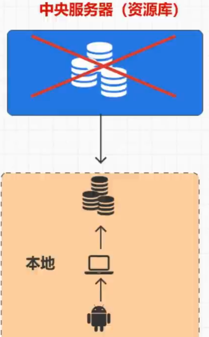

### SCM(软件配置管理)

SCM(Software Configuration Management)是指通过执行版本控制、变更控制的规程，以及使用合适的配置管理软件，来保证所有配置项的完整性和可跟踪性。配置管理是对工作成果的一种保护。

- #### 版本控制

- #### 集中式版本控制

  特点：通过中央服务器来控制

  缺点：文件冲突问题，对中央服务器依赖大

- #### 分布式版本控制

  

  特点：中央服务器跟本地做交互，不会因网络出现问题

  缺点：资源消耗大

- #### 多人协作开发

#### 版本控制软件的基础功能

1. 保存和管理文件
2. 提供客户端工具进行访问
3. 提供不同版本文件得比对功能 

### git

#### git介绍

开源的**分布式版本控制系统**可以有效、高速的处理从很小到非常大的项目版本管理也是Linux Torvalds为了帮助管理Linux内核开发而开发的一个开放源码的版本控制软件。

##### git-版本号

版本号利用SHA-1加密算法，以此得到40(2+38)位16进制的字符串，前两位代表文件夹，后38位是文件名。

**文件操作**

提交文件后利用git bash界面的git cat-file -p 命令查看版本号得到*提交信息*

得到了tree,parent后面的两个版本号，parent后的版本号是上一次提交时版本号。查找tree后的版本号得到了文件状态，之后查看文件状态中的版本号后可以看到文件文件内容

如果修改文件则parent版本号是上一次提交的版本号，同时文件状态的版本号中会有第一次的文件dfe0770；如果是删除则是文件状态中不显示c.txt文件，不会关联到c.txt

**分支操作**

HEAD文件中存储着分支，分支中有不同的版本号

- ##### 仓库管理

  1. $git init 初始化仓库

  2. $git clone 克隆仓库

     可以再往之后加上自己设的名称eg:remote-git-rep
     

    3.config

  全局和局部配置config

  

- ##### 文件管理

  - $git status查看暂存区

  - $git log 查看日志 /git log --oneline

  - git add xxx  git commit -m xxx

  - git restore、git reset和$git revert

    $git restore无法恢复已经提交删除即将本地库内的也删掉时不能恢复；

    $git reset可以恢复到删除前的那一次，但是提交（删除的）记录没有保存；

    $git revert则可以保存删除记录并恢复，恢复到删除前

    

    

- ##### 分支管理

  ps:在git创建仓库后需要提交来建立分支master，之后才能进行创建分支操作

  - $git branch xxx(创建xxx分支)
  - $git branch -v(查看分支)
  - $git checkout xxx(切换到某分支)
  - $git checkout -b xxx(创建并切换到xxx分支，合并了上述一三项)
  - $git branch -d xxx(删除分支)

  **合并分支以及冲突处理**

  $git merge xxx

  如果有文件冲突自己在文件中修改并提交即可

- ##### 标签管理

  

`$git tag XXX` 版本号后查询时可用`$git log XXX`查询，删除时可以用`$git log -d XXX`

- ##### 远程管理

  - $git push xxx
  - $git pull   xxx

